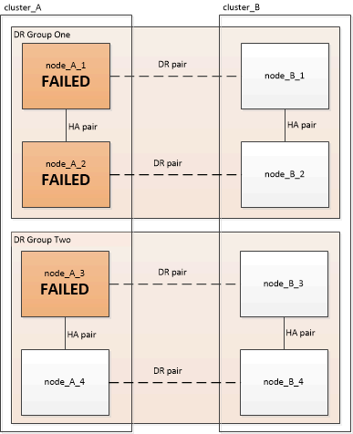

= 正しいリカバリ手順の選択
:allow-uri-read: 
:icons: font
:imagesdir: ../media/

[role="lead"]
MetroCluster 構成で障害が発生した場合は、正しいリカバリ手順を選択する必要があります。次の表と例を使用して、適切なリカバリ手順を選択してください。

次の表に示す情報は、インストールまたは移行が完了していること、つまりが完了していることを前提としています `metrocluster configure` コマンドが実行されました。

|===

| ディザスタサイトでの障害の範囲 | 手順 

 a| 
* ハードウェア障害（停電など）がない

 a| 
link:task_recover_from_a_non_controller_failure_mcc_dr.html["コントローラ以外の障害からのリカバリ"]

 a| 
* コントローラモジュールの障害はなし
* 他のハードウェアで障害が発生した

 a| 
link:task_recover_from_a_non_controller_failure_mcc_dr.html["コントローラ以外の障害からのリカバリ"]

 a| 
* 1 台のコントローラモジュールの障害またはコントローラモジュール内の FRU コンポーネントの障害
* ドライブは障害状態ではありません

 a| 
障害が 1 台のコントローラモジュールに限定されている場合は、プラットフォームモデルに対応したコントローラモジュール FRU 交換用手順を使用する必要があります。4 ノードまたは 8 ノードの MetroCluster 構成では、このような障害がローカル HA ペアに分離されます。

* 注： * ドライブやその他のハードウェアに障害が発生していない場合は、コントローラモジュールの FRU 交換用手順を 2 ノード MetroCluster 構成で使用できます。

https://docs.netapp.com/platstor/index.jsp["ONTAPハードウェアシステムのドキュメント"^]

 a| 
* 1 台のコントローラモジュールの障害またはコントローラモジュール内の FRU コンポーネントの障害
* ドライブで障害が発生している

 a| 
link:task_recover_from_a_multi_controller_and_or_storage_failure.html["マルチコントローラまたはストレージの障害からのリカバリ"]

 a| 
* 1 台のコントローラモジュールの障害またはコントローラモジュール内の FRU コンポーネントの障害
* ドライブは障害状態ではありません
* コントローラモジュールの外部にあるハードウェアでも障害が発生した

 a| 
link:task_recover_from_a_multi_controller_and_or_storage_failure.html["マルチコントローラまたはストレージの障害からのリカバリ"]

ドライブ割り当てのすべての手順を省略する必要があります。

 a| 
* DR グループ内の複数のコントローラモジュールの障害（その他の障害あり、またはなし）

 a| 
link:task_recover_from_a_multi_controller_and_or_storage_failure.html["マルチコントローラまたはストレージの障害からのリカバリ"]

|===

== MetroCluster のインストール中のコントローラモジュールの障害のシナリオ

MetroCluster 構成手順 でのコントローラモジュール障害への対応は、が搭載されているかどうかによって異なります `metrocluster configure` コマンドが完了しました。

* 状況に応じて `metrocluster configure` コマンドがまだ実行されていないか失敗しました。交換用コントローラモジュールを使用して、MetroCluster ソフトウェア設定手順 を最初から再起動する必要があります。
+

NOTE: の手順を必ず実行してください link:https://docs.netapp.com/us-en/ontap-metrocluster/install-ip/task_sw_config_restore_defaults.html["コントローラモジュールでのシステムデフォルトのリストア"] 各コントローラ（交換用コントローラを含む）で、以前の設定が削除されたことを確認します。

* 状況に応じて `metrocluster configure` コマンドが正常に完了し、コントローラモジュールが故障しました。前の表を使用して、正しいリカバリ手順 を特定してください。

== MetroCluster FC-to-IP移行時のコントローラモジュールの障害のシナリオ

リカバリ手順は、移行中にサイト障害が発生した場合に使用できます。ただし、この方法を使用できるのは、 FC DR グループと IP DR グループの両方が完全に設定された安定した混在構成の場合のみです。「 MetroCluster node show 」コマンドの出力には、 8 つのノードすべてを含む両方の DR グループが表示されます。

IMPORTANT: ノードの追加または削除を実行中に移行中に障害が発生した場合は、テクニカルサポートに連絡する必要があります。

== 8 ノード MetroCluster 構成でのコントローラモジュールの障害のシナリオ

障害シナリオ：

* <<1 つの DR グループでの 1 台のコントローラモジュールの障害>>
* <<1 つの DR グループでの 2 台のコントローラモジュールの障害>>
* <<別々の DR グループでの 1 台のコントローラモジュールの障害>>
* <<複数の DR グループにまたがる 3 台のコントローラモジュールの障害>>

=== 1 つの DR グループでの 1 台のコントローラモジュールの障害

この場合、障害は HA ペアに限定されます。

* ストレージを交換する必要がない場合は、プラットフォームモデルに対応したコントローラモジュールの FRU 交換用手順を使用できます。
+
https://docs.netapp.com/platstor/index.jsp["ONTAPハードウェアシステムのドキュメント"^]

* ストレージの交換が必要な場合は、マルチコントローラモジュールのリカバリ手順を使用できます。
+
link:task_recover_from_a_multi_controller_and_or_storage_failure.html["マルチコントローラまたはストレージの障害からのリカバリ"]

+
このシナリオでは、環境の 4 ノード MetroCluster 構成も使用します。

+
image::../media/mcc_dr_groups_8_node_with_a_single_controller_failure.gif[1つのコントローラに障害が発生した8ノードのMetroCluster DRグループ]

=== 1 つの DR グループでの 2 台のコントローラモジュールの障害

この障害の場合は、スイッチオーバーが必要です。マルチコントローラモジュールの障害からのリカバリ用手順を使用できます。

link:task_recover_from_a_multi_controller_and_or_storage_failure.html["マルチコントローラまたはストレージの障害からのリカバリ"]

このシナリオでは、環境の 4 ノード MetroCluster 構成も使用します。

image::../media/mcc_dr_groups_8_node_with_a_multi_controller_failure.gif[複数のコントローラに障害が発生した 8 ノードのMetroCluster DR グループ]

=== 別々の DR グループでの 1 台のコントローラモジュールの障害

この場合、障害は個別の HA ペアに限定されます。

* ストレージを交換する必要がない場合は、プラットフォームモデルに対応したコントローラモジュールの FRU 交換用手順を使用できます。
+
FRU 交換手順は、障害が発生したコントローラモジュールごとに 1 回、 2 回実行されます。

+
https://docs.netapp.com/platstor/index.jsp["ONTAPハードウェアシステムのドキュメント"^]

* ストレージの交換が必要な場合は、マルチコントローラモジュールのリカバリ手順を使用できます。
+
link:task_recover_from_a_multi_controller_and_or_storage_failure.html["マルチコントローラまたはストレージの障害からのリカバリ"]

image::../media/mcc_dr_groups_8_node_with_two_single_controller_failures.gif[2つの単一コントローラ障害を持つ8ノードのMetroCluster DRグループ]

=== 複数の DR グループにまたがる 3 台のコントローラモジュールの障害

この障害の場合は、スイッチオーバーが必要です。マルチコントローラモジュールの障害からのリカバリ用手順を DR グループ 1 に使用できます。

link:task_recover_from_a_multi_controller_and_or_storage_failure.html["マルチコントローラまたはストレージの障害からのリカバリ"]

プラットフォーム固有のコントローラモジュールの FRU 交換用手順を DR グループ 2 に使用できます。

https://docs.netapp.com/platstor/index.jsp["ONTAPハードウェアシステムのドキュメント"^]

== 2 ノード MetroCluster 構成でのコントローラモジュールの障害のシナリオ

使用する手順は、障害の範囲によって異なります。

* ストレージを交換する必要がない場合は、プラットフォームモデルに対応したコントローラモジュールの FRU 交換用手順を使用できます。
+
https://docs.netapp.com/platstor/index.jsp["ONTAPハードウェアシステムのドキュメント"^]

* ストレージの交換が必要な場合は、マルチコントローラモジュールのリカバリ手順を使用できます。
+
link:task_recover_from_a_multi_controller_and_or_storage_failure.html["マルチコントローラまたはストレージの障害からのリカバリ"]

image::../media/mcc_dr_groups_2_node_with_a_single_controller_failure.gif[単一コントローラ障害が発生した 2 ノードMetroCluster DR グループ]
