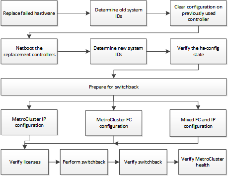

= マルチコントローラまたはストレージの障害からのリカバリ
:allow-uri-read: 
:icons: font
:imagesdir: ../media/

[role="lead"]
MetroCluster 構成内の DR グループの一方の側のすべてのコントローラモジュール（ 2 ノード MetroCluster 構成の 1 台のコントローラを含む）でコントローラの障害が発生した場合、またはストレージが交換された場合は、機器を交換し、ドライブの所有権を再割り当てして、災害からリカバリする必要があります。

この手順を実行する前に、次のタスクを確認して実行したことを確認します。

* この手順の使用を決定する前に、使用可能なリカバリ手順を確認してください。
+
link:concept_choosing_the_correct_recovery_procedure_parent_concept.html["正しいリカバリ手順の選択"]

* デバイスでコンソールログが有効になっていることを確認します。
+
link:task-enable-console-logging.html["コンソールログを有効にする"]

* ディザスタサイトがフェンシングされていることを確認します。
+
link:task_perform_a_forced_switchover_after_a_disaster.html#fencing-off-the-disaster-site["ディザスタサイトのフェンシング"]。

* スイッチオーバーが実行されたことを確認します。
+
link:task_perform_a_forced_switchover_after_a_disaster.html#performing-a-forced-switchover["強制スイッチオーバーの実行"]。

* 交換用ドライブとコントローラモジュールが新しく、以前に所有権が割り当てられていないことを確認します。
* この手順の例では、 2 ノードまたは 4 ノードの構成を示しています。8 ノード構成（ 2 つの DR グループ）の場合は、追加のコントローラモジュールの障害をすべて考慮し、必要なリカバリタスクを実行する必要があります。

この手順では次のワークフローを使用します。

この手順は、障害発生時に移行中だったシステムに対してリカバリを実行する場合に使用できます。その場合は、手順に示されているように、スイッチバックの準備の際に適切な手順を実行する必要があります。
