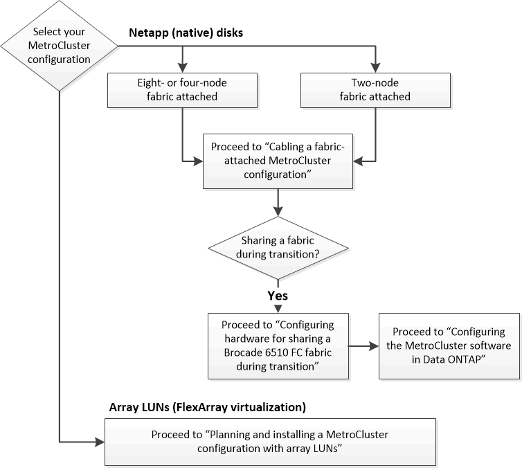

= 構成に適したインストール手順の選択
:icons: font
:imagesdir: ../media/

[role="lead"]
FlexArray LUN を使用しているかどうか、 MetroCluster 構成のノード数、および 7-Mode のファブリック MetroCluster で使用されている既存の FC スイッチファブリックを共有しているかどうかに基づいて、正しいインストール手順を選択する必要があります。

|===

| インストールの種類 | 使用する手順 

 a| 
ネットアップ（ネイティブ）ディスクを使用するファブリック接続構成
 a| 
. link:task_configure_the_mcc_hardware_components_fabric.html["ファブリック接続 MetroCluster 構成のケーブル接続"]
. link:concept_configure_the_mcc_software_in_ontap.html["ONTAP での MetroCluster ソフトウェアの設定"]

 a| 
既存の FC スイッチファブリックを共有するファブリック接続構成

このインストールは、 Brocade 6510 スイッチを使用する 7-Mode ファブリック MetroCluster 構成を含む一時的な構成としてのみサポートされています。
 a| 
. link:task_configure_the_mcc_hardware_components_fabric.html["ファブリック接続 MetroCluster 構成のケーブル接続"]
. link:task_fmc_mcc_transition_configure_the_mcc_hardware_for_share_a_7_mode_brocade_6510_fc_fabric_dure_transition.html["移行中に 7-Mode Brocade 6510 FC ファブリックを共有するための MetroCluster ハードウェアの構成"]
. link:concept_configure_the_mcc_software_in_ontap.html["ONTAP での MetroCluster ソフトウェアの設定"]

|===