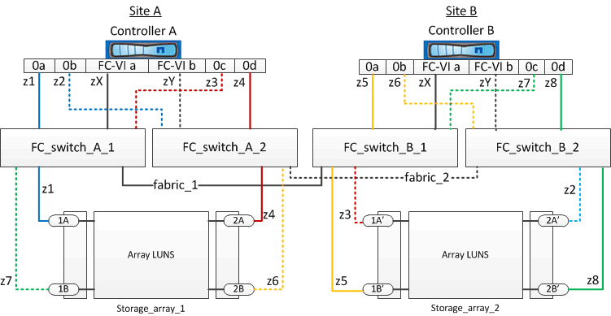

= アレイ LUN を使用する 2 ノード MetroCluster 構成におけるスイッチゾーニングの例
:icons: font
:imagesdir: ../media/

[role="lead"]
スイッチゾーニングは、接続されているノード間のパスを定義しますゾーニングを設定すると、特定の ONTAP システムでどのアレイ LUN を認識できるかを定義できます。

アレイ LUN を使用する 2 ノードファブリック接続 MetroCluster 構成のゾーニングを決定するときは、次の例を参照してください。

この例は、 MetroCluster 構成のシングルイニシエータからシングルターゲットのゾーニングを示しています。この例では、接続ではなくゾーンを表しており、該当するゾーン番号が記載されています。

この例では、アレイ LUN が各ストレージアレイに割り当てられています。SyncMirror の要件に従って、両方のサイトのストレージアレイで同じサイズの LUN がプロビジョニングされます。各 ONTAP システムに、アレイ LUN へのパスが 2 つずつあります。ストレージアレイのポートは冗長な構成になっています。

両方のサイトの冗長なアレイポートペアは次のとおりです。

* サイト A のストレージアレイ：
+
** ポート 1A と 2A
** ポート 1B と 2B

* サイト B のストレージアレイ：
+
** ポート 1A' と 2A'
** ポート 1B' と 2B'

各ストレージアレイの冗長ポートペアが代替パスを形成し、そのため、ポートペアの両方のポートが、対応するストレージアレイの LUN にアクセスできます。

次の表に、この図のゾーンを示します。

|===
| ゾーン | ONTAP のコントローラとイニシエータポート | ストレージアレイポート 

 a| 
* FC_switch_A_1

 a| 
Z1
 a| 
コントローラ A ：ポート 0a
 a| 
ポート 1A

 a| 
Z3
 a| 
コントローラ A ：ポート 0c
 a| 
ポート 1A'

 a| 
* FC_switch_A_2 *

 a| 
Z2
 a| 
コントローラ A ：ポート 0b
 a| 
ポート 2A'

 a| 
Z4
 a| 
コントローラ A ：ポート 0d
 a| 
ポート 2A

 a| 
* FC_switch_B_1
 a| 

 a| 
Z5
 a| 
コントローラ B ：ポート 0a
 a| 
ポート 1B'

 a| 
Z7
 a| 
コントローラ B ：ポート 0c
 a| 
ポート 1B

 a| 
* FC_switch_B_2 *
 a| 

 a| 
Z6
 a| 
コントローラ B ：ポート 0b
 a| 
ポート 2B

 a| 
Z8
 a| 
コントローラ B ：ポート 0d
 a| 
ポート 2B'

|===
次の表に、 FC-VI 接続のゾーンを示します。

|===
| ゾーン | ONTAP のコントローラとイニシエータポート | スイッチ 

 a| 
* サイト A *
 a| 

 a| 
ZX （ ZX ）
 a| 
コントローラ A ：ポート FC-VI a
 a| 
FC_switch_A_1 を使用します

 a| 
ZY
 a| 
コントローラ A ：ポート FC-VI b
 a| 
FC_switch_A_2

 a| 
* サイト B *
 a| 

 a| 
ZX （ ZX ）
 a| 
コントローラ B ：ポート FC-VI a
 a| 
FC_switch_B_1

 a| 
ZY
 a| 
コントローラ B ：ポート FC-VI b
 a| 
FC_switch_B_2

|===
* 関連情報 *

xref:reference_requirements_for_switch_zoning_in_a_mcc_configuration_with_array_luns.adoc[アレイ LUN を使用する MetroCluster 構成におけるスイッチゾーニングの要件]

xref:concept_example_of_switch_zoning_in_a_four_node_mcc_configuration_with_array_luns.adoc[アレイ LUN を使用する 4 ノード MetroCluster 構成におけるスイッチゾーニングの例]

xref:concept_example_of_switch_zoning_in_an_eight_node_mcc_configuration_with_array_luns.adoc[アレイ LUN を使用する 8 ノード MetroCluster 構成におけるスイッチゾーニング例]
