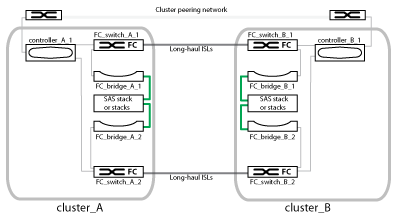

= ファブリック MetroCluster 構成のコンポーネント
:allow-uri-read: 
:icons: font
:imagesdir: ../media/

[role="lead"]
MetroCluster 構成を計画するときは、ハードウェアコンポーネントとその相互接続について理解しておく必要があります。

== ディザスタリカバリ（ DR ）グループ

ファブリック MetroCluster 構成は、 MetroCluster 構成のノード数に応じて、 1 つまたは 2 つの DR グループで構成されます。各 DR グループは 4 つのノードで構成されます。

* 8 ノードの MetroCluster 構成は、 2 つの DR グループで構成されます。
* 4 ノード MetroCluster 構成は、 1 つの DR グループで構成されます。

次の図は、 8 ノードの MetroCluster 構成におけるノードの編成を示しています。

image::../media/mcc_dr_groups_8_node.gif[MCC DR グループ 8 ノード]

次の図は、 4 ノード MetroCluster 構成におけるノードの編成を示しています。

image::../media/mcc_dr_groups_4_node.gif[MCC DR グループ 4 ノード]

== 主要なハードウェア要素

MetroCluster 構成には、中核をなす次のハードウェアが含まれます。

* ストレージコントローラ
+
ストレージコントローラはストレージに直接は接続されず、 2 つの冗長 FC スイッチファブリックに接続されます。

* FC-to-SAS ブリッジ
+
FC-to-SAS ブリッジは、 SAS ストレージスタックを FC スイッチに接続し、 2 つのプロトコル間のブリッジの役割を果たします。

* FC スイッチ
+
FC スイッチは、 2 つのサイト間の長距離基幹 ISL の役割を果たします。FC スイッチが提供する 2 つのストレージファブリックによって、リモートストレージプールへのデータミラーリングが可能になります。

* クラスタピアリングネットワーク
+
クラスタピアリングネットワークは、 Storage Virtual Machine （ SVM ）の設定を含むクラスタ構成をミラーするための接続を提供します。一方のクラスタのすべての SVM の設定が、パートナークラスタにミラーされます。

== 8 ノードのファブリック MetroCluster 構成

8 ノードの構成は、地理的に離れたサイトにある 2 つのクラスタで構成されています。cluster_A は 1 つ目の MetroCluster サイトに配置されています。cluster_B は 2 つ目の MetroCluster サイトに配置されています。各サイトには、 SAS ストレージスタックが 1 つあります。追加のストレージスタックもサポートされますが、図では各サイトに 1 つしかありません。HA ペアは、クラスタインターコネクトスイッチのないスイッチレスクラスタとして構成されています。スイッチを使用する構成もサポートされますが、ここでは使用していません。

8 ノード構成には次の接続が含まれます。

* 各コントローラの HBA アダプタおよび FC-VI アダプタから各 FC スイッチへの FC 接続
* 各 FC-to-SAS ブリッジから FC スイッチへの FC 接続
* 各 SAS シェルフ間および各スタックの上下から FC-to-SAS ブリッジへの SAS 接続
* ローカル HA ペアの各コントローラ間の HA インターコネクト
+
コントローラが単一シャーシの HA ペアをサポートしている場合、 HA インターコネクトはバックプレーンを使用して内部で接続されます。つまり、外部のインターコネクトは必要ありません。

* コントローラからクラスタピアリングに使用されるお客様ネットワークへのイーサネット接続
+
SVM の設定はクラスタピアリングネットワーク経由でレプリケートされます。

* ローカルクラスタの各コントローラ間のクラスタインターコネクト

== 4 ノードのファブリック MetroCluster 構成

次の図は、 4 ノードのファブリック MetroCluster 構成を単純化したものです。一部の接続では、コンポーネント間の複数の冗長接続を 1 本の線で表しています。データネットワーク接続と管理ネットワーク接続は表示されません。

image::../media/mcc_hardware_architecture_both_clusters.gif[MCC ハードウェアアーキテクチャ：両方のクラスタ]

次の図は、単一の MetroCluster クラスタ（両方のクラスタの構成が同じ）内の接続をより詳細に示したものです。

image::../media/mcc_hardware_architecture_cluster_a_with_7500n.gif[MCC ハードウェアアーキテクチャクラスタ A （ 7500n]

== 2 ノードのファブリック MetroCluster 構成

次の図は、 2 ノードのファブリック MetroCluster 構成を単純化したものです。一部の接続では、コンポーネント間の複数の冗長接続を 1 本の線で表しています。データネットワーク接続と管理ネットワーク接続は表示されません。

2 ノードの構成は、地理的に離れたサイトにある 2 つのクラスタで構成されています。cluster_A は 1 つ目の MetroCluster サイトに配置されています。cluster_B は 2 つ目の MetroCluster サイトに配置されています。各サイトには、 SAS ストレージスタックが 1 つあります。追加のストレージスタックもサポートされますが、図では各サイトに 1 つしかありません。

NOTE: 2 ノード構成では、ノードが HA ペアとして構成されません。

次の図は、単一の MetroCluster クラスタ（両方のクラスタの構成が同じ）内の接続をより詳細に示したものです。

image::../media/mcc_hardware_architecture_cluster_a_2_node_with_7500n.gif[MCC ハードウェアアーキテクチャでは、 7500n の 2 ノードをクラスタしています]

2 ノード構成には次の接続が含まれます。

* 各コントローラモジュールの FC-VI アダプタ間の FC 接続
* 各コントローラモジュールの HBA から各 SAS シェルフスタックの FC-to-SAS ブリッジへの FC 接続
* 各 SAS シェルフ間および各スタックの上下から FC-to-SAS ブリッジへの SAS 接続
* コントローラからクラスタピアリングに使用されるお客様ネットワークへのイーサネット接続
+
SVM の設定はクラスタピアリングネットワーク経由でレプリケートされます。

