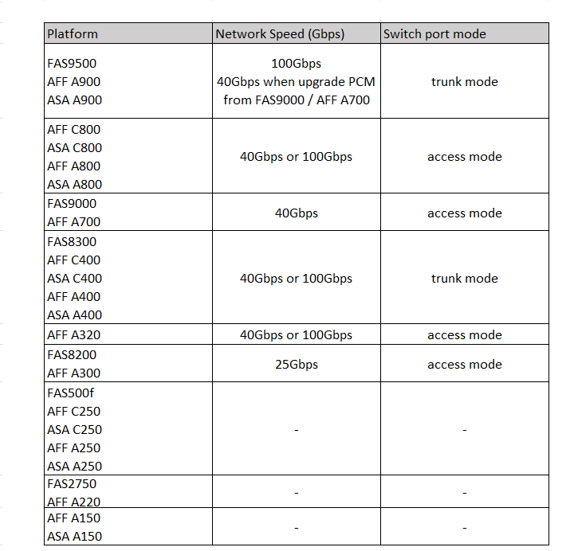

= MetroCluster準拠スイッチのプラットフォーム固有のネットワーク速度とスイッチポートモード
:allow-uri-read: 
:icons: font
:imagesdir: ../media/

[role="lead"]
MetroCluster準拠のスイッチを使用している場合は、プラットフォーム固有のネットワーク速度とスイッチポートモードの要件を確認しておく必要があります。

次の表に、MetroCluster準拠スイッチのネットワーク速度とスイッチポートモードをプラットフォーム別に示します。表に従ってスイッチポートモードを設定する必要があります。

NOTE: 値がない場合は、プラットフォームをMetroCluster準拠のスイッチで使用できないことを示しています。

