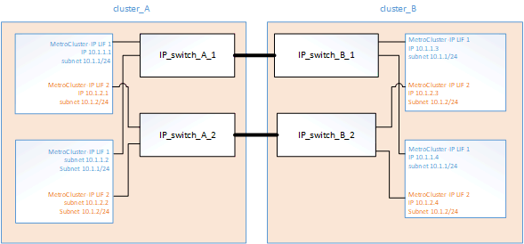

= MetroCluster IP 構成に関する考慮事項
:allow-uri-read: 
:icons: font
:imagesdir: ../media/

[role="lead"]
コントローラがリモートストレージにアクセスする方法と MetroCluster IP アドレスの仕組みを理解しておく必要があります。

== MetroCluster IP 構成のリモートストレージへのアクセス

MetroCluster IP 構成では、ローカルコントローラからリモートストレージプールにアクセスするには、リモートコントローラを使用する必要があります。IP スイッチはコントローラのイーサネットポートに接続され、ディスクシェルフに直接は接続されません。リモートコントローラが停止した場合、ローカルコントローラはリモートストレージプールにアクセスできません。

これは、 MetroCluster FC 構成とは異なります。 FC ファブリックまたは SAS 接続を介してリモートストレージプールがローカルコントローラに接続されます。ローカルコントローラはリモートコントローラが停止してもリモートストレージにアクセスできます。

== MetroCluster の IP アドレス

MetroCluster IP 構成での MetroCluster IP アドレスとインターフェイスの実装方法、および関連する要件について理解しておく必要があります。

MetroCluster IP 構成では、 HA ペア間および DR パートナー間でのストレージと不揮発性キャッシュのレプリケーションが、 MetroCluster IP ファブリック内の広帯域の専用リンクを使用して行われます。ストレージのレプリケーションには iSCSI 接続が使用されます。IP スイッチは、ローカルクラスタ内のすべてのクラスタ内トラフィックにも使用されます。MetroCluster トラフィックは、別の IP サブネットと VLAN を使用することでクラスタ内トラフィックから分離されます。MetroCluster IP ファブリックは、クラスタピアリングネットワークとは別のものです。

MetroCluster IP 構成では、バックエンド MetroCluster IP ファブリック用に予約された IP アドレスが各ノードに 2 つ必要です。予約された IP アドレスは、初期設定時に MetroCluster IP の論理インターフェイス（ LIF ）に割り当てられます。この IP アドレスの要件は次のとおりです。

NOTE: MetroCluster の IP アドレスは初期設定後は変更できないため、慎重に選択する必要があります。

* 一意の IP 範囲に属している必要があります。
+
環境内のどの IP スペースとも重複しないようにしてください。

* 2 つの IP サブネットのいずれかに属し、他のすべてのトラフィックから分離されている必要があります。

たとえば、次のようにノードの IP アドレスを設定できます。

|===

| ノード | インターフェイス | IP アドレス | サブネット 

 a| 
node_A_1
 a| 
MetroCluster IP インターフェイス 1
 a| 
10.1.1.1
 a| 
10.1.1/24

 a| 
node_A_1
 a| 
MetroCluster IP インターフェイス 2
 a| 
10.1.2.1
 a| 
10.1.2/24

 a| 
Node_a_2
 a| 
MetroCluster IP インターフェイス 1
 a| 
10.1.1.2
 a| 
10.1.1/24

 a| 
Node_a_2
 a| 
MetroCluster IP インターフェイス 2
 a| 
10.1.2.2
 a| 
10.1.2/24

 a| 
node_B_1
 a| 
MetroCluster IP インターフェイス 1
 a| 
10.1.1.3 の場合
 a| 
10.1.1/24

 a| 
node_B_1
 a| 
MetroCluster IP インターフェイス 2
 a| 
10.1.2.3
 a| 
10.1.2/24

 a| 
node_B_2
 a| 
MetroCluster IP インターフェイス 1
 a| 
10.1.1.4
 a| 
10.1.1/24

 a| 
node_B_2
 a| 
MetroCluster IP インターフェイス 2
 a| 
10.1.2.4
 a| 
10.1.2/24

|===

== MetroCluster IP インターフェイスの特性

MetroCluster IP インターフェイスは、 MetroCluster IP 構成に固有のインターフェイスです。他の ONTAP インターフェイスタイプとは異なる特性があります。

* これらは ' 初期 MetroCluster 構成の一部として MetroCluster configurion-settings interface create コマンドによって作成されます
+

NOTE: ONTAP 9.9..1 以降では、レイヤ 3 設定を使用している場合、 MetroCluster IP インターフェイスを作成するときに -gateway パラメータも指定する必要があります。を参照してください link:../install-ip/concept_considerations_layer_3.html["レイヤ 3 ワイドエリアネットワークに関する考慮事項"]。

+
ネットワークインターフェイスのコマンドで作成または変更することはできません。

* これらは 'network interface show コマンドの出力には表示されません
* フェイルオーバーせず、作成時と同じポートに関連付けられたままになります。
* MetroCluster IP 構成では、 MetroCluster IP インターフェイスに特定のイーサネットポート（プラットフォームによって異なる）を使用します。

