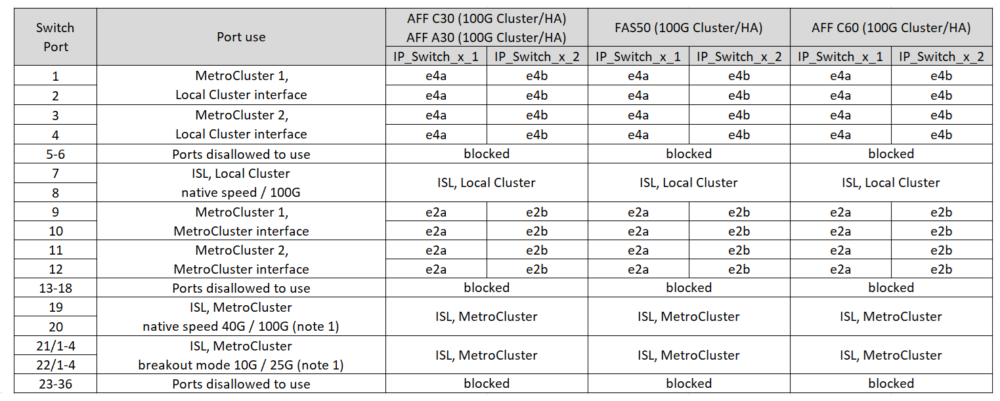

= 12ポートCisco 9336C-FX2スイッチのプラットフォームポート割り当て
:allow-uri-read: 
:icons: font
:imagesdir: ../media/

[role="lead"]
MetroCluster IP 構成で使用するポートは、スイッチのモデルとプラットフォームのタイプによって異なります。

構成テーブルを使用する前に、次の考慮事項を確認してください。

* このセクションの表は、12 ポートの Cisco 9336C-FX2 スイッチ用です。
+
NS224シェルフに接続していない36ポートのCisco 9336C-FX2スイッチがある場合は、 link:port_usage_3232c_9336c.html["Cisco 3232C または 36 ポート Cisco 9336C-FX2 スイッチのプラットフォーム ポート割り当て"] 。

+
36ポートのCisco 9336C-FX2スイッチがあり、少なくとも1つのMetroCluster構成またはDRグループがNS224シェルフをMetroClusterスイッチに接続している場合は、 link:port_usage_9336c_shared.html["NS224ストレージを接続する36ポートCisco 9336C-FX2スイッチのプラットフォームポート割り当て"] 。

NOTE: 12 ポートの Cisco 9336C-FX2 スイッチは、NS224 シェルフを MetroCluster スイッチに接続することをサポートしていません。

* 次の表は、サイト A で使用するポートを示していますサイト B でも同じケーブル接続が使用されます
* 異なる速度のポート (たとえば、100 Gbps ポートと 40 Gbps ポートの混在) を持つスイッチを構成することはできません。
* スイッチを使用して 1 つの MetroCluster を設定する場合は、 * MetroCluster 1 * ポートグループを使用します。
+
MetroClusterポートグループ（MetroCluster 1、MetroCluster 2）を把握しておいてください。この設定手順の後半で説明するRcfFileGeneratorツールを使用する際に必要になります。

* また、 RcfFileGenerator for MetroCluster IP では、各スイッチのポートごとのケーブル配線の概要についても説明します。

== 構成に適したケーブル接続テーブルを選択

次の表を使用して、必要なケーブル接続の表を特定します。

[cols="25,75"]
|===
| システムの状態 | 使用するケーブル接続テーブル 

| AFF A150、ASA A150 FAS500f AFF C250、ASA C250 AFF A250、ASA A250 | <<table_1_cisco_12port_9336c,Cisco 9336C-FX2 12 ポート プラットフォームのポート割り当て (グループ 1)>> 

| AFF A20用 | <<table_2_cisco_12port_9336c,Cisco 9336C-FX2 12ポート プラットフォームのポート割り当て（グループ2）>> 

| AFF A30、AFF C30 FAS50 AFF C60  a| 
次の表は、25G（グループ3a）と100G（グループ3b）のどちらのイーサネットカードを使用しているかによって異なります。

* <<table_3a_cisco_12port_9336c,Cisco 9336C-FX2 12 ポート プラットフォームのポート割り当て (グループ 3a - 25G)>>
* <<table_3b_cisco_12port_9336c,Cisco 9336C-FX2 12 ポート プラットフォームのポート割り当て (グループ 3b - 100G)>>

| FAS8300、AFF C400、ASA C400、FAS8700 AFF A400、ASA A400 | <<table_4_cisco_12port_9336c,Cisco 9336C-FX2 12 ポート プラットフォームのポート割り当て (グループ 4)>> 

| AFF A50用 | <<table_5_cisco_12port_9336c,Cisco 9336C-FX2 12ポート プラットフォームのポート割り当て（グループ5）>> 

| AFF C800、ASA C800、AFF A800、ASA A800 FAS9500、AFF A900、ASA A900 | <<table_6_cisco_12port_9336c,Cisco 9336C-FX2 12ポート プラットフォームのポート割り当て（グループ 6）>> 

| FAS70、AFF A70 AFF C80 FAS90、AFF A90 AFF A1K | <<table_7_cisco_12port_9336c,Cisco 9336C-FX2 12ポート プラットフォームのポート割り当て（グループ7）>> 
|===
.Cisco 9336C-FX2 12 ポート プラットフォームのポート割り当て (グループ 1)
AFF A150、ASA A150、FAS500f、AFF C250、ASA C250、AFF A250、または ASA A250 システムを 12 ポートの Cisco 9336C-FX2 スイッチにケーブル接続するには、プラットフォーム ポートの割り当てを確認します。

image:../media/mccip-cabling-9336c-12-port-a150-fas500f-a250-c250.png["Cisco 9336C-FX2 12ポートプラットフォームのポート割り当てを示します"]

*注 1:* 設定できるのはポート 19 と 20、またはポート 21 と 22 のみです。ポート 19 と 20 を先に使用した場合、ポート 21 と 22 はブロックされます。ポート 21 と 22 を先に使用した場合、ポート 19 と 20 はブロックされます。

.Cisco 9336C-FX2 12ポート プラットフォームのポート割り当て（グループ2）
AFF A20 システムを 12 ポートの Cisco 9336C-FX2 スイッチにケーブル接続するためのプラットフォーム ポートの割り当てを確認します。

image:../media/mccip-cabling-9336c-12-port-a20.png["Cisco 9336C-FX2 12ポートプラットフォームのポート割り当てを示します"]

*注 1:* 設定できるのはポート 19 と 20、またはポート 21 と 22 のみです。ポート 19 と 20 を先に使用した場合、ポート 21 と 22 はブロックされます。ポート 21 と 22 を先に使用した場合、ポート 19 と 20 はブロックされます。

.Cisco 9336C-FX2 12ポート プラットフォームのポート割り当て（グループ3a）
4 ポート 25G イーサネット カードを使用して、AFF A30、AFF C30、AFF C60、または FAS50 システムを 12 ポートの Cisco 9336C-FX2 スイッチにケーブル接続するためのプラットフォーム ポートの割り当てを確認します。

NOTE: この構成では、ローカルクラスタとHAインターフェイスを接続するために、スロット4に4ポートの25Gイーサネットカードが必要です。

image:../media/mccip-cabling-9336c-12-port-a30-c30-fas50-c60-25g.png["Cisco 9336C-FX2 12ポートプラットフォームのポート割り当てを示します"]

*注 1:* 設定できるのはポート 19 と 20、またはポート 21 と 22 のみです。ポート 19 と 20 を先に使用した場合、ポート 21 と 22 はブロックされます。ポート 21 と 22 を先に使用した場合、ポート 19 と 20 はブロックされます。

.Cisco 9336C-FX2 12ポート プラットフォームのポート割り当て（グループ3b）
2 ポート 100G イーサネット カードを使用して、AFF A30、AFF C30、AFF C60、または FAS50 システムを 12 ポートの Cisco 9336C-FX2 スイッチにケーブル接続するためのプラットフォーム ポートの割り当てを確認します。

NOTE: この構成では、ローカルクラスタとHAインターフェイスを接続するために、スロット4に2ポートの100Gイーサネットカードが必要です。

*注 1:* 設定できるのはポート 19 と 20、またはポート 21 と 22 のみです。ポート 19 と 20 を先に使用した場合、ポート 21 と 22 はブロックされます。ポート 21 と 22 を先に使用した場合、ポート 19 と 20 はブロックされます。

.Cisco 9336C-FX2 12 ポート プラットフォームのポート割り当て (グループ 4)
FAS8300、AFF C400、ASA C400、FAS8700、AFF A400、または ASA A400 システムを 12 ポートの Cisco 9336C-FX2 スイッチにケーブル接続するには、プラットフォーム ポートの割り当てを確認します。

image::../media/mccip-cabling-9336c-12-port-a400-c400-fas8300-fas8700.png[Cisco 9336C-FX2 12ポートプラットフォームのポート割り当てを示します]

*注 1:* 設定できるのはポート 19 と 20、またはポート 21 と 22 のみです。ポート 19 と 20 を先に使用した場合、ポート 21 と 22 はブロックされます。ポート 21 と 22 を先に使用した場合、ポート 19 と 20 はブロックされます。

.Cisco 9336C-FX2 12ポート プラットフォームのポート割り当て（グループ5）
AFF A50 システムを 12 ポートの Cisco 9336C-FX2 スイッチにケーブル接続するためのプラットフォーム ポートの割り当てを確認します。

image::../media/mccip-cabling-9336c-12-port-a50.png[Cisco 9336C-FX2 12ポートプラットフォームのポート割り当てを示します]

*注 1:* 設定できるのはポート 19 と 20、またはポート 21 と 22 のみです。ポート 19 と 20 を先に使用した場合、ポート 21 と 22 はブロックされます。ポート 21 と 22 を先に使用した場合、ポート 19 と 20 はブロックされます。

.Cisco 9336C-FX2 12ポート プラットフォームのポート割り当て（グループ 6）
AFF C800、ASA C800、AFF A800、ASA A800、FAS9500、AFF A900、または ASA A900 システムを 12 ポートの Cisco 9336C-FX2 スイッチにケーブル接続するためのプラットフォーム ポートの割り当てを確認します。

image::../media/mccip-cabling-9336c-12-port-c800-a800-fas9500-a900.png[Cisco 9336C-FX2 12ポートプラットフォームのポート割り当てを示します]

*注 1:* 設定できるのはポート 19 と 20、またはポート 21 と 22 のみです。ポート 19 と 20 を先に使用した場合、ポート 21 と 22 はブロックされます。ポート 21 と 22 を先に使用した場合、ポート 19 と 20 はブロックされます。

*注 2:* X91440A アダプタ (40Gbps) を使用している場合は、ポート e4a と e4e、またはポート e4a と e8a のいずれかを使用します。ポートe4aとe4b、またはX91153Aアダプタ（100Gbps）を使用している場合はe4aとe8aのいずれかを使用します。

.Cisco 9336C-FX2 12ポート プラットフォームのポート割り当て（グループ7）
AFF A70、FAS70、AFF C80、FAS90、AFF A90、または AFF A1K システムを 12 ポートの Cisco 9336C-FX2 スイッチにケーブル接続するには、プラットフォーム ポートの割り当てを確認します。

image:../media/mccip-cabling-9336c-12-port-fas70-a70-c80-fas90-a90-a1k.png["Cisco 9336C-FX2 12ポートプラットフォームのポート割り当てを示します"]

*注 1:* 設定できるのはポート 19 と 20、またはポート 21 と 22 のみです。ポート 19 と 20 を先に使用した場合、ポート 21 と 22 はブロックされます。ポート 21 と 22 を先に使用した場合、ポート 19 と 20 はブロックされます。
