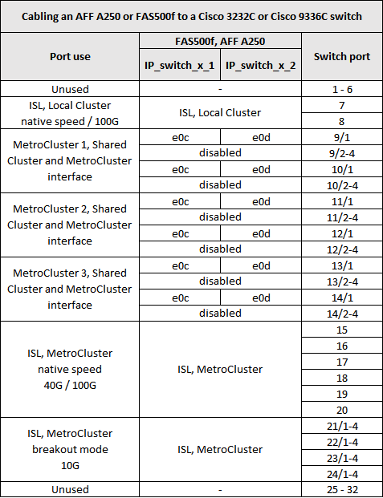
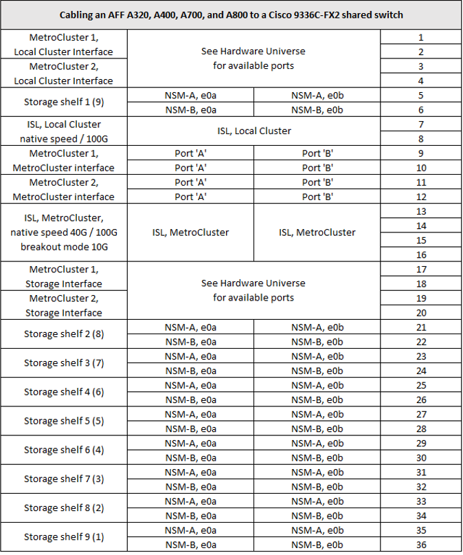

= Cisco 3232C スイッチまたは Cisco 9336C スイッチのプラットフォームポートの割り当て
:icons: font
:imagesdir: ../media/

[role="lead"]
MetroCluster IP 構成で使用するポートは、スイッチのモデルとプラットフォームのタイプによって異なります。

表を使用する前に、次の考慮事項を確認してください。

* 次の表は、サイト A で使用するポートを示していますサイト B でも同じケーブル接続が使用されます
* 速度が異なるポート（ 100Gbps ポートと 40Gbps ポートなど）をスイッチに設定することはできません。
* スイッチを使用して 1 つの MetroCluster を設定する場合は、 * MetroCluster 1 * ポートグループを使用します。
+
MetroCluster ポートグループ（ MetroCluster 1 、 MetroCluster 2 、または MetroCluster 3 ）を追跡します。RcfFileGenerator ツールを使用する場合は、この設定手順で後述するように、このツールが必要になります。

* また、 RcfFileGenerator for MetroCluster IP では、各スイッチのポートごとのケーブル配線の概要についても説明します。
+
ケーブル接続の概要を使用して、ケーブル接続を検証します。

== 2 つの MetroCluster 構成とスイッチのケーブル接続

複数の MetroCluster 設定を Cisco 3132Q-V スイッチにケーブル接続する場合は、該当する表に従って各 MetroCluster をケーブル接続します。たとえば、 FAS2750 と A700 を同じ Cisco 3132Q-V スイッチにケーブル接続する場合などです。次に、表 1 の「 MetroCluster 1 」に従って FAS2750 をケーブル接続し、表 2 の「 MetroCluster 2 」または「 MetroCluster 3 」に従って A700 をケーブル接続します。FAS2750 と A700 を「 MetroCluster 1 」として物理的にケーブル接続することはできません。

== FAS2750 または AFF A220 システムから Cisco 3232C または Cisco 9336C スイッチへのケーブル接続

image::../media/mcc_ip_cabling_an_aff_a220_or_fas2750_to_a_cisco_3232c_or_cisco_9336c_switch.png[MCC IP のケーブル接続： AFF A220 または fas2750 から Cisco 32c または Cisco 9336c スイッチへ]

== AFF A300 または FAS8200 と Cisco 3232C または Cisco 9336C スイッチのケーブル接続

image::../media/mcc_ip_cabling_a_aff_a300_or_fas8200_to_a_cisco_3232c_or_cisco_9336c_switch.png[MCC IP ケーブル構成： AFF A300 または fas8200 から Cisco 32c または Cisco 9336c スイッチへの接続]

== AFF A250 または FAS500f から Cisco 3232C または Cisco 9336C スイッチへのケーブル接続

== AFF A320 を Cisco 3232C スイッチまたは Cisco 9336C スイッチにケーブル接続する

image::../media/cabling_a_aff_a320_to_a_cisco_3232c_or_cisco_9336c_switch.png[AFF A320 を Cisco 32c スイッチまたは Cisco 9336c スイッチにケーブル接続する]

== AFF A400 、 FAS8300 、 FAS8700 と Cisco 3232C または Cisco 9336C スイッチのケーブル接続

image::../media/cabling_a_mcc_ip_aff_a400_fas8300_or_fas8700_to_a_cisco_3232c_or_cisco_9336c_switch.png[MCC IP AFF 400fas8300 または fas8700 から Cisco 32c または Cisco 9336c スイッチへのケーブル接続]

== AFF A700 または FAS9000 から Cisco 3232C または Cisco 9336C スイッチへのケーブル接続

image::../media/mcc_ip_cabling_a_aff_a700_or_fas9000_to_a_cisco_3232c_or_cisco_9336c_switch.png[MCC IP のケーブル接続： AFF A700 または fas9000 から Cisco 32c スイッチまたは Cisco 9336c スイッチ]

== AFF A800 から Cisco 3232C または Cisco 9336C スイッチへのケーブル接続

image::../media/cabling_an_aff_a800_to_a_cisco_3232c_or_cisco_9336c_switch.png[AFF A800 から Cisco 3232c または Cisco 9336c スイッチへのケーブル接続]

== AFF A320 、 AFF A400 、 AFF A700 、 AFF A800 を Cisco 9336C-FX2 共有スイッチにケーブル接続する方法

image::../media/mcc_interfaces_per_platform_9336-shared.png[プラットフォームごとの MCC インターフェイス 9336 共有]
