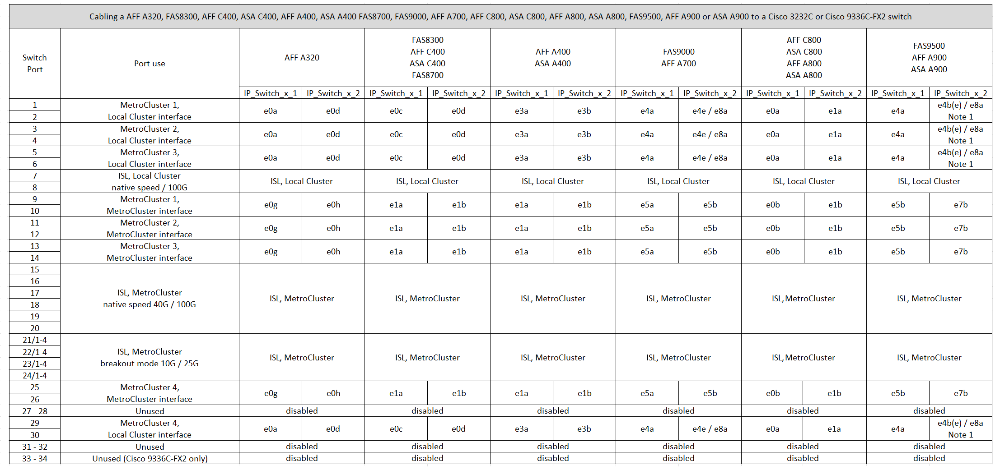

= Cisco 3232C スイッチまたは Cisco 9336C スイッチのプラットフォームポートの割り当て
:allow-uri-read: 
:icons: font
:imagesdir: ../media/

[role="lead"]
MetroCluster IP 構成で使用するポートは、スイッチのモデルとプラットフォームのタイプによって異なります。

表を使用する前に、次の考慮事項を確認してください。

* 次の表は、サイト A で使用するポートを示していますサイト B でも同じケーブル接続が使用されます
* 速度が異なるポート（ 100Gbps ポートと 40Gbps ポートなど）をスイッチに設定することはできません。
* スイッチを使用して 1 つの MetroCluster を設定する場合は、 * MetroCluster 1 * ポートグループを使用します。
+
MetroCluster ポートグループ（ MetroCluster 1 、 MetroCluster 2 、または MetroCluster 3 ）を追跡します。RcfFileGenerator ツールを使用する場合は、この設定手順で後述するように、このツールが必要になります。

* また、 RcfFileGenerator for MetroCluster IP では、各スイッチのポートごとのケーブル配線の概要についても説明します。
+
ケーブル接続の概要を使用して、ケーブル接続を検証します。

== 2 つの MetroCluster 構成とスイッチのケーブル接続

複数のMetroCluster 構成をCisco 3132Q-Vスイッチにケーブル接続する場合は、該当する表に従って各MetroCluster をケーブル接続する必要があります。たとえば、FAS2750とAFF A700を同じCisco 3132Q-Vスイッチにケーブル接続する場合などです。次に、表1の「MetroCluster 1」に従ってFAS2750をケーブル接続し、表2の「MetroCluster 2」または「MetroCluster 3」に従ってAFF A700をケーブル接続します。FAS2750とAFF A700の両方を「MetroCluster 1」として物理的にケーブル接続することはできません。

== AFF A150、FAS2750、AFF A220、FAS500f、AFF C250、またはAFF A250とCisco 3232CまたはCisco 9336-FX2Cスイッチのケーブル接続

image::../media/mcc_ip_cabling_a150_a220_a250_to_a_cisco_3232c_or_cisco_9336c_switch.png[a150 A220 A250とCisco 3232cまたはCisco 9336cスイッチのMCC IPケーブル接続]

== FAS8200またはAFF A300とCisco 3232CまたはCisco 9336Cスイッチのケーブル接続

image::../media/mcc_ip_cabling_a_aff_a300_or_fas8200_to_a_cisco_3232c_or_cisco_9336c_switch.png[MCC IP ケーブル構成： AFF A300 または fas8200 から Cisco 32c または Cisco 9336c スイッチへの接続]

== AFF A320、FAS8300、AFF C400、AFF A400、FAS8700のケーブル接続 FAS9000、AFF A700、AFF C800、AFF A800、FAS9500、またはAFF A900

== AFF A320、AFF C400、AFF A400、AFF A700、AFF C800のケーブル接続 またはAFF A800からCisco 9336C-FX2共有スイッチへの接続

image::../media/mcc_ip_cabling_aff_a320_c400_a400_a700_c800_a800_to_cisco_9336c_shared_switch.png[AFF A320 C400 a400 a700 c800 A800とCisco 9336c共有スイッチのMCC IPケーブル接続]
