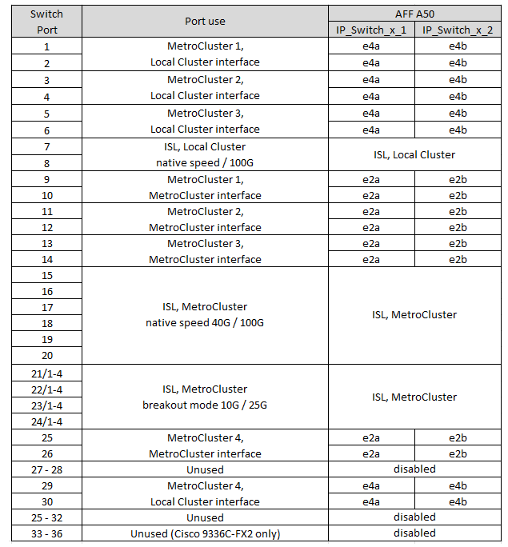
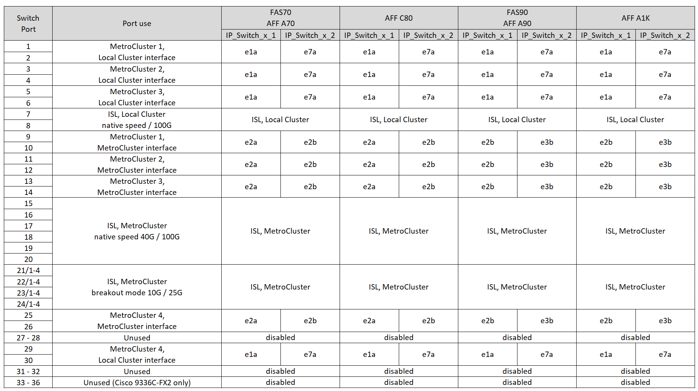

= Cisco 3232CまたはCisco 9336C-FX2スイッチのプラットフォームポート割り当て
:allow-uri-read: 
:icons: font
:imagesdir: ../media/

[role="lead"]
MetroCluster IP 構成で使用するポートは、スイッチのモデルとプラットフォームのタイプによって異なります。

構成テーブルを使用する前に、次の考慮事項を確認してください。

* 次の表は、サイト A で使用するポートを示していますサイト B でも同じケーブル接続が使用されます
* 速度が異なるポート（ 100Gbps ポートと 40Gbps ポートなど）をスイッチに設定することはできません。
* スイッチを使用して 1 つの MetroCluster を設定する場合は、 * MetroCluster 1 * ポートグループを使用します。
+
MetroClusterポートグループ（MetroCluster 1、MetroCluster 2、MetroCluster 3、またはMetroCluster 4）を追跡します。RcfFileGenerator ツールを使用する場合は、この設定手順で後述するように、このツールが必要になります。

* また、 RcfFileGenerator for MetroCluster IP では、各スイッチのポートごとのケーブル配線の概要についても説明します。
+
ケーブル接続の概要を使用して、ケーブル接続を検証します。

* MetroCluster ISLの25Gブレークアウトモードには、バージョンv2.10以降のRCFファイルが必要です。
* 「MetroCluster 4」グループでFAS8200またはAFF A300以外のプラットフォームを使用するには、ONTAP 9.13.1以降およびRCFファイルバージョン2.00が必要です。

NOTE: RCFファイルのバージョンは、ファイルの生成に使用されるRCFfilegeneratorツールのバージョンとは異なります。たとえば、RCFファイルジェネレータv1.6cを使用してバージョン2.00のRCFファイルを生成できます。

== 2 つの MetroCluster 構成とスイッチのケーブル接続

複数のMetroCluster 構成をCisco 3132Q-Vスイッチにケーブル接続する場合は、該当する表に従って各MetroCluster をケーブル接続する必要があります。たとえば、FAS2750とAFF A700を同じCisco 3132Q-Vスイッチにケーブル接続する場合などです。次に、表1の「MetroCluster 1」に従ってFAS2750をケーブル接続し、表2の「MetroCluster 2」または「MetroCluster 3」に従ってAFF A700をケーブル接続します。FAS2750とAFF A700の両方を「MetroCluster 1」として物理的にケーブル接続することはできません。

== 構成に適したケーブル接続テーブルを選択

次の表を使用して、必要なケーブル接続の表を特定します。

[cols="25,75"]
|===
| システムの状態 | 使用するケーブル接続テーブル 

| AFF A150、ASA A150 FAS2750、AFF A220 FAS500f、AFF C250、ASA C250 AFF A250、ASA A250 | <<table_1_cisco_3232c_9336c,Cisco 3232CまたはCisco 9336C-FX2プラットフォームのポート割り当て（グループ1）>> 

| AFF A20用 | <<table_2_cisco_3232c_9336c,Cisco 3232CまたはCisco 9336C-FX2プラットフォームのポート割り当て（グループ2）>> 

| AFF A30、AFF C30 FAS50 AFF C60  a| 
次の表は、25G（グループ3a）と100G（グループ3b）のどちらのイーサネットカードを使用しているかによって異なります。

* <<table_3a_cisco_3232c_9336c,Cisco 3232CまたはCisco 9336C-FX2プラットフォームのポート割り当て（グループ3a-25G）>>
* <<table_3b_cisco_3232c_9336c,Cisco 3232CまたはCisco 9336C-FX2プラットフォームのポート割り当て（グループ3b-100G）>>

| FAS8200、AFF A300 | <<table_4_cisco_3232c_9336c,Cisco 3232CまたはCisco 9336C-FX2プラットフォームのポート割り当て（グループ4）>> 

| AFF A320 FAS8300、AFF C400、ASA C400、FAS8700 AFF A400、ASA A400 | <<table_5_cisco_3232c_9336c,Cisco 3232CまたはCisco 9336C-FX2プラットフォームのポート割り当て（グループ5）>> 

| AFF A50用 | <<table_6_cisco_3232c_9336c,Cisco 3232CまたはCisco 9336C-FX2プラットフォームのポート割り当て（グループ6）>> 

| FAS9000、AFF A700 AFF C800、ASA C800、AFF A800、ASA A800 FAS9500、AFF A900、 ASA A900 | <<table_7_cisco_3232c_9336c,Cisco 3232CまたはCisco 9336C-FX2プラットフォームのポート割り当て（グループ7）>> 

| FAS70、AFF A70 AFF C80 FAS90、AFF A90 AFF A1K | <<table_8_cisco_3232c_9336c,Cisco 3232CまたはCisco 9336C-FX2プラットフォームのポート割り当て（グループ8）>> 
|===
.Cisco 3232CまたはCisco 9336C-FX2プラットフォームのポート割り当て（グループ1）
プラットフォームポート割り当てを確認して、AFF A150、ASA A150、FAS2750、AFF A220、FAS500f、 AFF C250、ASA C250、AFF A250、またはASA A250システムからCisco 3232Cまたは9336C-FX2スイッチへの接続：

image:../media/mcc-ip-cabling-a150-a220-a250-to-a-cisco-3232c-or-cisco-9336c-switch-9161.png["は、Cisco 3232CまたはCisco 9336C-FX2プラットフォームのポート割り当てを示しています。"]

.Cisco 3232CまたはCisco 9336C-FX2プラットフォームのポート割り当て（グループ2）
プラットフォームポート割り当てを確認し、AFF A20システムをCisco 3232Cまたは9336C-FX2スイッチにケーブル接続します。

image:../media/mcc-ip-cabling-aff-a20-9161.png["は、Cisco 3232CまたはCisco 9336C-FX2プラットフォームのポート割り当てを示しています。"]

.Cisco 3232CまたはCisco 9336C-FX2プラットフォームのポート割り当て（グループ3a）
プラットフォームポートの割り当てを確認し、4ポートの25Gイーサネットカードを使用してAFF A30、AFF C30、AFF C60、またはFAS50システムをCisco 3232Cまたは9336C-FX2スイッチにケーブル接続します。

NOTE: この構成では、ローカルクラスタとHAインターフェイスを接続するために、スロット4に4ポートの25Gイーサネットカードが必要です。

image:../media/mccip-cabling-a30-c30-fas50-c60-25G.png["は、Cisco 3232CまたはCisco 9336C-FX2プラットフォームのポート割り当てを示しています。"]

.Cisco 3232CまたはCisco 9336C-FX2プラットフォームのポート割り当て（グループ3b）
プラットフォームポートの割り当てを確認し、2ポートの100Gイーサネットカードを使用してAFF A30、AFF C30、AFF C60、またはFAS50システムをCisco 3232Cまたは9336C-FX2スイッチにケーブル接続します。

NOTE: この構成では、ローカルクラスタとHAインターフェイスを接続するために、スロット4に2ポートの100Gイーサネットカードが必要です。

image:../media/mccip-cabling-a30-c30-fas50-c60-100G.png["は、Cisco 3232CまたはCisco 9336C-FX2プラットフォームのポート割り当てを示しています。"]

.Cisco 3232CまたはCisco 9336C-FX2プラットフォームのポート割り当て（グループ4）
プラットフォームポート割り当てを確認し、FAS8200またはAFF A300システムをCisco 3232Cまたは9336C-FX2スイッチにケーブル接続します。

image::../media/mccip-cabling-fas8200-a300-updated.png[は、Cisco 3232CまたはCisco 9336C-FX2プラットフォームのポート割り当てを示しています。]

古いRCFファイルからアップグレードする場合は、「MetroCluster 4」グループのポート（ポート25 / 26および29 / 30）をケーブル接続構成で使用している可能性があります。

.Cisco 3232CまたはCisco 9336C-FX2プラットフォームのポート割り当て（グループ5）
AFF A320、FAS8300、AFF C400、ASA C400、FAS8700をケーブル接続するためのプラットフォームポート割り当ての確認 AFF A400またはASA A400システムからCisco 3232Cまたは9336C-FX2スイッチへの接続：

image::../media/mcc_ip_cabling_a320_a400_cisco_3232C_or_9336c_switch.png[は、Cisco 3232CまたはCisco 9336C-FX2プラットフォームのポート割り当てを示しています。]

NOTE: 「MetroCluster 4」グループのポートを使用するには、ONTAP 9.13.1以降が必要です。

.Cisco 3232CまたはCisco 9336C-FX2プラットフォームのポート割り当て（グループ6）
プラットフォームポート割り当てを確認し、AFF A50システムをCisco 3232Cまたは9336C-FX2スイッチにケーブル接続します。

.Cisco 3232CまたはCisco 9336C-FX2プラットフォームのポート割り当て（グループ7）
FAS9000、AFF A700、AFF C800、ASA C800、AFF A800をケーブル接続するためのプラットフォームポート割り当ての確認 ASA A800、FAS9500、AFF A900、またはASA A900システムからCisco 3232Cまたは9336C-FX2スイッチへの接続：

image::../media/mcc_ip_cabling_fas9000_a700_fas9500_a800_a900_cisco_3232C_or_9336c_switch.png[は、Cisco 3232CまたはCisco 9336C-FX2プラットフォームのポート割り当てを示しています。]

*注1 *：X91440Aアダプタ（40Gbps）を使用している場合は、ポートe4aとe4e、またはe4aとe8aのいずれかを使用します。ポートe4aとe4b、またはX91153Aアダプタ（100Gbps）を使用している場合はe4aとe8aのいずれかを使用します。

NOTE: 「MetroCluster 4」グループのポートを使用するには、ONTAP 9.13.1以降が必要です。

.Cisco 3232CまたはCisco 9336C-FX2プラットフォームのポート割り当て（グループ8）
プラットフォームポート割り当てを確認し、AFF A70、FAS70、AFF C80、FAS90、AFF A90、またはAFF A1KシステムをCisco 3232Cまたは9336C-FX2スイッチにケーブル接続します。

