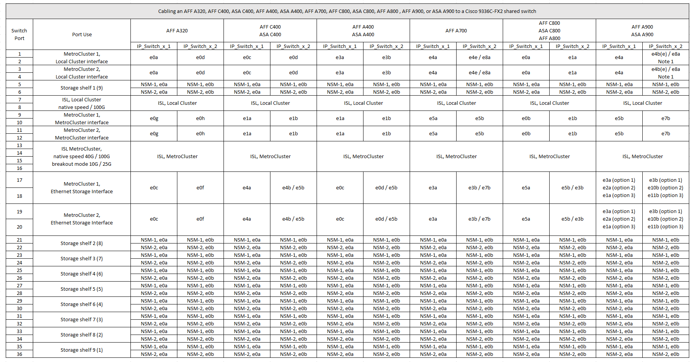

= Cisco 9336C-FX2共有スイッチのプラットフォームポート割り当て
:allow-uri-read: 
:icons: font
:imagesdir: ../media/

[role="lead"]
MetroCluster IP 構成で使用するポートは、スイッチのモデルとプラットフォームのタイプによって異なります。

表を使用する前に、次の考慮事項を確認してください。

* スイッチ接続NS224シェルフがサポートされているMetroCluster構成またはDRグループが少なくとも1つ必要です。
* スイッチ接続NS224シェルフをサポートしないプラットフォームは、2つ目のMetroCluster構成または2つ目のDRグループとしてのみ接続できます。
* RcfFileGeneratorでは、最初のプラットフォームが選択されている場合にのみ、対象となるプラットフォームが表示されます。
* 1つの8ノードまたは2つの4ノードMetroCluster構成を接続するには、ONTAP 9.14.1以降が必要です。

== AFF A320、AFF C400、ASA C400、AFF A400、ASA A400のケーブル接続 AFF A700、AFF C800、ASA C800、AFF A800、AFF A900、 またはASA A900システムからCisco 9336C-FX2共有スイッチへ

*注1 *：X91440Aアダプタ（40Gbps）を使用している場合は、ポートe4aとe4e、またはe4aとe8aのいずれかを使用します。X91153Aアダプタ（100Gbps）を使用する場合は、ポートe4aとe4b、またはe4aとe8aのいずれかを使用します。

== AFF A150、ASA A150、FAS2750、またはAFF A220システムとCisco 9336C-FX2共有スイッチのケーブル接続

image::../media/mcc_ip_cabling_a_aff_a150_asa_a150_fas27500_aff_a220_to_a_cisco_9336c_shared_switch.png[AFF a150 ASA a150 fas27500 AFF A220とCisco 9336c共有スイッチのMCC IPケーブル接続]

== FAS500f、AFF C250、ASA C250、AFF A250、またはASA A250システムとCisco 9336C-FX2共有スイッチのケーブル接続

image::../media/mcc_ip_cabling_c250_asa_c250_a250_asa_a250_to_cisco_9336c_shared_switch.png[MCC IPのケーブル接続C250 ASA C250 A250 ASA A250とCisco 9336c共有スイッチ]

== FAS8200またはAFF A300システムとCisco 9336C-FX2共有スイッチのケーブル接続

image::../media/mcc_ip_cabling_fas8200_affa300_to_cisco_9336c_shared_switch.png[Cisco 9336c共有スイッチへのMCC IPケーブル接続fas8200 affa300]

== FAS8300、FAS8700、FAS9000、またはFAS9500システムとCisco 9336C-FX2共有スイッチのケーブル接続

image::../media/mcc_ip_cabling_fas8300_fas8700_fas9000_fas9500_to_cisco_9336c_shared_switch.png[Cisco 9336c共有スイッチへのMCC IPケーブル接続fas8300 fas8700 fas9000 fas9500]

*注1 *：X91440Aアダプタ（40Gbps）を使用している場合は、ポートe4aとe4e、またはe4aとe8aのいずれかを使用します。X91153Aアダプタ（100Gbps）を使用する場合は、ポートe4aとe4b、またはe4aとe8aのいずれかを使用します。
