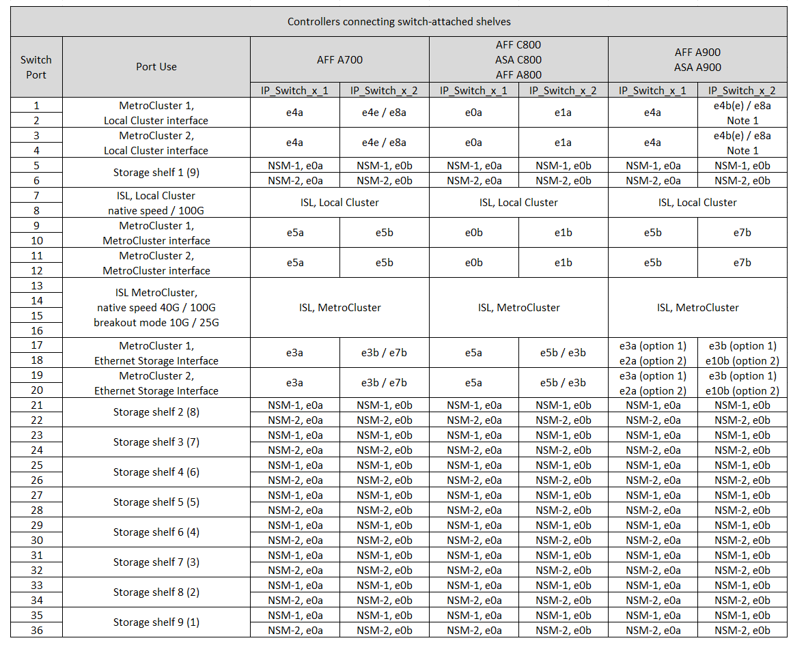

= Cisco 9336C-FX2共有スイッチのプラットフォームポート割り当て
:allow-uri-read: 
:icons: font
:imagesdir: ../media/

[role="lead"]
MetroCluster IP 構成で使用するポートは、スイッチのモデルとプラットフォームのタイプによって異なります。

表を使用する前に、次の考慮事項を確認してください。

* スイッチ接続NS224シェルフがサポートされているMetroCluster構成またはDRグループが少なくとも1つ必要です。
* スイッチ接続NS224シェルフをサポートしないプラットフォームは、2つ目のMetroCluster構成または2つ目のDRグループとしてのみ接続できます。
* RcfFileGeneratorでは、最初のプラットフォームが選択されている場合にのみ、対象となるプラットフォームが表示されます。
* 1つの8ノードまたは2つの4ノードMetroCluster構成を接続するには、ONTAP 9.14.1以降が必要です。

== 構成に適したケーブル接続テーブルを選択

構成に適したポート割り当ての表を確認します。このセクションには、2組のケーブルテーブルがあります。

* <<tables_connecting_ns224,スイッチ接続NS224シェルフに接続するコントローラのケーブル接続表>>
* <<tables_not_connecting_ns224,スイッチ接続NS224シェルフに接続されていないコントローラのケーブル接続表>>

=== スイッチ接続NS224シェルフに接続されているコントローラ

スイッチ接続NS224シェルフに接続するコントローラのポート割り当て表を確認します。

[cols="2*"]
|===
| プラットフォーム | 使用するケーブル接続テーブル 

| AFF A320 AFF C400、ASA C400 AFF A400、ASA A400 | <<table_1_cisco_9336c_fx2,Cisco 9336C-FX2共有スイッチプラットフォームのポート割り当て（グループ1）>> 

| AFF A700 AFF C800、ASA C800、AFF A800 AFF A900、ASA A900 | <<table_2_cisco_9336c_fx2,Cisco 9336C-FX2共有スイッチプラットフォームのポート割り当て（グループ2）>> 

| AFF A90 AFF A70 AFF A1K *注：*これらのシステムにはONTAP 9.15.1以降が必要です。 | <<table_3_cisco_9336c_fx2,Cisco 9336C-FX2共有スイッチプラットフォームのポート割り当て（グループ3）>> 
|===
.Cisco 9336C-FX2共有スイッチプラットフォームのポート割り当て（グループ1）
スイッチ接続NSS24シェルフをCisco 9336C-FX2共有スイッチに接続するAFF A320、AFF C400、ASA C400、AFF A400、またはASA A400システムをケーブル接続するためのプラットフォームポート割り当てを確認します。

image::../media/mcc_ip_cabling_a320_c400_a400_to_cisco_9336c_shared_switch.png[は、Cisco 9336C-FX2共有スイッチプラットフォームのポート割り当てを示しています。]

*注1 *：X91440Aアダプタ（40Gbps）を使用している場合は、ポートe4aとe4e、またはe4aとe8aのいずれかを使用します。X91153Aアダプタ（100Gbps）を使用する場合は、ポートe4aとe4b、またはe4aとe8aのいずれかを使用します。

.Cisco 9336C-FX2共有スイッチプラットフォームのポート割り当て（グループ2）
AFF A700、AFF C800、ASA C800、AFF A800、AFF A900のケーブル接続に使用するプラットフォームポートの割り当てを確認します。 または、スイッチ接続NSS24シェルフをCisco 9336C-FX2共有スイッチに接続するASA A900システム：

*注1 *：X91440Aアダプタ（40Gbps）を使用している場合は、ポートe4aとe4e、またはe4aとe8aのいずれかを使用します。X91153Aアダプタ（100Gbps）を使用する場合は、ポートe4aとe4b、またはe4aとe8aのいずれかを使用します。

.Cisco 9336C-FX2共有スイッチプラットフォームのポート割り当て（グループ3）
スイッチ接続NSS24シェルフをCisco 9336C-FX2共有スイッチに接続するAFF A90、AFF A70、またはAFF A1Kシステムをケーブル接続するためのプラットフォームポート割り当てを確認します。

NOTE: この表に示すシステムには、ONTAP 9.15.1以降が必要です。

image::../media/mcc_ip_cabling_a70_a90_a1k_to_cisco_9336c_shared_switch.png[は、Cisco 9336C-FX2共有スイッチプラットフォームのポート割り当てを示しています。]

スイッチ接続クラスタの場合は、AFF A90ノードまたはAFF A70ノード上の同一のクラスタポートが同じスイッチ上にある必要があります。たとえば、node1のe1aとnode2のe1aを1つのクラスタスイッチに接続する必要があります。同様に、両方のノードの2番目のクラスタポートを2番目のクラスタスイッチに接続する必要があります。共有クラスタHAポート（node1のe1aがIP_Switch_x_1に、node2のe1aがIP_Switch_x_2に接続）をクロス接続すると、HA通信障害を回避できます。

=== コントローラがスイッチ接続のNS224シェルフに接続されない

スイッチ接続のNS224シェルフに接続していないコントローラのポート割り当て表を確認します。

[cols="2*"]
|===
| プラットフォーム | 使用するケーブル接続テーブル 

| AFF A150、ASA A150 FAS2750、AFF A220 | <<table_4_cisco_9336c_fx2,Cisco 9336C-FX2共有スイッチプラットフォームのポート割り当て（グループ4）>> 

| FAS500f AFF C250、ASA C250 AFF A250、ASA A250 | <<table_5_cisco_9336c_fx2,Cisco 9336C-FX2共有スイッチプラットフォームのポート割り当て（グループ5）>> 

| FAS8200、AFF A300 | <<table_6_cisco_9336c_fx2,Cisco 9336C-FX2共有スイッチプラットフォームのポート割り当て（グループ6）>> 

| AFF A320 FAS8300、AFF C400、ASA C400、FAS8700 AFF A400、ASA A400 | <<table_7_cisco_9336c_fx2,Cisco 9336C-FX2共有スイッチプラットフォームのポート割り当て（グループ7）>> 

| FAS9000、AFF A700 AFF C800、ASA C800、AFF A800、ASA A800 FAS9500、AFF A900、 ASA A900 | <<table_8_cisco_9336c_fx2,Cisco 9336C-FX2共有スイッチプラットフォームのポート割り当て（グループ8）>> 

| AFF A70 AFF A90 AFF A1K *注：*これらのシステムにはONTAP 9.15.1以降が必要です。 | <<table_9_cisco_9336c_fx2,Cisco 9336C-FX2共有スイッチプラットフォームのポート割り当て（グループ9）>> 
|===
.Cisco 9336C-FX2共有スイッチプラットフォームのポート割り当て（グループ4）
プラットフォームポート割り当てを確認し、スイッチ接続NSS24シェルフをCisco 9336C-FX2共有スイッチに接続していないAFF A150、ASA A150、FAS2750、またはAFF A220システムをケーブル接続します。

image::../media/mcc-ip-cabling-a-aff-a150-asa-a150-fas2750-aff-a220-to-a-cisco-9336c-shared-switch.png[は、Cisco 9336C-FX2共有スイッチプラットフォームのポート割り当てを示しています。]

.Cisco 9336C-FX2共有スイッチプラットフォームのポート割り当て（グループ5）
スイッチ接続NSS24シェルフをCisco 9336C-FX2共有スイッチに接続していないFAS500f、AFF C250、ASA C250、AFF A250、またはASA A250システムのケーブル接続に使用するプラットフォームポート割り当てを確認します。

image::../media/mcc-ip-cabling-c250-asa-c250-a250-asa-a250-to-cisco-9336c-shared-switch.png[は、Cisco 9336C-FX2共有スイッチプラットフォームのポート割り当てを示しています。]

.Cisco 9336C-FX2共有スイッチプラットフォームのポート割り当て（グループ6）
プラットフォームポート割り当てを確認し、スイッチ接続NSS24シェルフをCisco 9336C-FX2共有スイッチに接続していないFAS8200またはAFF A300システムをケーブル接続します。

image::../media/mcc-ip-cabling-fas8200-affa300-to-cisco-9336c-shared-switch.png[は、Cisco 9336C-FX2共有スイッチプラットフォームのポート割り当てを示しています。]

.Cisco 9336C-FX2共有スイッチプラットフォームのポート割り当て（グループ7）
AFF A320、FAS8300、AFF C400、ASA C400、FAS8700をケーブル接続するためのプラットフォームポート割り当ての確認 スイッチ接続NSS24シェルフをCisco 9336C-FX2共有スイッチに接続していないAFF A400またはASA A400システム：

image::../media/mcc_ip_cabling_a320_fas8300_a400_fas8700_to_a_cisco_9336c_shared_switch.png[は、Cisco 9336C-FX2共有スイッチプラットフォームのポート割り当てを示しています。]

*注1 *：X91440Aアダプタ（40Gbps）を使用している場合は、ポートe4aとe4e、またはe4aとe8aのいずれかを使用します。X91153Aアダプタ（100Gbps）を使用する場合は、ポートe4aとe4b、またはe4aとe8aのいずれかを使用します。

.Cisco 9336C-FX2共有スイッチプラットフォームのポート割り当て（グループ8）
FAS9000、AFF A700、AFF C800、ASA C800、AFF A800をケーブル接続するためのプラットフォームポート割り当ての確認 スイッチ接続NSS24シェルフをCisco 9336C-FX2共有スイッチに接続していないASA A800、FAS9500、AFF A900、またはASA A900システム：

image::../media/mcc_ip_cabling_a700_a800_fas9000_fas9500_to_cisco_9336c_shared_switch.png[は、Cisco 9336C-FX2共有スイッチプラットフォームのポート割り当てを示しています。]

*注1 *：X91440Aアダプタ（40Gbps）を使用している場合は、ポートe4aとe4e、またはe4aとe8aのいずれかを使用します。X91153Aアダプタ（100Gbps）を使用する場合は、ポートe4aとe4b、またはe4aとe8aのいずれかを使用します。

.Cisco 9336C-FX2共有スイッチプラットフォームのポート割り当て（グループ9）
プラットフォームポートの割り当てを確認し、スイッチ接続のNSS24シェルフをCisco 9336C-FX2共有スイッチに接続していないAFF A70、AFF A90、またはAFF A1Kシステムをケーブル接続します。

NOTE: この表に示すシステムには、ONTAP 9.15.1以降が必要です。

image::../media/mcc_ip_cabling_a70_a90_a1k_to_no_shelves_cisco_9336c_shared_switch.png[は、Cisco 9336C-FX2共有スイッチプラットフォームのポート割り当てを示しています。]
