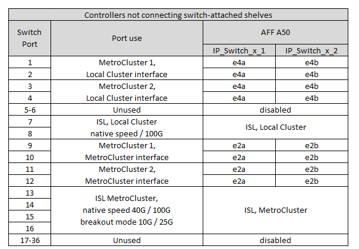
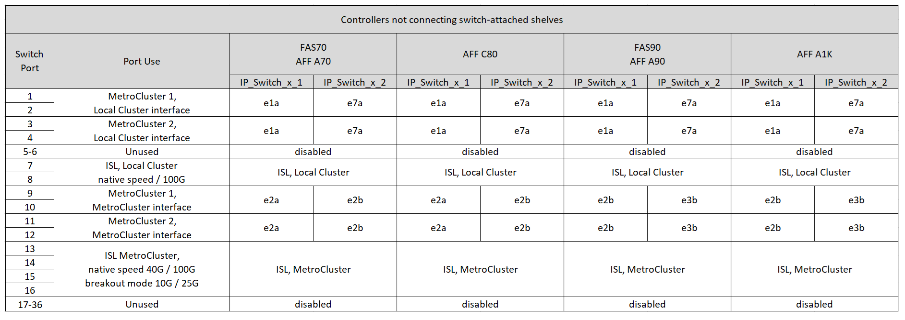

= NS224ストレージを接続する36ポートCisco 9336C-FX2スイッチのプラットフォームポート割り当て
:allow-uri-read: 
:icons: font
:imagesdir: ../media/

[role="lead"]
MetroCluster IP 構成で使用するポートは、スイッチのモデルとプラットフォームのタイプによって異なります。

構成テーブルを使用する前に、次の考慮事項を確認してください。

* このセクションの表は、少なくとも 1 つの MetroCluster 構成または DR グループが NS224 シェルフを MetroCluster スイッチに接続している場合の 36 ポート Cisco 9336C-FX2 スイッチ用です。
+
NS224ストレージに接続していない36ポートのCisco 9336C-FX2スイッチをお持ちの場合は、 link:port_usage_3232c_9336c.html["Cisco 3232C または 36 ポート Cisco 9336C-FX2 スイッチのプラットフォーム ポート割り当て"] 。

+
12ポートのCisco 9336C-FX2スイッチをお持ちの場合は、 link:port-usage-9336c-fx-2-12-port.html["12ポートCisco 9336C-FX2スイッチのプラットフォームポート割り当て"] 。

+

NOTE: 12 ポートの Cisco 9336C-FX2 スイッチは、NS224 シェルフを MetroCluster スイッチに接続することをサポートしていません。

* Cisco 9336C-FX2 スイッチを NS224 ストレージに接続してケーブル接続する場合、MetroCluster 構成または DR グループは最大 2 つまでしか作成できません。少なくとも 1 つの MetroCluster 構成または DR グループで NS224 シェルフを MetroCluster スイッチに接続する必要があります。スイッチ接続された NS224 シェルフを接続していないプラットフォームは、2 番目の MetroCluster 構成または 2 番目の DR グループとしてのみ接続できます。
+
2つ目のMetroClusterまたはDRグループがNS224シェルフをMetroClusterスイッチに接続しない場合は、 <<tables_not_connecting_ns224,スイッチ接続NS224シェルフに接続しないコントローラの配線表>> 。

* RcfFileGeneratorでは、最初のプラットフォームが選択されている場合にのみ、対象となるプラットフォームが表示されます。
* 1つの8ノードまたは2つの4ノードMetroCluster構成を接続するには、ONTAP 9.14.1以降が必要です。

== 構成に適したケーブル接続テーブルを選択

構成に適したポート割り当ての表を確認します。このセクションには、2組のケーブルテーブルがあります。

* <<tables_connecting_ns224,スイッチ接続NS224シェルフを接続するコントローラのケーブル接続表>>
* <<tables_not_connecting_ns224,スイッチ接続NS224シェルフを接続しないコントローラのケーブル接続表>>

=== スイッチ接続NS224シェルフを接続するコントローラ

スイッチ接続NS224シェルフを接続するコントローラのポート割り当て表を確認します。

[cols="25,75"]
|===
| プラットフォーム | 使用するケーブル接続テーブル 

| AFF C30、AFF A30 AFF C60  a| 
次の表は、25G（グループ1a）と100G（グループ1b）のどちらのイーサネットカードを使用しているかによって異なります。

* <<table_1a_cisco_9336c_fx2,NS224ストレージプラットフォームのポート割り当てを接続するCisco 9336C-FX2スイッチ（グループ1a-25G）>>
* <<table_1b_cisco_9336c_fx2,NS224ストレージプラットフォームのポート割り当てを接続するCisco 9336C-FX2スイッチ（グループ1b-100G）>>

| AFF A320 AFF C400、ASA C400 AFF A400、ASA A400 | <<table_2_cisco_9336c_fx2,NS224ストレージプラットフォームのポート割り当て（グループ2）を接続するCisco 9336C-FX2スイッチ>> 

| AFF A50用 | <<table_3_cisco_9336c_fx2,NS224ストレージプラットフォームのポート割り当てを接続するCisco 9336C-FX2スイッチ（グループ3）>> 

| AFF A700 AFF C800、ASA C800、AFF A800 AFF A900、ASA A900 | <<table_4_cisco_9336c_fx2,NS224ストレージプラットフォームのポート割り当てを接続するCisco 9336C-FX2スイッチ（グループ4）>> 

| AFF A70 AFF C80 AFF A90 AFF A1K | <<table_5_cisco_9336c_fx2,NS224ストレージプラットフォームのポート割り当てを接続するCisco 9336C-FX2スイッチ（グループ5）>> 
|===
.NS224ストレージプラットフォームのポート割り当てを接続するCisco 9336C-FX2スイッチ（グループ1a）
プラットフォームポートの割り当てを確認し、4ポートの25Gイーサネットカードを使用してスイッチ接続NSS24シェルフをCisco 9336C-FX2スイッチに接続するAFF A30、AFF C30、またはAFF C60システムをケーブル接続します。

NOTE: この構成では、ローカルクラスタとHAインターフェイスを接続するために、スロット4に4ポートの25Gイーサネットカードが必要です。

image:../media/mccip-cabling-greeley-connecting-a30-c30-fas50-c60-25G.png["は、NS224ストレージプラットフォームのポート割り当てを接続するCisco 9336C-FX2スイッチを示しています。"]

.NS224ストレージプラットフォームのポート割り当てを接続するCisco 9336C-FX2スイッチ（グループ1b）
プラットフォームポートの割り当てを確認し、2ポート100Gイーサネットカードを使用してスイッチ接続NSS24シェルフをCisco 9336C-FX2スイッチに接続するAFF A30、AFF C30、またはAFF C60システムをケーブル接続します。

NOTE: この構成では、ローカルクラスタとHAインターフェイスを接続するために、スロット4に2ポートの100Gイーサネットカードが必要です。

image:../media/mccip-cabling-greeley-connecting-a30-c30-fas50-c60-100G.png["は、NS224ストレージプラットフォームのポート割り当てを接続するCisco 9336C-FX2スイッチを示しています。"]

.NS224ストレージプラットフォームのポート割り当て（グループ2）を接続するCisco 9336C-FX2スイッチ
プラットフォームポート割り当てを確認し、スイッチ接続NSS24シェルフをCisco 9336C-FX2スイッチに接続するAFF A320、AFF C400、ASA C400、AFF A400、またはASA A400システムをケーブル接続します。

image::../media/mcc_ip_cabling_a320_c400_a400_to_cisco_9336c_shared_switch.png[は、NS224ストレージプラットフォームのポート割り当てを接続するCisco 9336C-FX2スイッチを示しています。]

.NS224ストレージプラットフォームのポート割り当てを接続するCisco 9336C-FX2スイッチ（グループ3）
プラットフォームポート割り当てを確認し、スイッチ接続NSS24シェルフをCisco 9336C-FX2スイッチに接続するAFF A50システムをケーブル接続します。

image:../media/mccip-cabling-greeley-connecting-a50-updated.png["は、NS224ストレージプラットフォームのポート割り当てを接続するCisco 9336C-FX2スイッチを示しています。"]

.NS224ストレージプラットフォームのポート割り当てを接続するCisco 9336C-FX2スイッチ（グループ4）
プラットフォームポート割り当てを確認し、スイッチ接続のNSS24シェルフをCisco 9336C-FX2スイッチに接続するAFF A700、AFF A900、ASA C800、AFF A800、AFF C800、またはASA A900システムをケーブル接続します。

image:../media/mcc_ip_cabling_a700_c800_a800_a900_to_cisco_9336c_shared_switch.png["は、NS224ストレージプラットフォームのポート割り当てを接続するCisco 9336C-FX2スイッチを示しています。"]

*注1 *：X91440Aアダプタ（40Gbps）を使用している場合は、ポートe4aとe4e、またはe4aとe8aのいずれかを使用します。ポートe4aとe4b、またはX91153Aアダプタ（100Gbps）を使用している場合はe4aとe8aのいずれかを使用します。

.NS224ストレージプラットフォームのポート割り当てを接続するCisco 9336C-FX2スイッチ（グループ5）
プラットフォームポート割り当てを確認し、スイッチ接続NSS24シェルフをCisco 9336C-FX2スイッチに接続するAFF A70、AFF C80、AFF A90、またはAFF A1Kシステムをケーブル接続します。

image::../media/mccip-cabling-greeley-connecting-a70-c80-a-90-fas90-a1k.png[は、NS224ストレージプラットフォームのポート割り当てを接続するCisco 9336C-FX2スイッチを示しています。]

=== コントローラがスイッチ接続NS224シェルフを接続しない

スイッチ接続NS224シェルフを接続しないコントローラのポート割り当て表を確認します。

[cols="25,75"]
|===
| プラットフォーム | 使用するケーブル接続テーブル 

| AFF A150、ASA A150 FAS2750、AFF A220 | <<table_6_cisco_9336c_fx2,Cisco 9336C-FX2スイッチがNS224ストレージプラットフォームのポート割り当てを接続しない（グループ6）>> 

| AFF A20用 | <<table_7_cisco_9336c_fx2,Cisco 9336C-FX2スイッチがNS224ストレージプラットフォームのポート割り当てを接続しない（グループ7）>> 

| FAS500f AFF C250、ASA C250 AFF A250、ASA A250 | <<table_8_cisco_9336c_fx2,Cisco 9336C-FX2スイッチがNS224ストレージプラットフォームのポート割り当てを接続しない（グループ8）>> 

| AFF C30、AFF A30 FAS50 AFF C60  a| 
次の表は、25G（グループ9a）と100G（グループ9b）のどちらのイーサネットカードを使用しているかによって異なります。

* <<table_9a_cisco_9336c_fx2,Cisco 9336C-FX2スイッチでNS224ストレージプラットフォームのポート割り当てが接続されない（グループ9a）>>
* <<table_9b_cisco_9336c_fx2,Cisco 9336C-FX2スイッチがNS224ストレージプラットフォームのポート割り当てを接続しない（グループ9b）>>

| FAS8200、AFF A300 | <<table_10_cisco_9336c_fx2,Cisco 9336C-FX2スイッチがNS224ストレージプラットフォームのポート割り当てを接続しない（グループ10）>> 

| AFF A320 FAS8300、AFF C400、ASA C400、FAS8700 AFF A400、ASA A400 | <<table_11_cisco_9336c_fx2,Cisco 9336C-FX2スイッチがNS224ストレージプラットフォームのポート割り当てを接続しない（グループ11）>> 

| AFF A50用 | <<table_12_cisco_9336c_fx2,Cisco 9336C-FX2スイッチがNS224ストレージプラットフォームのポート割り当てを接続しない（グループ12）>> 

| FAS9000、AFF A700 AFF C800、ASA C800、AFF A800、ASA A800 FAS9500、AFF A900、 ASA A900 | <<table_13_cisco_9336c_fx2,Cisco 9336C-FX2スイッチがNS224ストレージプラットフォームのポート割り当てを接続しない（グループ13）>> 

| FAS70、AFF A70 AFF C80 FAS90、AFF A90 AFF A1K | <<table_14_cisco_9336c_fx2,Cisco 9336C-FX2スイッチがNS224ストレージプラットフォームのポート割り当てを接続しない（グループ14）>> 
|===
.Cisco 9336C-FX2スイッチがNS224ストレージプラットフォームのポート割り当てを接続しない（グループ6）
プラットフォームポート割り当てを確認し、スイッチ接続NSS24シェルフをCisco 9336C-FX2スイッチに接続していないAFF A150、ASA A150、FAS2750、またはAFF A220システムをケーブル接続します。

image::../media/mcc-ip-cabling-a-aff-a150-asa-a150-fas2750-aff-a220-to-a-cisco-9336c-shared-switch.png[は、Cisco 9336C-FX2スイッチでNS224ストレージプラットフォームのポート割り当てが接続されない状態を示しています。]

.Cisco 9336C-FX2スイッチがNS224ストレージプラットフォームのポート割り当てを接続しない（グループ7）
プラットフォームポート割り当てを確認し、スイッチ接続NSS24シェルフをCisco 9336C-FX2スイッチに接続していないAFF A20システムをケーブル接続します。

image:../media/mcc-ip-aff-a20-to-a-cisco-9336c-shared-switch-not-connecting.png["は、Cisco 9336C-FX2スイッチでNS224ストレージプラットフォームのポート割り当てが接続されない状態を示しています。"]

.Cisco 9336C-FX2スイッチがNS224ストレージプラットフォームのポート割り当てを接続しない（グループ8）
プラットフォームポート割り当てを確認し、スイッチ接続NSS24シェルフをCisco 9336C-FX2スイッチに接続していないFAS500f、AFF C250、ASA C250、AFF A250、またはASA A250システムをケーブル接続します。

image::../media/mcc-ip-cabling-c250-asa-c250-a250-asa-a250-to-cisco-9336c-shared-switch.png[は、Cisco 9336C-FX2スイッチでNS224ストレージプラットフォームのポート割り当てが接続されない状態を示しています。]

.Cisco 9336C-FX2スイッチでNS224ストレージプラットフォームのポート割り当てが接続されない（グループ9a）
プラットフォームポート割り当てを確認し、4ポート25Gイーサネットカードを使用してスイッチ接続NSS24シェルフをCisco 9336C-FX2スイッチに接続していないAFF A30、AFF C30、AFF C60、またはFAS50システムをケーブル接続します。

NOTE: この構成では、ローカルクラスタとHAインターフェイスを接続するために、スロット4に4ポートの25Gイーサネットカードが必要です。

image:../media/mccip-cabling-greeley-not-connecting-a30-c30-fas50-c60-25G.png["は、Cisco 9336C-FX2スイッチでNS224ストレージプラットフォームのポート割り当てが接続されない状態を示しています。"]

.Cisco 9336C-FX2スイッチがNS224ストレージプラットフォームのポート割り当てを接続しない（グループ9b）
プラットフォームポート割り当てを確認し、2ポート100Gイーサネットカードを使用してスイッチ接続NSS24シェルフをCisco 9336C-FX2スイッチに接続していないAFF A30、AFF C30、AFF C60、またはFAS50システムをケーブル接続します。

NOTE: この構成では、ローカルクラスタとHAインターフェイスを接続するために、スロット4に2ポートの100Gイーサネットカードが必要です。

image:../media/mccip-cabling-greeley-not-connecting-a30-c30-fas50-c60-100G.png["は、NS224ストレージプラットフォームのポート割り当てを接続するCisco 9336C-FX2スイッチを示しています。"]

.Cisco 9336C-FX2スイッチがNS224ストレージプラットフォームのポート割り当てを接続しない（グループ10）
プラットフォームポート割り当てを確認し、スイッチ接続NSS24シェルフをCisco 9336C-FX2スイッチに接続していないFAS8200またはAFF A300システムをケーブル接続します。

image::../media/mcc-ip-cabling-fas8200-affa300-to-cisco-9336c-shared-switch.png[は、NS224ストレージプラットフォームのポート割り当てを接続するCisco 9336C-FX2スイッチを示しています。]

.Cisco 9336C-FX2スイッチがNS224ストレージプラットフォームのポート割り当てを接続しない（グループ11）
プラットフォームポート割り当てを確認し、スイッチ接続NSS24シェルフをFAS8300 Cisco 9336C-FX2スイッチに接続していないAFF A320 ASA A400、FAS8700、AFF C400 AFF A400、またはASA C400システムをケーブル接続します。

image::../media/mcc_ip_cabling_a320_fas8300_a400_fas8700_to_a_cisco_9336c_shared_switch.png[は、Cisco 9336C-FX2スイッチでNS224ストレージプラットフォームのポート割り当てが接続されない状態を示しています。]

.Cisco 9336C-FX2スイッチがNS224ストレージプラットフォームのポート割り当てを接続しない（グループ12）
プラットフォームポート割り当てを確認し、スイッチ接続NSS24シェルフをCisco 9336C-FX2スイッチに接続していないAFF A50システムをケーブル接続します。

.Cisco 9336C-FX2スイッチがNS224ストレージプラットフォームのポート割り当てを接続しない（グループ13）
プラットフォームポート割り当てを確認し、スイッチ接続NSS24シェルフをASA C800 Cisco 9336C-FX2スイッチに接続していないFAS9000、AFF A800 AFF A900、ASA A800 ASA A900、FAS9500、AFF A700、またはAFF C800システムをケーブル接続します。

image::../media/mcc_ip_cabling_a700_a800_fas9000_fas9500_to_cisco_9336c_shared_switch.png[は、Cisco 9336C-FX2スイッチでNS224ストレージプラットフォームのポート割り当てが接続されない状態を示しています。]

*注1 *：X91440Aアダプタ（40Gbps）を使用している場合は、ポートe4aとe4e、またはe4aとe8aのいずれかを使用します。ポートe4aとe4b、またはX91153Aアダプタ（100Gbps）を使用している場合はe4aとe8aのいずれかを使用します。

.Cisco 9336C-FX2スイッチがNS224ストレージプラットフォームのポート割り当てを接続しない（グループ14）
プラットフォームポート割り当てを確認し、スイッチ接続NSS24シェルフをCisco 9336C-FX2スイッチに接続していないAFF A70、FAS70、AFF C80、FAS90、AFF A90、またはAFF A1Kシステムをケーブル接続します。

