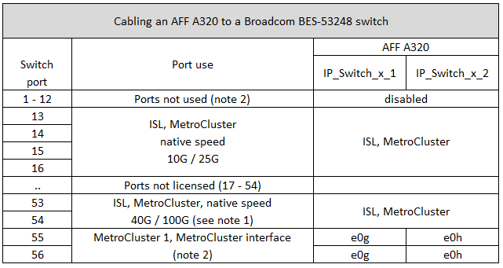

= Broadcom 対応 BES-53248 IP スイッチのプラットフォームポート割り当て
:allow-uri-read: 
:icons: font
:imagesdir: ../media/

[role="lead"]
MetroCluster IP 構成で使用するポートは、スイッチのモデルとプラットフォームのタイプによって異なります。

速度が異なるリモート ISL ポート（ 10Gbps ISL ポートに接続されている 25Gbps ポートなど）では、スイッチを使用できません。

.以下の表に関する注意事項：
. 一部のプラットフォームでは、 MetroCluster ISL または MetroCluster インターフェイス接続にポート 49-54 を使用できます。
+
これらのポートには追加のライセンスが必要です。

. A320 システムを使用する 4 ノード MetroCluster をスイッチに接続できます。
+
スイッチクラスタを必要とする機能は、 MetroCluster から IP への移行や機器更改の手順など、この構成ではサポートされていません。

. AFF A320 システムが Broadcom BES-53248 スイッチで構成されている場合、一部の機能がサポートされないことがあります。
+
ローカルクラスタ接続を必要とする設定または機能がスイッチに接続されていても、サポートされていません。たとえば、次の設定と手順はサポートされていません。

+
** 8 ノード MetroCluster 構成
** MetroCluster FC から MetroCluster IP 構成への移行
** 4 ノード MetroCluster IP 構成の更新（ ONTAP 9.8 以降）

== AFF A220 または FAS2750 システムの使用するスイッチポート

image::../media/mcc_ip_cabling_a_aff_a220_or_fas2750_to_a_broadcom_bes_53248_switch.png[MCC IP ケーブル構成： AFF A220 または fas2750 から Broadcom BES-53248 スイッチへ]

== AFF A250 または FAS500f システムに使用するスイッチポート

image::../media/mcc_ip_cabling_a_aff_a250_or_fas500f_to_a_broadcom_bes_53248_switch.png[MCC IP ケーブル構成： AFF A250 または fas500f を Broadcom BES-53248 スイッチに接続します]

== AFF A300 または FAS8200 システムで使用するスイッチポート

image::../media/mcc_ip_cabling_a_aff_a300_or_fas8200_to_a_broadcom_bes_53248_switch.png[MCC IP のケーブル接続： AFF A300 または fas8200 から Broadcom BES-53248 スイッチへ]

== AFF A400 、 FAS8300 、 FAS8700 システムに使用するスイッチポートを指定します

image::../media/mcc_ip_cabling_a_fas8300_a400_or_fas8700_to_a_broadcom_bes_53248_switch.png[MCC IP ケーブル構成： fas8300 、 fas8700 から Broadcom BES-53248 スイッチへ]
