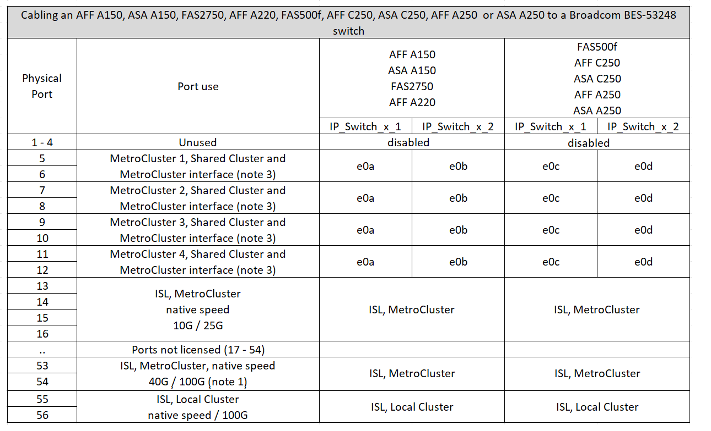
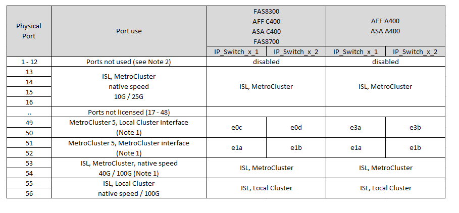

= Broadcom 対応 BES-53248 IP スイッチのプラットフォームポート割り当て
:allow-uri-read: 
:icons: font
:imagesdir: ../media/

[role="lead"]
MetroCluster IP 構成で使用するポートは、スイッチのモデルとプラットフォームのタイプによって異なります。

速度が異なるリモート ISL ポート（ 10Gbps ISL ポートに接続されている 25Gbps ポートなど）では、スイッチを使用できません。

.表を使用する前に、次の情報を確認してください。
* スイッチをMetroCluster FCからIPへの移行用に設定する場合は、選択したターゲットプラットフォームに応じて次のポートが使用されます。
+
[cols="75,25"]
|===
| ターゲットプラットフォーム | ポート 

| FAS500f、AFF C250、ASA C250、AFF A250、ASA A250、 FAS8300、AFF C400、ASA C400、AFF A400、ASA A400、 またはFAS8700プラットフォーム | ポート1~6、10Gbps 

| FAS8200またはAFF A300プラットフォーム | ポート3~4および9~12、10Gbps 
|===
* AFF A320 システムが Broadcom BES-53248 スイッチで構成されている場合、一部の機能がサポートされないことがあります。
+
ローカルクラスタ接続を必要とする設定または機能がスイッチに接続されていても、サポートされていません。たとえば、次の設定と手順はサポートされていません。

+
** 8 ノード MetroCluster 構成
** MetroCluster FC から MetroCluster IP 構成への移行
** 4 ノード MetroCluster IP 構成の更新（ ONTAP 9.8 以降）

.表で参照されているメモ：
* *注1 *：これらのポートを使用するには、追加ライセンスが必要です。
* *注2 *：AFF A320システムを使用する単一の4ノードMetroClusterのみをスイッチに接続できます。
+
この構成では、MetroClusterのFCからIPへの移行や機器更改の手順など、スイッチクラスタを必要とする機能はサポートされません。

* *注3 *：BES-53248スイッチでは、4ポートグループ内のすべてのポートが同じ速度で動作する必要があります。AFF 150、ASA A150、FAS2750、AFF A220およびFAS500f、AFF C250、ASA C250、AFF A250、およびASA A250プラットフォームを混在させる場合は、別 々 の4ポートグループにあるスイッチポートを使用する必要があります。このタイプの設定が必要な場合は、次の条件が適用されます。
+
** を参照してください https://mysupport.netapp.com/site/tools/tool-eula/rcffilegenerator["MetroCluster IP 用の RcfFileGenerator"]「MetroCluster 1」および「MetroCluster 2」のドロップダウンフィールドには、MetroCluster 3または「MetroCluster 4」のプラットフォームを選択した場合にのみ値が入力されます。  を参照してください link:../install-ip/using_rcf_generator.html["RcfFileGenerator ツールまたは複数の MetroCluster 設定でポートテーブルを使用する"] ポートテーブルの使用方法の詳細については、を参照してください。
** 両方のMetroCluster構成で同じプラットフォームを使用している場合、NetAppでは、一方の構成にグループ「MetroCluster 3」を、もう一方の構成にグループ「MetroCluster 4」を選択することを推奨します。プラットフォームが異なる場合は、最初の構成で「MetroCluster 3」または「MetroCluster 4」を選択し、2つ目の構成で「MetroCluster 1」または「MetroCluster 2」を選択する必要があります。

== AFF A150、ASA A150、FAS2750、AFF A220、FAS500fのケーブル接続 AFF C250、ASA C250、AFF A250、またはASA A250からBroadcom BES-53248スイッチ

== FAS8200、AFF A300、またはAFF A320システムとBroadcom BES-53248スイッチのケーブル接続

image::../media/mcc_ip_cabling_a_aff_a300_or_fas8200_to_a_broadcom_bes_53248_switch.png[MCC IP のケーブル接続： AFF A300 または fas8200 から Broadcom BES-53248 スイッチへ]

image::../media/mcc_ip_cabling_a_aff_a320_to_a_broadcom_bes_53248_switch.png[MCC IP ケーブル配線 A AFF A320 を Broadcom BES-53248 スイッチに接続します]

== FAS8300、AFF C400、ASA C400、AFF A400、ASA A400、またはFAS8700システムとBroadcom BES-53248スイッチのケーブル接続

