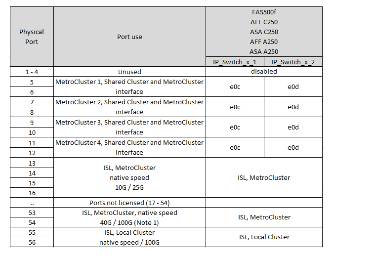

= Broadcom 対応 BES-53248 IP スイッチのプラットフォームポート割り当て
:allow-uri-read: 
:icons: font
:imagesdir: ../media/

[role="lead"]
MetroCluster IP 構成で使用するポートは、スイッチのモデルとプラットフォームのタイプによって異なります。

構成テーブルを使用する前に、次の考慮事項を確認してください。

* 速度が異なるリモートISLポート（25Gbpsポートを10Gbps ISLポートに接続した場合など）のスイッチは使用できません。
* スイッチをMetroCluster FCからIPへの移行用に設定する場合は、選択したターゲットプラットフォームに応じて次のポートが使用されます。
+
[cols="75,25"]
|===
| ターゲットプラットフォーム | ポート 

| FAS500f、AFF C250、ASA C250、AFF A250、ASA A250、 FAS8300、AFF C400、ASA C400、AFF A400、ASA A400、 またはFAS8700プラットフォーム | ポート1~6、10Gbps 

| FAS8200またはAFF A300プラットフォーム | ポート3~4および9~12、10Gbps 
|===
* AFF A320 システムが Broadcom BES-53248 スイッチで構成されている場合、一部の機能がサポートされないことがあります。
+
ローカルクラスタ接続を必要とする設定または機能がスイッチに接続されていても、サポートされていません。たとえば、次の設定と手順はサポートされていません。

+
** 8 ノード MetroCluster 構成
** MetroCluster FC から MetroCluster IP 構成への移行
** 4 ノード MetroCluster IP 構成の更新（ ONTAP 9.8 以降）

== 構成に適したケーブル接続テーブルを選択

次の表を使用して、必要なケーブル接続の表を特定します。

[cols="25,75"]
|===
| システムの状態 | 使用するケーブル接続テーブル 

 a| 
AFF A150、ASA A150向け

FAS2750

AFF A220
| <<table_1_bes_53248,Broadcom BES-53248プラットフォームのポート割り当て（グループ1）>> 

| FAS500f AFF C250、ASA C250 AFF A250、ASA A250 | <<table_2_bes_53248,Broadcom BES-53248プラットフォームのポート割り当て（グループ2）>> 

| AFF A20用 | <<table_3_bes_53248,Broadcom BES-53248プラットフォームのポート割り当て（グループ3）>> 

| AFF C30、AFF A30 FAS50 AFF C60 | <<table_4_bes_53248,Broadcom BES-53248プラットフォームのポート割り当て（グループ4）>> 

| FAS8200、AFF A300 | <<table_5_bes_53248,Broadcom BES-53248プラットフォームのポート割り当て（グループ5）>> 

| AFF A320 | <<table_6_bes_53248,Broadcom BES-53248プラットフォームのポート割り当て（グループ6）>> 

| FAS8300 AFF C400、ASA C400 AFF A400、ASA A400 FAS8700 | <<table_7_bes_53248,Broadcom BES-53248プラットフォームのポート割り当て（グループ7）>> 
|===
.Broadcom BES-53248プラットフォームのポート割り当て（グループ1）
プラットフォームポート割り当てを確認し、AFF A150、ASA A150、FAS2750、またはAFF A220システムをBroadcom BES-53248スイッチにケーブル接続します。

image::../media/mcc_ip_cabling_a_aff_asa_a150_a220_fas2750_to_a_broadcom_bes_53248_switch.png[Broadcom BES-53248プラットフォームのポート割り当てを表示]

* *注1 *：これらのポートを使用するには、追加ライセンスが必要です。
* 両方のMetroCluster構成で同じプラットフォームを使用している場合、NetAppは一方の構成にグループ「MetroCluster 3」を、もう一方の構成にグループ「MetroCluster 4」を選択することを推奨します。プラットフォームが異なる場合は、最初の構成で「MetroCluster 3」または「MetroCluster 4」を選択し、2つ目の構成で「MetroCluster 1」または「MetroCluster 2」を選択する必要があります。

.Broadcom BES-53248プラットフォームのポート割り当て（グループ2）
プラットフォームポート割り当てを確認し、FAS500f、AFF C250、ASA C250、AFF A250、またはASA A250システムをBroadcom BES-53248スイッチにケーブル接続します。

* *注1 *：これらのポートを使用するには、追加ライセンスが必要です。
* 両方のMetroCluster構成で同じプラットフォームを使用している場合、NetAppは一方の構成にグループ「MetroCluster 3」を、もう一方の構成にグループ「MetroCluster 4」を選択することを推奨します。プラットフォームが異なる場合は、最初の構成で「MetroCluster 3」または「MetroCluster 4」を選択し、2つ目の構成で「MetroCluster 1」または「MetroCluster 2」を選択する必要があります。

.Broadcom BES-53248プラットフォームのポート割り当て（グループ3）
プラットフォームポートの割り当てを確認し、AFF A20システムをBroadcom BES-53248スイッチにケーブル接続します。

image:../media/mccip-cabling-bes-a20-updated.png["Broadcom BES-53248プラットフォームのポート割り当てを表示"]

* *注1 *：これらのポートを使用するには、追加ライセンスが必要です。

.Broadcom BES-53248プラットフォームのポート割り当て（グループ4）
プラットフォームポートの割り当てを確認し、4ポートの25Gイーサネットカードを使用してAFF A30、AFF C30、AFF C60、またはFAS50システムをBroadcom BES-53248スイッチにケーブル接続します。

[NOTE]
====
* この構成では、ローカルクラスタとHAインターフェイスを接続するために、スロット4に4ポートの25Gイーサネットカードが必要です。
* この構成では、25Gbpsのネットワーク速度をサポートするために、コントローラのカードにQSFP / SFP+アダプタが必要です。

====
image:../media/mccip-cabling-bes-a30-c30-fas50-c60-25G.png["Broadcom BES-53248プラットフォームのポート割り当てを表示"]

* *注1 *：これらのポートを使用するには、追加ライセンスが必要です。

.Broadcom BES-53248プラットフォームのポート割り当て（グループ5）
プラットフォームポート割り当てを確認し、FAS8200またはAFF A300システムをBroadcom BES-53248スイッチにケーブル接続します。

image::../media/mcc-ip-cabling-a-aff-a300-or-fas8200-to-a-broadcom-bes-53248-switch-9161.png[Broadcom BES-53248プラットフォームのポート割り当てを表示]

* *注1 *：これらのポートを使用するには、追加ライセンスが必要です。

.Broadcom BES-53248プラットフォームのポート割り当て（グループ6）
プラットフォームポートの割り当てを確認し、AFF A320システムをBroadcom BES-53248スイッチにケーブル接続します。

image::../media/mcc-ip-cabling-a-aff-a320-to-a-broadcom-bes-53248-switch.png[Broadcom BES-53248プラットフォームのポート割り当てを表示]

* *注1 *：これらのポートを使用するには、追加ライセンスが必要です。
* *注2 *：AFF A320システムを使用する単一の4ノードMetroClusterのみをスイッチに接続できます。
+
この構成では、スイッチクラスタを必要とする機能はサポートされません。これには、MetroClusterのFCからIPへの移行と機器更改の手順が含まれます。

.Broadcom BES-53248プラットフォームのポート割り当て（グループ7）
FAS8300、AFF C400、ASA C400、AFF A400、ASA A400をケーブル接続するためのプラットフォームポート割り当てを確認します。 またはFAS8700システムからBroadcom BES-53248スイッチへの接続：

image::../media/mcc-ip-cabling-a-fas8300-a400-c400-or-fas8700-to-a-broadcom-bes-53248-switch.png[Broadcom BES-53248プラットフォームのポート割り当てを表示]

* *注1 *：これらのポートを使用するには、追加ライセンスが必要です。
* *注2 *：AFF A320システムを使用する単一の4ノードMetroClusterのみをスイッチに接続できます。
+
この構成では、スイッチクラスタを必要とする機能はサポートされません。これには、MetroClusterのFCからIPへの移行と機器更改の手順が含まれます。

