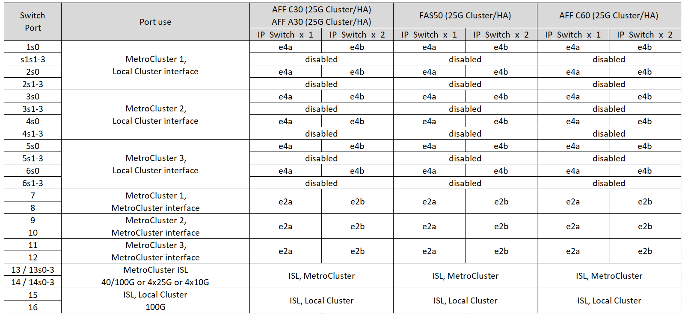
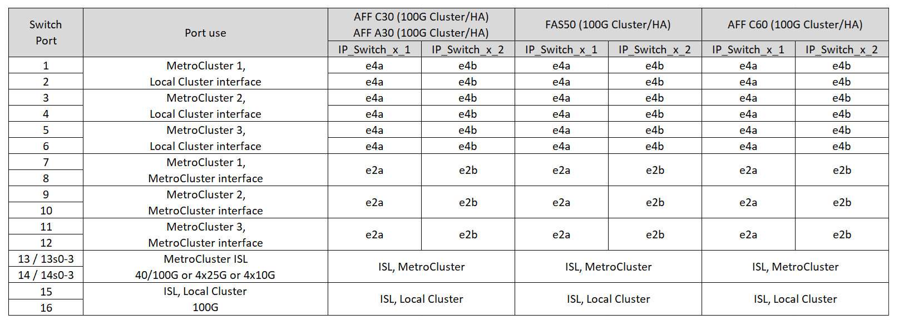

= MetroCluster IP構成におけるNVIDIA対応SN2100 IPスイッチのプラットフォームポート割り当て
:allow-uri-read: 
:icons: font
:imagesdir: ../media/

[role="lead"]
MetroCluster IP 構成で使用するポートは、スイッチのモデルとプラットフォームのタイプによって異なります。

構成テーブルを使用する前に、次の考慮事項を確認してください。

* 8ノードまたは2つの4ノードMetroCluster構成を接続するには、ONTAP 9.14.1以降とRCFファイルバージョン2.00以降が必要です。
+

NOTE: RCFファイルのバージョンは、ファイルの生成に使用されるRCFfilegeneratorツールのバージョンとは異なります。たとえば、RCFファイルジェネレータv1.6cを使用してバージョン2.00のRCFファイルを生成できます。

* 複数のMetroCluster 構成をケーブル接続する場合は、該当する表に従ってください。例：
+
** タイプがAFF A700の2つの4ノードMetroCluster 構成をケーブル接続する場合は、AFF A700の表で「MetroCluster 1」と表示されている最初のMetroCluster と「MetroCluster 2」と表示されている2つ目のMetroCluster を接続します。

NOTE: ポート13と14は、40Gbpsと100Gbpsをサポートするネイティブ速度モードまたは4×25Gbpsをサポートするブレークアウトモードで使用できます。ネイティブ速度モードを使用している場合は、ポート13と14として表されます。ブレークアウトモード（4×25Gbpsまたは4×10Gbps）を使用する場合、ポート13s0-3および14s0-3として表されます。

以降の各セクションでは、物理的なケーブル接続の概要について説明します。を参照することもできます https://mysupport.netapp.com/site/tools/tool-eula/rcffilegenerator["RcfFileGenerator の順にクリックします"] ケーブル接続の詳細については、を参照して

== 構成に適したケーブル接続テーブルを選択

次の表を使用して、必要なケーブル接続の表を特定します。

[cols="25,75"]
|===
| システムの状態 | 使用するケーブル接続テーブル 

 a| 
AFF A150、ASA A150向け

FAS500f

AFF C250、ASA C250向け

AFF A250、ASA A250向け
| <<table_1_nvidia_sn2100,NVIDIA SN2100プラットフォームのポート割り当て（グループ1）>> 

| AFF A20用 | <<table_2_nvidia_sn2100,NVIDIA SN2100プラットフォームのポート割り当て（グループ2）>> 

| AFF C30、AFF A30 FAS50 AFF C60  a| 
次の表は、25G（グループ3a）と100G（グループ3b）のどちらのイーサネットカードを使用しているかによって異なります。

* <<table_3a_nvidia_sn2100,NVIDIA SN2100プラットフォームのポート割り当て（グループ3a-25G）>>
* <<table_3b_nvidia_sn2100,NVIDIA SN2100プラットフォームのポート割り当て（グループ3b-100G）>>

| FAS8300 AFF C400、ASA C400 AFF A400、ASA A400 FAS8700 FAS9000、AFF A700 | <<table_4_nvidia_sn2100,NVIDIA SN2100プラットフォームのポート割り当て（グループ4）>> 

| AFF A50用 | <<table_5_nvidia_sn2100,NVIDIA SN2100プラットフォームのポート割り当て（グループ5）>> 

| AFF C800、ASA C800 AFF A800、ASA A800 FAS9500 AFF A900、ASA A900 | <<table_6_nvidia_sn2100,NVIDIA SN2100プラットフォームのポート割り当て（グループ6）>> 

| FAS70、AFF A70 AFF C80 FAS90、AFF A90 AFF A1K | <<table_7_nvidia_sn2100,NVIDIA SN2100プラットフォームのポート割り当て（グループ7）>> 
|===
.NVIDIA SN2100プラットフォームのポート割り当て（グループ1）
プラットフォームポートの割り当てを確認して、AFF A150、ASA A150、FAS500f、AFF C250、ASA C250、 AFF A250またはASA A250システムからNVIDIA SN2100スイッチへの接続：

[#table_1_nvidia_sn2100]
image::../media/mcc-ip-cabling-aff-asa-a150-fas500f-a25-c250-MSN2100.png[はNVIDIA SN2100プラットフォームのポート割り当てを示しています]

.NVIDIA SN2100プラットフォームのポート割り当て（グループ2）
プラットフォームポートの割り当てを確認して、AFF A20システムをNVIDIA SN2100スイッチにケーブル接続します。

[#table_2_nvidia_sn2100]
image::../media/mccip-cabling-nvidia-a20-updated.png[はNVIDIA SN2100プラットフォームのポート割り当てを示しています]

.NVIDIA SN2100プラットフォームのポート割り当て（グループ3a）
プラットフォームポート割り当てを確認し、4ポートの25Gイーサネットカードを使用してAFF A30、AFF C30、AFF C60、またはFAS50システムをNVIDIA SN2100スイッチにケーブル接続します。

NOTE: この構成では、ローカルクラスタとHAインターフェイスを接続するために、スロット4に4ポートの25Gイーサネットカードが必要です。

[#table_3a_nvidia_sn2100]

.NVIDIA SN2100プラットフォームのポート割り当て（グループ3b）
プラットフォームポート割り当てを確認し、2ポート100Gイーサネットカードを使用してAFF A30、AFF C30、AFF C60、またはFAS50システムをNVIDIA SN2100スイッチにケーブル接続します。

NOTE: この構成では、ローカルクラスタとHAインターフェイスを接続するために、スロット4に2ポートの100Gイーサネットカードが必要です。

[#table_3b_nvidia_sn2100]

.NVIDIA SN2100プラットフォームのポート割り当て（グループ4）
FAS8300、AFF C400、ASA C400、AFF A400、ASA A400をケーブル接続するためのプラットフォームポート割り当てを確認します。 FAS8700、FAS9000、またはAFF A700システムからNVIDIA SN2100スイッチへの接続：

image::../media/mccip-cabling-fas8300-aff-a400-c400-a700-fas900-nvidaia-sn2100.png[はNVIDIA SN2100プラットフォームのポート割り当てを示しています]

*注1 *：X91440Aアダプタ（40Gbps）を使用している場合は、ポートe4aとe4e、またはe4aとe8aのいずれかを使用します。ポートe4aとe4b、またはX91153Aアダプタ（100Gbps）を使用している場合はe4aとe8aのいずれかを使用します。

.NVIDIA SN2100プラットフォームのポート割り当て（グループ5）
プラットフォームポートの割り当てを確認して、AFF A50システムをNVIDIA SN2100スイッチにケーブル接続します。

[#table_5_nvidia_sn2100]
image::../media/mccip-cabling-aff-a50-nvidia-sn2100.png[はNVIDIA SN2100プラットフォームのポート割り当てを示しています]

.NVIDIA SN2100プラットフォームのポート割り当て（グループ6）
AFF C800、ASA C800、AFF A800、ASA A800、FAS9500をケーブル接続するためのプラットフォームポート割り当ての確認 AFF A900またはASA A900システムからNVIDIA SN2100スイッチへの接続：

image::../media/mcc_ip_cabling_fas8300_aff_asa_a800_a900_fas9500_MSN2100.png[はNVIDIA SN2100プラットフォームのポート割り当てを示しています]

*注1 *：X91440Aアダプタ（40Gbps）を使用している場合は、ポートe4aとe4e、またはe4aとe8aのいずれかを使用します。ポートe4aとe4b、またはX91153Aアダプタ（100Gbps）を使用している場合はe4aとe8aのいずれかを使用します。

.NVIDIA SN2100プラットフォームのポート割り当て（グループ7）
プラットフォームポート割り当てを確認し、FAS70、AFF A70、AFF C80、FAS90、AFF A90、またはAFF A1KシステムをNVIDIA SN2100スイッチにケーブル接続します。

image::../media/mccip-cabling-nvidia-a70-c80-fas90-fas70-a1k.png[はNVIDIA SN2100プラットフォームのポート割り当てを示しています]
