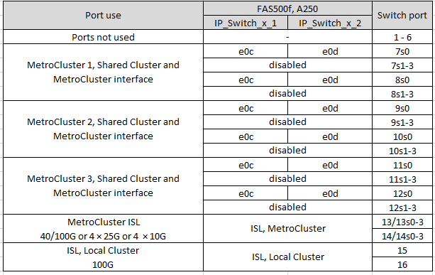
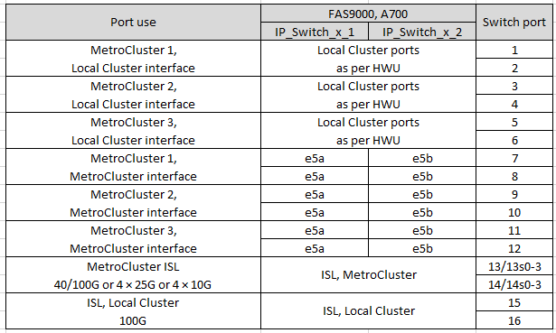
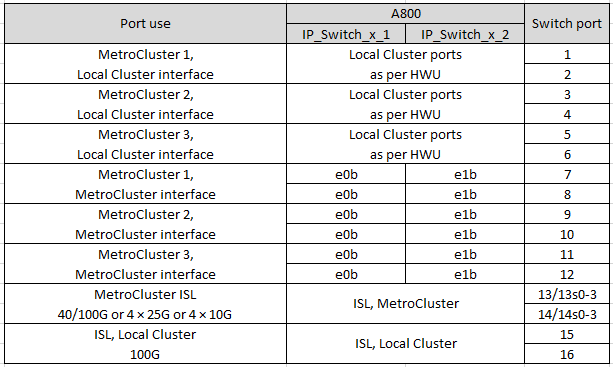

= NVIDIAがサポートするSN2100 IPスイッチのプラットフォームポート割り当て
:allow-uri-read: 
:icons: font
:imagesdir: ../media/

[role="lead"]
MetroCluster IP 構成で使用するポートは、スイッチのモデルとプラットフォームのタイプによって異なります。

== サポートされている構成

現在サポートされているプラットフォームは次のとおりです。

* AFF A250
* FAS8300 / AFF A400
* FAS8700 の場合
* FAS9000 / AFF A700
* AFF A800

次のプラットフォームと構成は現在サポートされていません。

* MetroCluster FC-to IPの移行
* 8ノードMetroCluster 構成

.設定テーブルを使用する前に、これらの考慮事項を確認してください
複数のMetroCluster 構成をケーブル接続する場合は、該当する表に従ってください。例：

* AFF A700タイプの4ノードMetroCluster 構成を2つケーブル接続する場合は、最初のMetroCluster を「MetroCluster 1」と、2番目のMetroCluster をAFF A700テーブルに「MetroCluster 2」と表示して接続します。

NOTE: ポート13と14は、40Gbpsと100Gbpsをサポートするネイティブ速度モードまたは4×25Gbpsをサポートするブレークアウトモードで使用できます。ネイティブ速度モードを使用する場合は、ポート13および14と表されます。ブレークアウトモード（4×25 Gbpsまたは4×10 Gbps）を使用する場合、これらは13s0-3および14s0-3として表されます。

以降の各セクションでは、物理的なケーブル接続の概要について説明します。を参照することもできます https://mysupport.netapp.com/site/tools/tool-eula/rcffilegenerator["RcfFileGenerator の順にクリックします"] ケーブル接続の詳細については、を参照して

== AFF A250 または FAS500f システムに使用するスイッチポート

== AFF A400 、 FAS8300 、 FAS8700 システムに使用するスイッチポートを指定します

image::../media/mcc_ip_cabling_A400_MSN2100.png[MCC IPケーブルA400 MSN2100]

== AFF A700またはFAS9000でのスイッチポートの用途

== AFF A800で使用するスイッチポート

