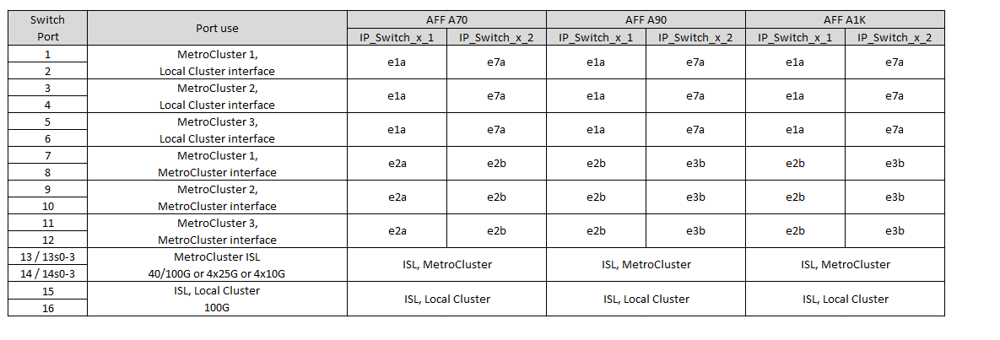

= NVIDIAがサポートするSN2100 IPスイッチのプラットフォームポート割り当て
:allow-uri-read: 
:icons: font
:imagesdir: ../media/

[role="lead"]
MetroCluster IP 構成で使用するポートは、スイッチのモデルとプラットフォームのタイプによって異なります。

== サポートされている構成

次の構成は現在サポートされていません。

* MetroCluster FC-to IPの移行

.設定テーブルを使用する前に、これらの考慮事項を確認してください
* 8ノードまたは2つの4ノードMetroCluster構成を接続するには、ONTAP 9.14.1以降とRCFファイルバージョン2.00以降が必要です。
* 複数のMetroCluster 構成をケーブル接続する場合は、該当する表に従ってください。例：
+
** タイプがAFF A700の2つの4ノードMetroCluster 構成をケーブル接続する場合は、AFF A700の表で「MetroCluster 1」と表示されている最初のMetroCluster と「MetroCluster 2」と表示されている2つ目のMetroCluster を接続します。

NOTE: ポート13と14は、40Gbpsと100Gbpsをサポートするネイティブ速度モードまたは4×25Gbpsをサポートするブレークアウトモードで使用できます。ネイティブ速度モードを使用している場合は、ポート13と14として表されます。ブレークアウトモード（4×25Gbpsまたは4×10Gbps）を使用する場合、ポート13s0-3および14s0-3として表されます。

以降の各セクションでは、物理的なケーブル接続の概要について説明します。を参照することもできます https://mysupport.netapp.com/site/tools/tool-eula/rcffilegenerator["RcfFileGenerator の順にクリックします"] ケーブル接続の詳細については、を参照して

== 構成に適したケーブル接続テーブルを選択

次の表を使用して、必要なケーブル接続の表を特定します。

[cols="2*"]
|===
| システムの状態 | 使用するケーブル接続テーブル 

 a| 
AFF A150、ASA A150向け

FAS500f

AFF C250、ASA C250向け

AFF A250、ASA A250向け
| <<table_1_nvidia_sn2100,NVIDIA SN2100プラットフォームのポート割り当て（グループ1）>> 

| FAS8300 AFF C400、ASA C400 AFF A400、ASA A400 FAS8700 FAS9000、AFF A700 | <<table_2_nvidia_sn2100,NVIDIA SN2100プラットフォームのポート割り当て（グループ2）>> 

| AFF C800、ASA C800 AFF A800、ASA A800 FAS9500 AFF A900、ASA A900 | <<table_3_nvidia_sn2100,NVIDIA SN2100プラットフォームのポート割り当て（グループ3）>> 

| AFF A70 AFF A90 AFF A1K *注：*これらのシステムにはONTAP 9.15.1以降が必要です。 | <<table_4_nvidia_sn2100,NVIDIA SN2100プラットフォームのポート割り当て（グループ4）>> 
|===
.NVIDIA SN2100プラットフォームのポート割り当て（グループ1）
プラットフォームポートの割り当てを確認して、AFF A150、ASA A150、FAS500f、AFF C250、ASA C250、 AFF A250またはASA A250システムからNVIDIA SN2100スイッチへの接続：

[#table_1_nvidia_sn2100]
image::../media/mcc-ip-cabling-aff-asa-a150-fas500f-a25-c250-MSN2100.png[はNVIDIA SN2100プラットフォームのポート割り当てを示しています]

.NVIDIA SN2100プラットフォームのポート割り当て（グループ2）
FAS8300、AFF C400、ASA C400、AFF A400、ASA A400をケーブル接続するためのプラットフォームポート割り当てを確認します。 FAS8700、FAS9000、またはAFF A700システムからNVIDIA SN2100スイッチへの接続：

*注1 *：X91440Aアダプタ（40Gbps）を使用している場合は、ポートe4aとe4e、またはe4aとe8aのいずれかを使用します。X91153Aアダプタ（100Gbps）を使用する場合は、ポートe4aとe4b、またはe4aとe8aのいずれかを使用します。

.NVIDIA SN2100プラットフォームのポート割り当て（グループ3）
AFF C800、ASA C800、AFF A800、ASA A800、FAS9500をケーブル接続するためのプラットフォームポート割り当ての確認 AFF A900またはASA A900システムからNVIDIA SN2100スイッチへの接続：

image::../media/mcc_ip_cabling_fas8300_aff_asa_a800_a900_fas9500_MSN2100.png[はNVIDIA SN2100プラットフォームのポート割り当てを示しています]

*注1 *：X91440Aアダプタ（40Gbps）を使用している場合は、ポートe4aとe4e、またはe4aとe8aのいずれかを使用します。X91153Aアダプタ（100Gbps）を使用する場合は、ポートe4aとe4b、またはe4aとe8aのいずれかを使用します。

.NVIDIA SN2100プラットフォームのポート割り当て（グループ4）
プラットフォームポートの割り当てを確認し、AFF A90、AFF A70、またはAFF A1KシステムをNVIDIA SN2100スイッチにケーブル接続します。

NOTE: この表に示すシステムには、ONTAP 9.15.1以降が必要です。

