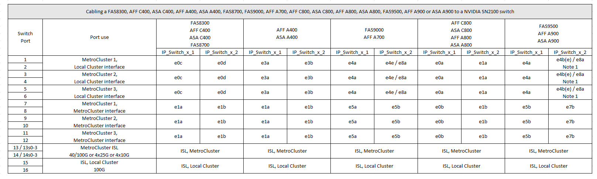

= NVIDIAがサポートするSN2100 IPスイッチのプラットフォームポート割り当て
:allow-uri-read: 
:icons: font
:imagesdir: ../media/

[role="lead"]
MetroCluster IP 構成で使用するポートは、スイッチのモデルとプラットフォームのタイプによって異なります。

== サポートされている構成

次の構成は現在サポートされていません。

* MetroCluster FC-to IPの移行

.設定テーブルを使用する前に、これらの考慮事項を確認してください
* 8ノードまたは2つの4ノードMetroCluster構成を接続するには、ONTAP 9.14.1以降とRCFファイルバージョン2.00以降が必要です。
* 複数のMetroCluster 構成をケーブル接続する場合は、該当する表に従ってください。例：
+
** タイプがAFF A700の2つの4ノードMetroCluster 構成をケーブル接続する場合は、AFF A700の表で「MetroCluster 1」と表示されている最初のMetroCluster と「MetroCluster 2」と表示されている2つ目のMetroCluster を接続します。

NOTE: ポート13と14は、40Gbpsと100Gbpsをサポートするネイティブ速度モードまたは4×25Gbpsをサポートするブレークアウトモードで使用できます。ネイティブ速度モードを使用している場合は、ポート13と14として表されます。ブレークアウトモード（4×25Gbpsまたは4×10Gbps）を使用する場合、ポート13s0-3および14s0-3として表されます。

以降の各セクションでは、物理的なケーブル接続の概要について説明します。を参照することもできます https://mysupport.netapp.com/site/tools/tool-eula/rcffilegenerator["RcfFileGenerator の順にクリックします"] ケーブル接続の詳細については、を参照して

== AFF A150、ASA A150、FAS500f、AFF C250、ASA C250のケーブル接続 AFF A250またはASA A250システムからNVIDIA SN2100スイッチへ

image::../media/mcc_ip_cabling_aff_asa_a150_fas500f_A250_C250_MSN2100.png[MCC IPケーブルAFF ASA a150 fas500f A250 C250 MSN2100]

== FAS8300、AFF C400、ASA C400、AFF A400、ASA A400のケーブル接続 FAS8700、FAS9000、AFF A700、AFF C800、ASA C800、 AFF A800、ASA A800、FAS9500、AFF A900、またはASA A900システムからNVIDIA SN2100スイッチへの接続

*注1 *：X91440Aアダプタ（40Gbps）を使用している場合は、ポートe4aとe4e、またはe4aとe8aのいずれかを使用します。X91153Aアダプタ（100Gbps）を使用する場合は、ポートe4aとe4b、またはe4aとe8aのいずれかを使用します。
