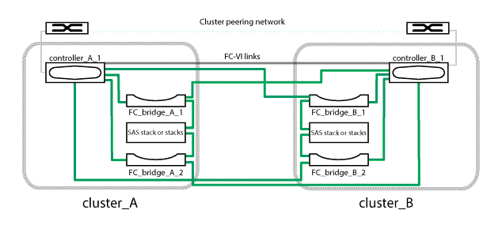

= 2 ノードブリッジ接続 MetroCluster 構成における FC-to-SAS ブリッジとコントローラモジュールのケーブル接続
:icons: font
:imagesdir: ../media/

[role="lead"]
2 ノードブリッジ接続 MetroCluster 構成では、ブリッジをコントローラモジュールにケーブル接続する必要があります。

.手順
. 各ブリッジが、ブリッジの接続先のすべてのディスクドライブとディスクシェルフを検出できることを確認します。
+
|===
| 使用する手段 | 作業 

 a| 
ATTO ExpressNAV の GUI
 a| 
.. サポートされている Web ブラウザで、ブリッジの IP アドレスをブラウザのアドレスバーに入力します。
+
入力した IP アドレスのブリッジリンクの ATTO FibreBridge ホームページに移動します。

.. リンクをクリックし、ブリッジを設定するときに指定したユーザ名とパスワードを入力します。
+
ブリッジの ATTO FibreBridge ステータスページが開き、左側にメニューが表示されます。

.. メニューの「 * 詳細設定 * 」をクリックします。
.. 次のコマンドを実行してから '[*Submit*:+`*sastargets*] をクリックします

 a| 
シリアルポート接続
 a| 
次のコマンドを実行します。

'*sastargets*'

|===
+
「 astargets 」コマンドの出力には、ブリッジに接続されているデバイス（ディスクおよびディスクシェルフ）が表示されます。出力行には行番号が振られているため、デバイスの台数を簡単に把握できます。

+

NOTE: 出力の先頭に「 text response 」が省略されている場合は、 Telnet を使用してブリッジに接続し、同じコマンドを実行すると、すべての出力を表示できます。

+
次の出力は、 10 本のディスクが接続されていることを示します。

+
[listing]
----
Tgt VendorID ProductID        Type        SerialNumber
  0 NETAPP   X410_S15K6288A15 DISK        3QP1CLE300009940UHJV
  1 NETAPP   X410_S15K6288A15 DISK        3QP1ELF600009940V1BV
  2 NETAPP   X410_S15K6288A15 DISK        3QP1G3EW00009940U2M0
  3 NETAPP   X410_S15K6288A15 DISK        3QP1EWMP00009940U1X5
  4 NETAPP   X410_S15K6288A15 DISK        3QP1FZLE00009940G8YU
  5 NETAPP   X410_S15K6288A15 DISK        3QP1FZLF00009940TZKZ
  6 NETAPP   X410_S15K6288A15 DISK        3QP1CEB400009939MGXL
  7 NETAPP   X410_S15K6288A15 DISK        3QP1G7A900009939FNTT
  8 NETAPP   X410_S15K6288A15 DISK        3QP1FY0T00009940G8PA
  9 NETAPP   X410_S15K6288A15 DISK        3QP1FXW600009940VERQ
----
. コマンド出力を確認して、ブリッジがスタック内の想定されるすべてのディスクおよびディスクシェルフに接続していることを確認します。
+
|===
| 出力結果 | 作業 

 a| 
正解です
 a| 
繰り返します <<STEP_524EBC3334F54467B771D9E2FD2B2DDA,手順 1.>> 残りの各ブリッジ。

 a| 
不正解です
 a| 
.. SAS ケーブルに緩みがないか確認するか、ディスクシェルフからブリッジへの SAS ケーブル接続をやり直します。
+
xref:task_fb_new_install_cabl.adoc[ディスクシェルフとブリッジのケーブル接続]

.. 繰り返します <<STEP_524EBC3334F54467B771D9E2FD2B2DDA,手順 1.>> 残りの各ブリッジ。

|===
. 各ブリッジをコントローラモジュールにケーブル接続します。
+
.. ブリッジの FC ポート 1 を cluster_A のコントローラモジュールの FC ポートにケーブル接続します
.. ブリッジの FC ポート 2 を cluster_B のコントローラモジュールの FC ポートにケーブル接続します
+
コントローラモジュールにクアッドポート FC アダプタが設定されている場合は、ストレージスタックを同じ ASIC の 2 つの FC ポートに接続してください。ポート a とポート b で同じ ASIC を、ポート c とポート d で同じ ASIC をそれぞれ共有します。シェルフのスタックをポート A とポート B に接続しないでください代わりに、ポート a とポート c を使用するか、ポート b とポート d を使用して、 ASIC に障害が発生した場合の単一点障害を回避します。

+
コントローラモジュールに複数の FC アダプタが設定されている場合は、両方のブリッジポートを同じアダプタに接続しないでください。単一点障害を避けるために、 FC ポート 1 をアダプタ A 、 FC ポート 2 をアダプタ B に分散させる必要があります。

+

. 繰り返します <<STEP_F00134584D424D4F869B5E9ECFCD56EB,手順 3>> 他のブリッジについて、すべてのブリッジがケーブル接続されるまで。

