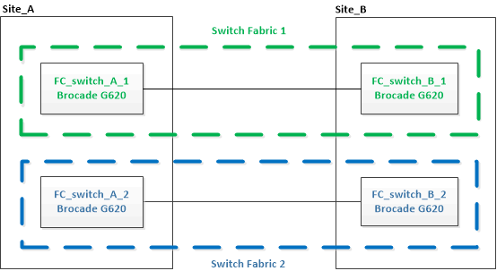

= 新しい Brocade FC スイッチへのアップグレード
:allow-uri-read: 
:icons: font
:imagesdir: ../media/

[role="lead"]
新しい Brocade FC スイッチにアップグレードする場合は、最初のファブリック内のスイッチを交換し、 MetroCluster 構成が完全に動作していることを確認してから、 2 番目のファブリック内のスイッチを交換する必要があります。

* MetroCluster 構成が正常に動作している必要があります。
* MetroCluster スイッチファブリックは 4 つの Brocade スイッチで構成されます。
+
以下の手順の図は、現在のスイッチを示しています。

* スイッチがサポート対象の最新のファームウェアを実行している必要があります。
+
https://mysupport.netapp.com/matrix["NetApp Interoperability Matrix Tool で確認できます"^]

* これはシステムの停止を伴わない手順であり、完了までに約 2 時間かかります。
* 管理パスワードと FTP サーバまたは SCP サーバへのアクセスが必要です。
* link:enable-console-logging-before-maintenance.html["コンソールログを有効にする"] このタスクを実行する前に。

スイッチファブリックは一度に 1 つずつアップグレードされます。

この手順の最後に、 4 つのスイッチすべてを新しいスイッチにアップグレードします。

.手順
. 最初のスイッチファブリックを無効にします。
+
'*FC_switch_a_1:admin>switchCfgPersistentDisable *

+
[listing]
----
FC_switch_A_1:admin> switchCfgPersistentDisable
----
+
image::../media/brocade_upgr_to_g620_fab_1_down.gif[Brocade Upgr から G620 fab 1 が停止しています]

. 1 つの MetroCluster サイトで古いスイッチを交換します。
+
.. 無効なスイッチのケーブルを外してスイッチを取り外します。
.. 新しいスイッチをラックに設置します。
+
image::../media/brocade_upgr_to_g620_replaced_a_1.gif[Brocade Upgr から G620 に変更され、 1 が交換されました]

.. 両方のスイッチで次のコマンドを実行して、新しいスイッチを無効にします。
+
'witchcfgpersistentdisable

+
[listing]
----
FC_switch_A_1:admin> switchCfgPersistentDisable
----
.. 推奨されるポート割り当てを使用して、新しいスイッチをケーブル接続します。
+
link:concept_port_assignments_for_fc_switches_when_using_ontap_9_1_and_later.html["ONTAP 9.1 以降を使用している場合の FC スイッチのポート割り当て"]

.. パートナーの MetroCluster サイトで上記の手順を繰り返して、 1 つ目のスイッチファブリック内の 2 つ目のスイッチを交換します。
+
ファブリック 1 の両方のスイッチが交換されている。

+
image::../media/brocade_upgr_to_g620_replaced_b_1.gif[Brocade Upgr から G620 に変更しました。 b 1]

. 新しいスイッチに電源を投入し、起動するのを待ちます。
. 次のいずれかの手順を使用してBrocade FCスイッチを設定します。
+
link:../install-fc/task_reset_the_brocade_fc_switch_to_factory_defaults.html["RCF ファイルを使用して Brocade FC スイッチを設定します"]

+
link:../install-fc/task_fcsw_brocade_configure_the_brocade_fc_switches_supertask.html["Brocade FC スイッチを手動で設定"]

. スイッチの設定を保存します。
+
cfgsave

. 設定が安定するまで 10 分待ちます。
. いずれかの MetroCluster ノードで次のコマンドを入力して、ディスクへの接続を確認します。
+
'run local sysconfig -v

+
出力には、コントローラのイニシエータポートに接続されているディスクが表示され、 FC-to-SAS ブリッジに接続されているシェルフが示されます。

+
[listing]
----

node_A_1> run local sysconfig -v
NetApp Release 9.3.2X18: Sun Dec 13 01:23:24 PST 2017
System ID: 4068741258 (node_A_1); partner ID: 4068741260 (node_B_1)
System Serial Number: 940001025471 (node_A_1)
System Rev: 70
System Storage Configuration: Multi-Path HA**<=== Configuration should be multi-path HA**
.
.
.
slot 0: FC Host Adapter 0g (QLogic 8324 rev. 2, N-port, <UP>)**<=== Initiator port**
		Firmware rev:      7.5.0
		Flash rev:         0.0.0
		Host Port Id:      0x60130
		FC Node Name:      5:00a:098201:bae312
		FC Port Name:      5:00a:098201:bae312
		SFP Vendor:        UTILITIES CORP.
		SFP Part Number:   FTLF8529P3BCVAN1
		SFP Serial Number: URQ0Q9R
		SFP Capabilities:  4, 8 or 16 Gbit
		Link Data Rate:    16 Gbit
		Switch Port:       brcd6505-fcs40:1
  **<List of disks visible to port\>**
		 ID     Vendor   Model            FW    Size
		brcd6505-fcs29:12.126L1527     : NETAPP   X302_HJUPI01TSSM NA04 847.5GB (1953525168 512B/sect)
		brcd6505-fcs29:12.126L1528     : NETAPP   X302_HJUPI01TSSA NA02 847.5GB (1953525168 512B/sect)
		.
		.
		.
		**<List of FC-to-SAS bridges visible to port\>**
		FC-to-SAS Bridge:
		brcd6505-fcs40:12.126L0        : ATTO     FibreBridge6500N 1.61  FB6500N102980
		brcd6505-fcs42:13.126L0        : ATTO     FibreBridge6500N 1.61  FB6500N102980
		brcd6505-fcs42:6.126L0         : ATTO     FibreBridge6500N 1.61  FB6500N101167
		brcd6505-fcs42:7.126L0         : ATTO     FibreBridge6500N 1.61  FB6500N102974
		.
		.
		.
  **<List of storage shelves visible to port\>**
		brcd6505-fcs40:12.shelf6: DS4243  Firmware rev. IOM3 A: 0200  IOM3 B: 0200
		brcd6505-fcs40:12.shelf8: DS4243  Firmware rev. IOM3 A: 0200  IOM3 B: 0200
		.
		.
		.
----
. スイッチのプロンプトに戻り、スイッチのファームウェアバージョンを確認します。
+
「 firmwareShow

+
スイッチがサポート対象の最新のファームウェアを実行している必要があります。

+
https://mysupport.netapp.com/matrix["NetApp Interoperability Matrix Tool で確認できます"]

. スイッチオーバー処理をシミュレートします。
+
.. いずれかのノードのプロンプトで、 advanced 権限レベルに切り替えます。 + 「 set -privilege advanced 」
+
advanced モードで続けるかどうかを尋ねられたら、「 y 」と入力して応答する必要があります。 advanced モードのプロンプトが表示されます（ * > ）。

.. 「 -simulate 」パラメータを指定して、スイッチオーバー操作を実行します。
+
MetroCluster switchover -simulate

.. admin 権限レベルに戻ります。
+
「特権管理者」

. 2 つ目のスイッチファブリックで、ここまでの手順を繰り返します。

上記の手順を繰り返して実行すると、 4 つのスイッチすべてがアップグレードされ、 MetroCluster 構成は正常に動作します。

