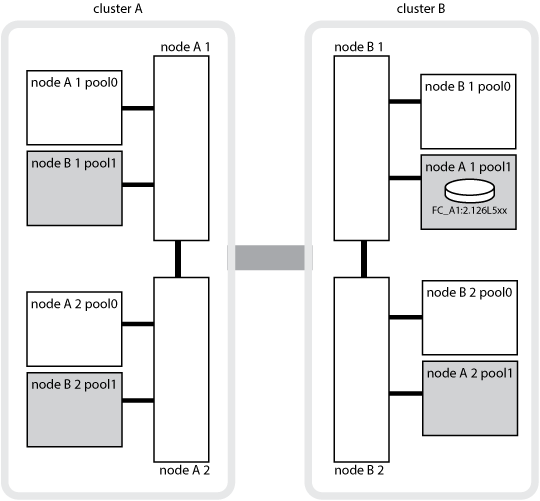

= MetroCluster のデータ保護とディザスタリカバリについて理解する
:allow-uri-read: 
:icons: font
:imagesdir: ../media/

[role="lead"]
MetroCluster でデータ保護と障害からの透過的なリカバリがどのように行われるかを理解しておくと、スイッチオーバーとスイッチバックの作業を簡単かつ効率的に実施できます。

MetroCluster は、ミラーリングを使用してクラスタ内のデータを保護します。ディザスタリカバリは 1 つの MetroCluster コマンドで実装されます。このコマンドは、サバイバーサイトのセカンダリをアクティブ化して、災害の影響を受けたプライマリサイトが本来所有していた、ミラーリングされたデータを提供できるようにします。

== 8 ノード / 4 ノード MetroCluster 構成でのローカルフェイルオーバーとスイッチオーバー

8 ノード / 4 ノードの MetroCluster 構成では、ローカルレベルとクラスタレベルの両方でデータが保護されます。MetroCluster 構成をセットアップする場合は、 MetroCluster 構成がどのようにデータを保護するかを理解しておく必要があります。

MetroCluster 構成は、物理的に分離され、ミラーされた 2 つのクラスタを使用することでデータを保護各クラスタで、もう一方のクラスタのデータおよび Storage Virtual Machine （ SVM ）の設定が同期的にミラーされます。一方のサイトで災害が発生すると、管理者は、ミラーされた SVM をアクティブ化し、サバイバーサイトからミラーされたデータの提供を開始します。さらに、各クラスタ内のノードは HA ペアとして構成されているため、ローカルフェイルオーバーも可能になります。

=== MetroCluster 構成でのローカルの HA データ保護の仕組み

MetroCluster 構成での HA ペアの仕組みを理解する必要があります。

ピアネットワークにある 2 つのクラスタは、それぞれがもう一方のクラスタのソースクラスタおよびバックアップクラスタになることで、双方向のディザスタリカバリを実現します。各クラスタは、 HA ペアとして構成された 2 つのノードで構成されます。1 つのノード構成内で障害が発生した場合やメンテナンスが必要な場合、ストレージフェイルオーバーによって、そのノードの処理をローカルの HA パートナーに転送することができます。

次の図は、 MetroCluster FC 構成を示しています。HA 機能は、 HA インターコネクトがクラスタスイッチで確立されている点を除いて、 MetroCluster IP 構成と同じです。

image::../media/mcc_hw_architecture_local_ha.gif[MCC ハードウェアアーキテクチャローカル HA]

.関連情報
link:https://docs.netapp.com/us-en/ontap/high-availability/index.html["ハイアベイラビリティ構成"^]

== MetroCluster 構成でのデータと設定のレプリケーション

MetroCluster 構成では、各種の ONTAP 機能を使用して、 2 つの MetroCluster サイト間でデータと設定の同期レプリケーションが行われます。

=== 設定レプリケーションサービスによる設定の保護

ONTAP の Configuration Replication Service （ CRS ；設定レプリケーションサービス）は、 DR パートナーに情報を自動的にレプリケートして MetroCluster の設定を保護します。

CRS は、ローカルノードの設定をパートナークラスタの DR パートナーに同期的にレプリケートします。このレプリケーションは、クラスタピアリングネットワーク経由で行われます。

レプリケートされる情報には、クラスタの設定と SVM の設定が含まれます。

=== MetroCluster 処理中の SVM のレプリケーション

ONTAP の Configuration Replication Service （ CRS ；設定レプリケーションサービス）は、冗長なデータサーバ構成と SVM に属するデータボリュームのミラーリングを提供します。スイッチオーバーでは、ソース SVM が停止され、サバイバークラスタ上にあるデスティネーション SVM がアクティブになります。

NOTE: MetroCluster 構成のデスティネーション SVM の名前には、識別しやすいように「 -mc 」というサフィックスが自動的に付加されます。MetroCluster 構成では、デスティネーション SVM の名前に「 -mc 」というサフィックスが付加されます。 SVM 名にピリオドが含まれている場合は、最初のピリオドの前にサフィックス「 -mc 」が適用されます。たとえば、 SVM 名が SVM.DNS.NAME の場合、サフィックス「 -mc 」は SVM-MC.DNS.NAME のように付加されます。

次の例は、 MetroCluster 構成の SVM を示しています。「 SVM_cluster_A 」はソースサイトの SVM 、「 SVM_cluster_A-mc 」はディザスタリカバリサイトの同期先のアグリゲートです。

* SVM_cluster_A はクラスタ A のデータを提供します
+
これは同期元の SVM であり、 SVM の設定（ LIF 、プロトコル、サービス）および SVM に属するボリュームのデータを表します。設定とデータは、クラスタ B にある同期先の SVM 、 SVM_cluster_A-mc にレプリケートされます

* SVM_cluster_B はクラスタ B のデータを提供します
+
これは同期元の SVM であり、クラスタ A にある SVM_cluster_B-mc に対する設定とデータを表します

* SVM_cluster_B-mc は同期先の SVM であり、 MetroCluster 構成が通常どおり正常に動作している間は停止しています。
+
クラスタ B からクラスタ A へのスイッチオーバーが成功すると SVM_cluster_B は停止し、 SVM_cluster_B-mc がアクティブになって、クラスタ A のデータ提供を開始します

* SVM_cluster_A-mc は同期先の SVM であり、 MetroCluster 構成が通常どおり正常に動作している間は停止しています。
+
クラスタ A からクラスタ B へのスイッチオーバーが成功すると SVM_cluster_A は停止し、 SVM_cluster_A-mc がアクティブになって、クラスタ B のデータ提供を開始します

image::../media/mcc_mirroring_of_svms.gif[SVM の MCC ミラーリング]

スイッチオーバーでは、サバイバークラスタ上のリモートプレックスがオンラインになり、セカンダリ SVM がデータの提供を開始します。

image::../media/mcc_svms_after_switchover.gif[スイッチオーバー後に SVM を MCC]

スイッチオーバー後にリモートプレックスを使用できるかどうかは、 MetroCluster の構成タイプによって異なります。

* MetroCluster FC 構成では、スイッチオーバー後に ISL を使用してディザスタサイトのストレージにアクセスできる場合、ローカルプレックスとリモートプレックスの両方がオンラインのままになります。
+
ISL で障害が発生し、ディザスタサイトのストレージを使用できない場合、同期先の SVM がサバイバーサイトからデータの提供を開始します。

* MetroCluster IP 構成でリモートプレックスを使用できるかどうかは、 ONTAP のバージョンによって決まります。
+
** ONTAP 9.5 以降では、ディザスタサイトのノードがブートしたままの場合、ローカルプレックスとリモートプレックスの両方がオンラインのままになります。
** ONTAP 9.5 よりも前のバージョンでは、サバイバーサイトのローカルプレックスからのみストレージを使用できます。
+
同期先の SVM がサバイバーサイトからデータの提供を開始します。

.関連情報
https://docs.netapp.com/ontap-9/topic/com.netapp.doc.dot-cm-sag/home.html["システム管理"^]

=== MetroCluster 構成で SyncMirror を使用してデータの冗長性を実現する方法

SyncMirror 機能を使用するミラーされたアグリゲートにはソースとデスティネーションの Storage Virtual Machine （ SVM ）が所有するボリュームが格納され、データの冗長性が確保されます。データはパートナークラスタのディスクプールにレプリケートされます。ミラーされていないアグリゲートもサポートされます

次の表に、スイッチオーバー後のミラーされていないアグリゲートの状態（オンラインまたはオフライン）を示します。

|===

| スイッチオーバーのタイプ | 状態 

 a| 
ネゴシエートスイッチオーバー（ NSO ）
 a| 
オンライン

 a| 
自動計画外スイッチオーバー（ AUSO ）
 a| 
オンライン

 a| 
計画外スイッチオーバー（ USO ）
 a| 
* ストレージが使用できない場合は、オフラインになります
* ストレージが使用可能な場合：オンライン

|===

NOTE: スイッチオーバー後に、ミラーされていないアグリゲートが DR パートナーノードにある状態でスイッチ間リンク（ ISL ）に障害が発生すると、そのローカルノードで障害が発生することがあります。

次の図は、ディスクプールがパートナークラスタ間でミラーされる仕組みを示しています。ローカルプレックス（プール 0 内）のデータは、リモートプレックス（プール 1 内）にレプリケートされます。

IMPORTANT: ハイブリッドアグリゲートを使用している場合、ソリッドステートディスク（ SSD ）レイヤがいっぱいになったことが原因で SyncMirror プレックスに障害が発生すると、パフォーマンスが低下する可能性があります。

image::../media/mcc_mirroring_of_pools.gif[プールの MCC ミラーリング]

=== MetroCluster 構成での NVRAM / NVMEM キャッシュミラーリングと動的ミラーリング

ストレージコントローラの不揮発性メモリ（プラットフォームモデルに応じて NVRAM または NVMEM ）は、ローカル HA パートナーにローカルでミラーされ、同時にパートナーサイトのリモートディザスタリカバリ（ DR ）パートナーにリモートでミラーされます。この構成により、ローカルでフェイルオーバーまたはスイッチオーバーが発生しても、不揮発性キャッシュ内のデータを保護することができます。

MetroCluster 構成に含まれない HA ペアでは、各ストレージコントローラに、不揮発性キャッシュパーティションが 2 つ保持されます。 1 つは不揮発性キャッシュパーティションで、もう 1 つは HA パートナー用です。

4 ノード MetroCluster 構成では、各ストレージコントローラの不揮発性キャッシュが 4 つのパーティションに分かれています。2 ノード MetroCluster 構成では、ストレージコントローラが HA ペアとして構成されないため、 HA パートナーパーティションと DR 補助パーティションが使用されません。

|===

2+| ストレージコントローラの不揮発性キャッシュ 

| MetroCluster 構成の場合 | MetroCluster に属さない HA ペア 

 a| 
image:../media/mcc_nvram_quartering.gif[""]
 a| 
image:../media/mcc_nvram_split_in_non_mcc_ha_pair.gif[""]

|===
不揮発性キャッシュには次の情報が格納されます。

* ローカルパーティションは、ストレージコントローラからディスクに書き込まれる前のデータを格納します。
* HA パートナーパーティションは、 HA パートナーのローカルキャッシュのコピーを格納します。
+
2 ノード MetroCluster 構成では、ストレージコントローラが HA ペアとして構成されないため、 HA パートナーパーティションは存在しません。

* DR パートナーパーティションは、 DR パートナーのローカルキャッシュのコピーを格納します。
+
DR パートナーは、ローカルノードとペアリングされているパートナークラスタ内のノードです。

* DR 補助パートナーパーティションは、 DR 補助パートナーのローカルキャッシュのコピーを格納します。
+
DR 補助パートナーは、ローカルノードの DR パートナーの HA パートナーです。このキャッシュは、 HA テイクオーバーが実行された場合（構成の通常動作時または MetroCluster スイッチオーバー後）に必要です。

+
2 ノード MetroCluster 構成では、ストレージコントローラが HA ペアとして構成されないため、 DR 補助パートナーパーティションは存在しません。

たとえば、ノード（ node_A_1 ）のローカルキャッシュは、 MetroCluster サイトでローカルおよびリモートの両方でミラーされます。次の図では、 node_A_1 のローカルキャッシュが、 HA パートナー（ node_B_2 ）と DR パートナー（ node_B_1 ）にミラーされています。

image::../media/mcc_nvram_mirroring_example.gif[MCC NVRAM のミラーリングの例]

==== ローカルの HA テイクオーバー時の動的なミラーリング

4 ノード MetroCluster 構成でローカルの HA テイクオーバーが行われると、テイクオーバーされたノードは DR パートナーのミラーとして機能しなくなります。DR ミラーリングを続行するために、ミラーリング先が自動的に DR 補助パートナーに切り替わります。ギブバックが正常に完了すると、ミラーリング先は自動的に DR パートナーに戻ります。

たとえば、 node_B_1 で障害が発生し、 node_B_2 によってテイクオーバーされたとします。node_A_1 のローカルキャッシュを node_B_1 にミラーできなくなります。ミラーリング先が DR 補助パートナー node_B_2 に切り替わります。

image::../media/mcc_nvram_mirroring_example_dynamic_dr_aux.gif[MCC NVRAM ミラーリングの例：ダイナミック DR 補助]

== 災害の種類とリカバリ方法

MetroCluster 構成を使用して適切に対応できるように、さまざまな種類の障害や災害について熟知しておく必要があります。

* 単一ノード障害です
+
ローカル HA ペアの 1 つのコンポーネントで障害が発生した場合。

+
4 ノード MetroCluster 構成の場合、障害が発生したコンポーネントによっては、障害ノードの自動テイクオーバーまたはネゴシエートテイクオーバーが行われる可能性があります。データ・リカバリについては、を参照してください link:https://docs.netapp.com/us-en/ontap/high-availability/index.html["ハイアベイラビリティペアの管理"^] 。

+
2 ノード MetroCluster 構成の場合は、 Automatic Unplanned Switchover （ AUSO ；自動計画外スイッチオーバー）が行われます。

* サイト全体のコントローラ障害
+
電源の喪失、機器の交換、または災害が原因で、サイトのすべてのコントローラモジュールで発生する障害です。通常、 MetroCluster 構成では障害と災害を区別できません。ただし、 MetroCluster Tiebreaker ソフトウェアなどの監視ソフトウェアはこれらを区別できます。スイッチ間リンク（ ISL ）およびスイッチが稼働しており、ストレージにアクセスできる場合は、サイト全体のコントローラ障害によって自動スイッチオーバーが実行される可能性があります。

+
link:https://docs.netapp.com/us-en/ontap/high-availability/index.html["ハイアベイラビリティペアの管理"^] サイト全体のコントローラ障害（コントローラ障害を含まない）および1台以上のコントローラを含む障害からのリカバリ方法について詳しく説明します。

* ISL 障害です
+
サイト間のリンクで障害が発生した場合MetroCluster の設定は何の動作も行いません。各ノードは通常どおりデータを提供しますが、対応するディザスタリカバリサイトにアクセスできないため、ミラーデータの書き込みは行われません。

* 複数の連続的な障害
+
複数のコンポーネントで連続して発生する障害です。たとえば、コントローラモジュール、スイッチファブリック、シェルフで連続して障害が発生すると、ダウンタイムやデータ損失から保護するために、ストレージフェイルオーバー、ファブリックの冗長化、および SyncMirror が順次行われる場合があります。

次の表に、障害の種類、および対応するディザスタリカバリ（ DR ）メカニズムとリカバリ方法を示します。

NOTE: MetroCluster IP構成では、AUSO（自動計画外スイッチオーバー）はサポートされません。

|===

.2+| 障害のタイプ 2+| DR メカニズム 2+| リカバリ方法の概要 

| 4 ノード構成 | 2 ノード構成 | 4 ノード構成 | 2 ノード構成 

| 単一ノード障害です | ローカル HA フェイルオーバー | AUSO | 自動フェイルオーバーとギブバックが有効になっている場合は必要なし。 | ノードがリストアされた後は ' MetroCluster heal-phase aggregates コマンド 'MetroCluster heal-phase root-aggregates コマンド 'MetroCluster switchback コマンドを使用して ' 手動で修復およびスイッチバックを行う必要があります注 MetroCluster : ONTAP 9.5 以降を実行する MetroCluster IP 構成では 'CLI heal-' コマンドは必要ありません 

| サイト障害 2+| MetroCluster スイッチオーバー 2.3+| ノードがリストアされた後には ' MetroCluster healing' および MetroCluster switchback コマンドを使用した手動での修復とスイッチバックが必要ですONTAP 9.5 を実行する MetroCluster IP 構成では 'CLI MetroCluster heal-' コマンドは必要ありません 

| サイト全体のコントローラ障害 | AUSO が行われるのは、ディザスタサイトのストレージにアクセスできる場合のみです。 | AUSO （単一ノード障害と同じ） 

| 複数の連続的な障害 | ローカル HA フェイルオーバーのあとに、 MetroCluster switchover -forced-on-disaster コマンドを使用して MetroCluster 強制スイッチオーバーを実行。注：障害が発生したコンポーネントによっては、強制スイッチオーバーは不要な場合があります。 | MetroCluster は 'MetroCluster switche-forced-on-disaster コマンドを使用して強制的にスイッチオーバーします 

| ISL 障害です 2+| MetroCluster のスイッチオーバーなし。 2 つのクラスタがそれぞれのデータを独立して提供します 2+| このタイプの障害では必要ありません。接続が回復すると、ストレージは自動的に再同期されます。 
|===

== 8 ノード / 4 ノード MetroCluster 構成でのノンストップオペレーションの実現

問題が 1 つのノードに限定されている場合、ローカル HA ペア内でのフェイルオーバーとギブバックにより、中断のないノンストップオペレーションが実現します。この場合、 MetroCluster 構成ではリモートサイトへのスイッチオーバーは必要ありません。

8 ノード / 4 ノードの MetroCluster 構成は各サイトに 1 つ以上の HA ペアで構成されるため、それぞれのサイトでのローカルな障害には、パートナーサイトにスイッチオーバーしなくても対応でき、サービスが中断することはありません。HA ペアの動作は、 MetroCluster 以外の構成の HA ペアと同じです。

4 ノードおよび 8 ノードの MetroCluster 構成では、パニックまたは停電によるノード障害が原因の自動スイッチオーバーによって発生する可能性があります。

link:https://docs.netapp.com/us-en/ontap/high-availability/index.html["ハイアベイラビリティペアの管理"^]

ローカルのフェイルオーバー後に 2 回目の障害が発生した場合、 MetroCluster のスイッチオーバーイベントによって、中断のないノンストップオペレーションが実現します。同様に、スイッチオーバー処理後にサバイバーノードの 1 つで次の障害が発生すると、ローカルのフェイルオーバーイベントによってノンストップオペレーションが継続されます。この場合、 1 つのサバイバーノードが、 DR グループ内の他の 3 つのノードにデータを提供します。

=== MetroCluster 移行中のスイッチオーバーとスイッチバック

MetroCluster FC-to IP の移行では、 MetroCluster IP ノードと IP スイッチを既存の MetroCluster FC 構成に追加し、 MetroCluster FC ノードを撤去します。移行プロセスの各ステージでは、 MetroCluster のスイッチオーバー、修復、スイッチバックの各処理のワークフローが異なります。

を参照してください http://docs.netapp.com/ontap-9/topic/com.netapp.doc.dot-mcc-upgrade/GUID-1870FDC4-1774-4604-86A7-5C979C297ADA.html["移行時のスイッチオーバー、修復、スイッチバックの処理"^]。

=== スイッチオーバー後のローカルフェイルオーバーの影響

MetroCluster のスイッチオーバー後にサバイバーサイトで問題が発生した場合は、ローカルフェイルオーバーによって中断のないノンストップオペレーションが実現します。ただし、冗長構成ではなくなるため、システムはリスクにさらされます。

スイッチオーバー後にローカルフェイルオーバーが発生すると、 1 台のコントローラが MetroCluster 構成内のすべてのストレージシステムにデータを提供します。そのため、リソースの問題が発生する可能性があり、さらに障害が発生した場合にはシステムが中断します。

== 2 ノード MetroCluster 構成でのノンストップオペレーションの実現

パニックが原因で 2 つのサイトのどちらかに問題がある場合は、 MetroCluster スイッチオーバーによって中断のないノンストップオペレーションが実現します。停電がノードとストレージの両方に影響を与える場合 ' スイッチオーバーは自動的には行われず 'MetroCluster switchover' コマンドが発行されるまで停止します

すべてのストレージがミラーリングされるため、ノード障害時の HA ペアでのストレージフェイルオーバーの場合と同様に、サイト障害が発生した場合にスイッチオーバー処理を使用して無停止の耐障害性を実現できます。

2 ノード構成では、 HA ペアで自動ストレージフェイルオーバーをトリガーするイベントと同じイベントによって、自動計画外スイッチオーバー（ AUSO ）がトリガーされます。つまり、 2 ノード MetroCluster 構成では HA ペアと同じ保護レベルが確保されます。

.関連情報
link:concept_understanding_mcc_data_protection_and_disaster_recovery.html["MetroCluster FC 構成での自動計画外スイッチオーバー"]

== スイッチオーバープロセスの概要

MetroCluster スイッチオーバー処理を実行すると、ストレージおよびクライアントのアクセスがソースクラスタからリモートサイトに移されるため、災害発生後にサービスの迅速な復旧が可能となります。スイッチオーバーが発生した場合に想定される変化と、実行する必要がある操作を把握しておく必要があります。

スイッチオーバー処理では、システムによって次の処理が実行されます。

* ディザスタサイトに属するディスクの所有権がディザスタリカバリ（ DR ）パートナーに変更されます。
+
これは、停止中のパートナーに属するディスクの所有権が正常な状態のパートナーに変更されるハイアベイラビリティ（ HA ）ペアでのローカルフェイルオーバーと似ています。

* サバイバーサイトにあるサバイバープレックスがディザスタクラスタ内のノードに属する場合、そのサバイバープレックスは、サバイバーサイトのクラスタでオンラインになります。
* ディザスタサイトに属する同期元の Storage Virtual Machine （ SVM ）が、ネゴシエートスイッチオーバーの実行中のみ停止されます。
+

NOTE: この処理は、ネゴシエートスイッチオーバーにのみ該当します。

* ディザスタサイトに属する同期先の SVM を起動します。

DR パートナーのルートアグリゲートは、スイッチオーバー中にオンラインになりません。

「 MetroCluster switchover 」コマンドは、 MetroCluster 構成のすべての DR グループのノードを切り替えます。たとえば、 8 ノードの MetroCluster 構成では、両方の DR グループでノードがスイッチオーバーされます。

サービスのみをリモートサイトにスイッチオーバーする場合は、サイトをフェンシングせずにネゴシエートスイッチオーバーを実行します。ストレージまたは機器を信頼できない場合は、ディザスタサイトをフェンシングしてから、計画外スイッチオーバーを実行する必要があります。フェンシングにより、ディスクに電源が順次投入されたときの RAID の再構築が回避されます。

NOTE: この手順は、もう一方のサイトが安定していてオフラインにすることがない場合にのみ使用してください。

=== スイッチオーバー中にコマンドを使用できるかどうか

次の表に、スイッチオーバー時に使用できるコマンドを示します。

|===

| コマンドを実行します | 可用性 

 a| 
「 storage aggregate create 」
 a| 
アグリゲートを作成できます。

* サバイバークラスタの一部であるノードが所有している場合

次の場合はアグリゲートを作成できません。

* ディザスタサイトのノード用
* サバイバークラスタに属するノードの場合

 a| 
「 storage aggregate delete 」をクリックします
 a| 
データアグリゲートは削除できます。

 a| 
「 storage aggregate mirror 」のように表示されます
 a| 
ミラーされていないアグリゲートのプレックスを作成できます。

 a| 
「 storage aggregate plex delete 」と入力します
 a| 
ミラーアグリゲートのプレックスを削除できます。

 a| 
「 vserver create 」
 a| 
SVM を作成できます。

* 稼働しているクラスタが所有するデータアグリゲートにルートボリュームがある場合

SVM は作成できません。

* ディザスタサイトのクラスタが所有するデータアグリゲートにルートボリュームがある場合

 a| 
「 vserver delete 」
 a| 
sync-source と sync-destination の両方の SVM を削除できます。

 a| 
「 network interface create -lif 」と入力します
 a| 
同期元と同期先の両方の SVM に対してデータ SVM LIF を作成できます。

 a| 
network interface delete -lif
 a| 
同期元と同期先の両方の SVM のデータ SVM LIF を削除できます。

 a| 
'volume create'
 a| 
同期元と同期先の両方の SVM に対してボリュームを作成できます。

* 同期元の SVM の場合、ボリュームはサバイバークラスタが所有するデータアグリゲートに配置されている必要があります
* 同期先の SVM の場合、ボリュームはディザスタサイトのクラスタが所有するデータアグリゲートに配置されている必要があります

 a| 
volume delete
 a| 
同期元と同期先の両方の SVM のボリュームを削除できます。

 a| 
ボリューム移動
 a| 
同期元と同期先の両方の SVM のボリュームを移動できます。

* 同期元の SVM の場合、サバイバークラスタがデスティネーションアグリゲートを所有している必要があります
* 同期先の SVM の場合、ディザスタサイトのクラスタがデスティネーションアグリゲートを所有している必要があります

 a| 
「昼休み」
 a| 
データ保護ミラーのソースとデスティネーションのエンドポイント間の SnapMirror 関係を解除できます。

|===

=== MetroCluster FC 構成と IP 構成のスイッチオーバーの違い

MetroCluster IP 構成では、 iSCSI ターゲットとして機能するリモート DR パートナーノードを介してリモートディスクがアクセスされるため、スイッチオーバー処理でリモートノードが停止している間はリモートディスクにアクセスできません。そのため、 MetroCluster FC 構成とは次の点が異なります。

* ローカルクラスタが所有するミラーアグリゲートがデグレード状態になります。
* リモートクラスタからスイッチオーバーされたミラーアグリゲートがデグレード状態になります。

NOTE: ミラーされていないアグリゲートが MetroCluster IP 構成でサポートされている場合、リモートクラスタからスイッチオーバーされていないミラーされていないアグリゲートにはアクセスできません。

=== 4 ノード MetroCluster 構成での HA テイクオーバーおよび MetroCluster スイッチオーバー中のディスク所有権の変更

ハイアベイラビリティ処理および MetroCluster 処理中、ディスク所有権が一時的に変更されます。どのノードがどのディスクを所有するかをシステムが追跡する仕組みを把握しておくと役立ちます。

ONTAP では、コントローラモジュールの一意のシステム ID （ノードの NVRAM カードまたは NVMEM ボードから取得）を使用して、どのノードがどの特定のディスクを所有するかを識別します。システムの HA または DR の状態によっては、ディスク所有権が一時的に変わる場合があります。HA テイクオーバーまたは DR スイッチオーバーによって所有権が変わった場合、どのノードがディスクの元の（「ホーム」）所有者であるかが記録されるため、 HA ギブバックまたは DR スイッチバック後に所有権を戻すことができます。ディスク所有権の追跡には次のフィールドが使用されます。

* オーナー
* ホーム所有者
* DR ホーム所有者

MetroCluster 構成でスイッチオーバーが発生した場合、ノードは、パートナークラスタのノードが元々所有していたアグリゲートの所有権を取得できます。このようなアグリゲートは「クラスタ外アグリゲート」と呼ばれます。クラスタ外アグリゲートはその時点でクラスタに認識されていないアグリゲートであるため、 DR ホーム所有者フィールドにはパートナークラスタのノードが所有していることが示されます。HA ペア内の従来の外部アグリゲートは所有者とホーム所有者の値が異なりますが、所有者とホーム所有者の値はクラスタ外アグリゲートで同じであるため、 DR ホーム所有者の値によってクラスタ外アグリゲートを識別できます。

システムの状態が変わると、各フィールドの値も次のように変わります。

|===

.2+| フィールド 4+| 次の状況における値 

| 通常運用時 | ローカルの HA テイクオーバー | MetroCluster スイッチオーバー | スイッチオーバー中のテイクオーバー 

 a| 
オーナー
 a| 
ディスクにアクセスできるノードの ID
 a| 
一時的にディスクにアクセスできる HA パートナーの ID
 a| 
一時的にディスクにアクセスできる DR パートナーの ID
 a| 
一時的にディスクにアクセスできる DR 補助パートナーの ID

 a| 
ホーム所有者
 a| 
HA ペア内の元のディスク所有者の ID
 a| 
HA ペア内の元のディスク所有者の ID
 a| 
スイッチオーバー中に HA ペアのホーム所有者となる DR パートナーの ID
 a| 
スイッチオーバー中に HA ペアのホーム所有者となる DR パートナーの ID

 a| 
DR ホーム所有者
 a| 
空です
 a| 
空です
 a| 
MetroCluster 構成内の元のディスク所有者の ID
 a| 
MetroCluster 構成内の元のディスク所有者の ID

|===
次の図と表は、物理的には cluster_B に配置されている node_A_1 のディスクプール 1 のディスクについて、所有権が変化する例を示しています

|===

| MetroCluster の状態 | オーナー | ホーム所有者 | DR ホーム所有者 | 注： 

 a| 
通常の状態：すべてのノードが完全に動作
 a| 
node_A_1
 a| 
node_A_1
 a| 
該当なし
 a| 

 a| 
ローカルの HA テイクオーバー： node_A_1 に属するディスクをテイクオーバーします。
 a| 
Node_a_2
 a| 
node_A_1
 a| 
該当なし
 a| 

 a| 
DR スイッチオーバー： node_B_1 が DR パートナー node_A_1 に属するディスクをテイクオーバー
 a| 
node_B_1
 a| 
node_B_1
 a| 
node_A_1
 a| 
元のホームノード ID は DR ホーム所有者フィールドに移動します。アグリゲートのスイッチバックまたは修復後、所有権は node_A_1 に戻ります。

 a| 
DR のスイッチオーバーとローカルの HA テイクオーバー（二重障害）： node_B_2 が HA node_B_1 に属するディスクをテイクオーバー
 a| 
node_B_2
 a| 
node_B_1
 a| 
node_A_1
 a| 
ギブバック後、所有権は node_B_1 に戻ります。スイッチバックまたは修復後、所有権は node_A_1 に戻ります。

 a| 
HA ギブバックおよび DR スイッチバック後：すべてのノードが完全に動作
 a| 
node_A_1
 a| 
node_A_1
 a| 
該当なし
 a| 

|===

=== ミラーされていないアグリゲートを使用する場合の

ミラーされていないアグリゲートが構成に含まれている場合、スイッチオーバー処理後にアクセスに関する問題が発生する可能性があります。

==== 電源のシャットダウンが必要なメンテナンス実施時のミラーされていないアグリゲートに関する考慮事項

サイト全体の電源のシャットダウンが必要なメンテナンスのためにネゴシエートスイッチオーバーを実行する場合は、最初にディザスタサイトが所有するミラーされていないアグリゲートを手動でオフラインにする必要があります。

そうしないと、複数のディスクがパニック状態になって、サバイバーサイトのノードが停止する可能性があります。この問題は、電源のシャットダウンまたは ISL の喪失によってディザスタサイトのストレージへの接続が失われたことが原因で、スイッチオーバーされたミラーされていないアグリゲートがオフラインになるか、または見つからない場合に発生します。

==== ミラーされていないアグリゲートと階層状のネームスペースに関する考慮事項

階層状のネームスペースを使用している場合は、パス内のすべてのボリュームがミラーされたアグリゲートのみ、またはミラーされていないアグリゲートのみに配置されるようにジャンクションパスを設定する必要があります。ジャンクションパスにミラーされていないアグリゲートとミラーされたアグリゲートが混在していると、スイッチオーバー処理後にミラーされていないアグリゲートにアクセスできなくなる可能性があります。

==== ミラーされていないアグリゲート、 CRS メタデータボリューム、およびデータ SVM ルートボリュームに関する考慮事項

設定レプリケーションサービス（ CRS ）メタデータボリュームとデータ SVM ルートボリュームは、ミラーされたアグリゲートに配置する必要があります。これらのボリュームをミラーされていないアグリゲートに移動することはできませミラーされていないアグリゲートにある場合、ネゴシエートスイッチオーバー処理とスイッチバック処理が拒否されます。MetroCluster check コマンドは ' その場合に警告を表示します

==== ミラーされていないアグリゲートと SVM に関する考慮事項

SVM は、ミラーされたアグリゲートでのみ、またはミラーされていないアグリゲートでのみ設定してください。ミラーされていないアグリゲートとミラーされたアグリゲートが混在しているとスイッチオーバー処理に 2 分以上かかり、ミラーされていないアグリゲートがオンラインにならない場合にデータを利用できなくなることがあります。

==== ミラーされていないアグリゲートと SAN に関する考慮事項

LUN がミラーされていないアグリゲート上にないようにしてください。ミラーされていないアグリゲートに LUN を設定すると、スイッチオーバー処理が 120 秒を超え、データを利用できなくなる可能性があります。

=== MetroCluster FC 構成での自動計画外スイッチオーバー

MetroCluster FC 構成では、サイト全体のコントローラ障害が発生した場合に、特定の状況で自動計画外スイッチオーバー（ AUSO ）がトリガーされ、ノンストップオペレーションが実現します。必要に応じて、 AUSO を無効にすることができます。

NOTE: MetroCluster IP 構成では、自動計画外スイッチオーバーはサポートされません。

MetroCluster FC 構成では、次の理由でサイトのすべてのノードに障害が発生した場合に AUSO がトリガーされます。

* 電源をオフにします
* 電源喪失
* パニック

NOTE: 8 ノード MetroCluster FC 構成では、 HA ペアの両方のノードで障害が発生した場合に AUSO をトリガーするオプションを設定できます。

2 ノード MetroCluster 構成ではローカル HA フェイルオーバーを使用できないため、システムが AUSO を実行してコントローラ障害発生後も処理が継続されるようにします。この機能は、 HA ペアの HA テイクオーバー機能に相当します。2 ノード MetroCluster 構成では、次のシナリオで AUSO がトリガーされます。

* ノードの電源がオフになりました
* ノードの電源が失われました
* ノードがパニック状態になった
* ノードがリブートしました

AUSO が実行されると、障害ノードの pool0 と pool1 のディスクの所有権が、 disaster recovery （ DR ；ディザスタリカバリ）パートナーに変更されます。この所有権の変更により、スイッチオーバー後にアグリゲートがデグレード状態に陥ることがなくなります。

自動スイッチオーバーが完了したら、修復処理とスイッチバック処理を手動で実行して、コントローラを通常動作に戻す必要があります。

==== 2 ノード MetroCluster 構成でのハードウェアアシスト AUSO

2 ノード MetroCluster 構成では、コントローラモジュールのサービスプロセッサ（ SP ）が構成を監視します。一部のシナリオでは、 SP は ONTAP ソフトウェアよりも先に障害を検出します。その場合、 SP は AUSO をトリガーします。この機能は自動的に有効になります。

SP は、 DR パートナーとの間で SNMP トラフィックを送受信して健全性を監視します。

==== MetroCluster FC 構成での AUSO の設定の変更

デフォルトでは、 AUSO は「 auso-on-cluster-disaster 」に設定されています。MetroCluster のステータスは、 lun show コマンドで確認できます。

NOTE: AUSO の設定は MetroCluster IP 構成には適用されません。

AUSO を無効にするには、「 MetroCluster modify -auto-switchover-failure-domain auto-disabled 」コマンドを使用します。このコマンドは、 DR サイト全体のコントローラ障害時に AUSO がトリガーされないようにします。両方のサイトで AUSO を無効にする場合は、両方のサイトでコマンドを実行する必要があります。

AUSO を再度有効にするには、「 MetroCluster modify -auto-switchover-failure-domain auso-on-cluster-disaster 」コマンドを使用します。

AUSO は「 auso-on-dr-group-disaster 」に設定することもできます。この advanced レベルのコマンドは、 1 つのサイトで HA フェイルオーバーが実行されたときに AUSO をトリガーします。このコマンドは 'dr-group-disaster コマンドを使用して ' 両方のサイトで実行する必要があります MetroCluster modify-auto-switchover-failure-domain auso-on-dr-group-da`command を使用します

==== スイッチオーバー中の AUSO 設定

スイッチオーバーが発生すると AUSO 設定は無効になります。スイッチオーバー中のサイトを自動的にスイッチオーバーすることはできないためです。

==== AUSO からのリカバリ

AUSO からリカバリするには、計画されたスイッチオーバーの場合と同じ手順を実行します。

link:task_perform_switchover_for_tests_or_maintenance.html["テストまたはメンテナンスのためのスイッチオーバーの実行"]

=== MetroCluster IP 構成でのメディエーターアシスト自動計画外スイッチオーバー

MetroCluster IP 構成では、 ONTAP メディエーターを使用して障害を検出し、 Mediator-Assisted Automatic Unplanned Switchover （ MAUSO ；メディエーターアシスト自動計画外スイッチオーバー）を実行できます。

NOTE: MetroCluster FC 構成では、 MAUSO はサポートされません。

ONTAP メディエーターは、 MetroCluster IP ノード用のメールボックス LUN を提供します。これらの LUN は ONTAP メディエーターと一緒に配置され、 MetroCluster サイトとは物理的に分離された Linux ホストで実行されます。

MetroCluster ノードでは、このメールボックスの情報を使用して MAUSO が必要かどうかを判断します。ストレージコントローラの不揮発性メモリ（プラットフォームモデルに応じて NVRAM または NVMEM ）がパートナーサイトのリモートディザスタリカバリ（ DR ）パートナーにミラーリングされていない場合、 MAUSO は開始されません

== 修復時の動作（ MetroCluster FC 構成）

MetroCluster FC 構成での修復では、ミラーされたアグリゲートの再同期が実施され、修復されたディザスタサイトのノードがスイッチバックに向けて準備されます。計画的なイベントであるため、各手順を細かく制御してダウンタイムを最小限にすることができます。修復は、ストレージとコントローラのコンポーネントで発生する、 2 段階のプロセスです。

=== データアグリゲートの修復

ディザスタサイトでの問題が解決したら、ストレージ修復フェーズを開始します。

. サバイバーサイトで、すべてのノードが稼働中であることを確認します。
. ルートアグリゲートを含め、ディザスタサイトのプール 0 のすべてのディスクの所有権を変更します。

このフェーズでは、 RAID サブシステムがミラーされたアグリゲートを再同期し、 WAFL サブシステムが、スイッチオーバー時に pool1 プレックスで障害が発生したミラーされたアグリゲートの nvsave ファイルを再実行します。

一部のソースストレージコンポーネントで障害が発生した場合は、該当するレベル（ストレージ、サンダウン、 RAID ）でエラーが報告されます。

エラーが何も報告されない場合は、アグリゲートの再同期が完了しています。このプロセスは、完了までに数時間かかることがあります。

link:../manage/task_verifiy_that_your_system_is_ready_for_a_switchover.html["構成の修復"]

=== ルートアグリゲートの修復

アグリゲートが同期されたら、 CFO アグリゲートとルートアグリゲートをそれぞれの対応する DR パートナーに戻すことにより、コントローラの修復フェーズを開始します。

link:../manage/task_verifiy_that_your_system_is_ready_for_a_switchover.html["構成の修復"]

== 修復時の動作（ MetroCluster IP 構成）

MetroCluster IP 構成での修復では、ミラーされたアグリゲートの再同期が実施され、修復されたディザスタサイトのノードがスイッチバックに向けて準備されます。計画的なイベントであるため、各手順を細かく制御してダウンタイムを最小限にすることができます。修復は、ストレージとコントローラのコンポーネントで発生する、 2 段階のプロセスです。

=== MetroCluster FC 構成との違い

MetroCluster IP 構成では、修復処理を実行する前に、ディザスタサイトのクラスタ内のノードをブートする必要があります。

アグリゲートを再同期するときにリモートの iSCSI ディスクにアクセスできるように、ディザスタサイトのクラスタ内のノードが実行されている必要があります。

ディザスタサイトのノードが実行されていない場合、ディザスタノードは必要なディスク所有権の変更を実行できないため、修復処理が失敗します。

=== データアグリゲートの修復

ディザスタサイトでの問題が解決したら、ストレージ修復フェーズを開始します。

. サバイバーサイトで、すべてのノードが稼働中であることを確認します。
. ルートアグリゲートを含め、ディザスタサイトのプール 0 のすべてのディスクの所有権を変更します。

このフェーズでは、 RAID サブシステムがミラーされたアグリゲートを再同期し、 WAFL サブシステムが、スイッチオーバー時に pool1 プレックスで障害が発生したミラーされたアグリゲートの nvsave ファイルを再実行します。

一部のソースストレージコンポーネントで障害が発生した場合は、該当するレベル（ストレージ、サンダウン、 RAID ）でエラーが報告されます。

エラーが何も報告されない場合は、アグリゲートの再同期が完了しています。このプロセスは、完了までに数時間かかることがあります。

link:../manage/task_verifiy_that_your_system_is_ready_for_a_switchover.html["構成の修復"]

=== ルートアグリゲートの修復

アグリゲートが同期されたら、ルートアグリゲートの修復フェーズを実行します。MetroCluster IP 構成では、アグリゲートが修復されたことをこのフェーズで確認します。

link:../manage/task_verifiy_that_your_system_is_ready_for_a_switchover.html["構成の修復"]

== スイッチオーバー後の MetroCluster IP 構成でのアグリゲートの自動修復

ONTAP 9.5 以降の MetroCluster IP 構成では、ネゴシエートスイッチオーバー処理の実行中に自動的に修復が実行されます。ONTAP 9.6 以降では、計画外スイッチオーバー後の自動修復がサポートされます。これにより 'MetroCluster heal-' コマンドを問題する必要がなくなります

=== ネゴシエートスイッチオーバー後の自動修復（ ONTAP 9.5 以降）

ネゴシエートスイッチオーバー（ -forced-on-disaster true オプションを指定せずにスイッチオーバーコマンドを実行）の実施後、システムを通常動作に戻すために必要な手順が自動修復機能によって実行されます。自動修復に対応したシステムでは、スイッチオーバー後に次の状況が発生します。

* ディザスタサイトのノードは稼働したままです。
+
これらのノードはスイッチオーバーされているため、ローカルのミラーされたプレックスからはデータを提供していません。

* 災害サイトのノードは「 Waiting for switchback 」状態に移行します。
+
ディザスタサイトのノードのステータスは、 MetroCluster operation show コマンドを使用して確認できます。

* 修復コマンドを実行せずにスイッチバック処理を実行できます。

この機能は、 ONTAP 9.5 以降を実行する環境 MetroCluster IP 構成に対応しています。MetroCluster FC 構成には適用されません。

ONTAP 9.4 以前を実行する MetroCluster IP 構成では、引き続き手動で修復コマンドを実行する必要があります。

image::../media/mcc_so_sb_with_autoheal.gif[自動修復機能を備えた MCC sb]

=== 計画外スイッチオーバー後の自動修復（ ONTAP 9.6 以降）

ONTAP 9.6 以降を実行する MetroCluster IP 構成では、計画外スイッチオーバー後の自動修復がサポートされます。計画外のスイッチオーバーでは '-forced-on-disaster true オプションを指定して 'switchover コマンドを問題します

MetroCluster FC 構成では、計画外スイッチオーバー後の自動修復がサポートされません。また、 ONTAP 9.5 以前を実行する MetroCluster IP 構成では、計画外スイッチオーバー後に引き続き手動で修復コマンドを実行する必要があります。

ONTAP 9.6 以降を実行するシステムでは、計画外スイッチオーバー後に次の状況が発生します。

* 災害の規模によっては、ディザスタサイトのノードが停止する可能性があります。
+
これらのノードはスイッチオーバーされているため、電源が入っていてもローカルのミラーされたプレックスからはデータを提供していません。

* 災害サイトが停止した場合は、ブート時に災害サイトのノードが「 Waiting for switchback 」状態に移行します。
+
災害サイトが稼働していた場合は ' ただちに Waiting for switchback 状態に移行します

* 修復処理が自動的に実行されます。
+
MetroCluster operation show コマンドを使用すると ' 災害サイト・ノードのステータスと ' 修復処理が成功したことを確認できます

image::../media/mcc_uso_with_autoheal.gif[自動修復機能を備えた MCC ソ]

=== 自動修復が失敗した場合

何らかの理由で自動修復操作が失敗した場合は、 ONTAP 9.6 より前の ONTAP バージョンで行われているように、「 MetroCluster heal-」 コマンドを手動で問題する必要があります。修復のステータスを監視し、障害の原因を判別するには、 MetroCluster operation show および MetroCluster operation history show -instance コマンドを使用します。

== MetroCluster 構成用の SVM の作成

MetroCluster 構成用の SVM を作成して、 MetroCluster 構成用に設定されたクラスタのデータに対して同期ディザスタリカバリおよび高可用性を提供できます。

* 2 つのクラスタが MetroCluster 構成になっている必要があります。
* 両方のクラスタ内でアグリゲートが利用可能でオンラインになっている必要があります。
* 必要に応じて、両方のクラスタに同じ名前の IPspace を作成しておく必要があります。
* MetroCluster 構成を形成する一方のクラスタをスイッチオーバーを使用せずにリブートすると、同期元 SVM が「 started 」ではなく「 stopped 」とオンラインになることがあります。

MetroCluster 構成のどちらかのクラスタに SVM を作成すると、その SVM はソース SVM として作成されます。パートナー SVM は同じ名前で自動的に作成されますが、パートナークラスタには「 -mc 」というサフィックスが付きます。SVM 名にピリオドが含まれている場合、「 -mc 」サフィックスは最初のピリオドの前に適用されます。たとえば、 SVM-MC.DNS.NAME のようになります。

MetroCluster 構成では、 1 つのクラスタに 64 個の SVM を作成できます。MetroCluster 構成は最大 128 個の SVM をサポートします。

. vserver create コマンドを使用します
+
次の例は、ローカルサイトに「 sync-source 」のサブタイプの SVM と、パートナーサイトに「 sync-destination 」サブタイプの SVM を示しています。

+
[listing]
----
cluster_A::>vserver create -vserver vs4 -rootvolume vs4_root -aggregate aggr1
-rootvolume-security-style mixed
[Job 196] Job succeeded:
Vserver creation completed
----
+
ローカルサイトに SVM 「 vs4` 」が作成され、パートナーサイトに SVM 「 vs4-mc 」が作成されます。

. 作成した SVM を表示します。
+
** ローカルクラスタで、 SVM の設定状態を確認します。
+
MetroCluster vserver show

+
次の例は、パートナー SVM とその設定状態を示しています。

+
[listing]
----
cluster_A::> metrocluster vserver show

                      Partner    Configuration
Cluster     Vserver   Vserver    State
---------  --------  --------- -----------------
cluster_A   vs4       vs4-mc     healthy
cluster_B   vs1       vs1-mc     healthy
----
** ローカルクラスタとパートナークラスタから、新しく設定した SVM の状態を確認します。
+
vserver show コマンド

+
次の例は、 SVM の管理状態と運用状態を表示します。

+
[listing]
----
cluster_A::> vserver show

                             Admin   Operational Root
Vserver Type  Subtype        State   State       Volume     Aggregate
------- ----- -------       ------- --------    ----------- ----------
vs4     data  sync-source   running   running    vs4_root   aggr1

cluster_B::> vserver show

                               Admin   Operational  Root
Vserver Type  Subtype          State   State        Volume      Aggregate
------- ----- -------          ------  ---------    ----------- ----------
vs4-mc  data  sync-destination running stopped      vs4_root    aggr1
----

+
SVM の作成がルートボリュームの作成などの中間処理が原因で失敗した場合、 SVM が「 initializing 」の状態であると、 SVM の作成が失敗することがあります。その場合は、 SVM を削除して再度作成する必要があります。

MetroCluster 構成用の SVM が、 1GB のルートボリュームで作成されます。同期元 SVM の状態は「 running 」、同期先 SVM の状態は「 stopped 」です。

== スイッチバック時の動作

ディザスタサイトがリカバリし、アグリゲートが修復されると、 MetroCluster のスイッチバックプロセスによって、ストレージアクセスとクライアントアクセスがディザスタリカバリサイトからホームクラスタに戻ります。

MetroCluster switchback コマンドは ' プライマリ・サイトを通常の完全な MetroCluster 動作に戻します設定に対する変更があった場合、元の SVM に反映されます。次に、データサーバ処理がディザスタサイトの同期元 SVM に返され、サバイバーサイトで動作していた同期先 SVM は非アクティブになります。

MetroCluster 構成がスイッチオーバー状態のときにサバイバーサイトで SVM が削除された場合、スイッチバックプロセスで次の処理が実行されます。

* パートナーサイト（元のディザスタサイト）の対応する SVM を削除する
* 削除された SVM にピアリング関係がある場合は削除する

