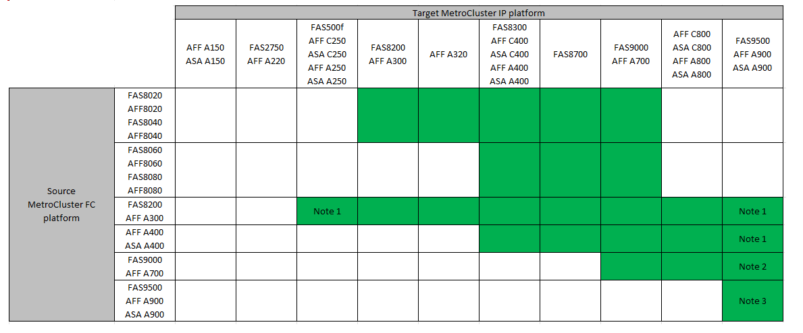

= 移行する手順を選択します
:allow-uri-read: 
:icons: font
:imagesdir: ../media/

[role="lead"]
MetroCluster IP 構成に移行する場合は、サポートされているプラットフォームモデルを組み合わせて使用する必要があります。また、MetroCluster IPプラットフォームが、MetroCluster FC構成からMetroCluster IP構成に移行する負荷に適したサイズであることを確認する必要があります。

次の表に、サポートされるプラットフォームの組み合わせを示します。左側の列にあるプラットフォームから、列の右側にサポートされているプラットフォームに移行できます。これは、色付きの表のセルで示されます。

たとえば、 AFF8060 コントローラモジュールで構成される MetroCluster FC 構成から、 AFF A400 コントローラモジュールで構成される IP 構成への移行がサポートされます。

* 注1：このプラットフォームの組み合わせには、ONTAP 9.11.1以降が必要です。
* 注2：FCノードのローカルクラスタインターフェイスには、40GbEインターフェイスが必要です。このプラットフォームの組み合わせには、ONTAP 9.11.1以降が必要です。
* 注3：FCノードのローカルクラスタインターフェイスには100GbEインターフェイスが必要です。このプラットフォームの組み合わせには、ONTAP 9.11.1以降が必要です。
* 移行手順を実行するには、特に記載がないかぎり、または個 々 のプラットフォームで必要とされる場合を除き、ONTAP 9.8以降が必要です。
* MetroCluster構成内のすべてのノードで同じバージョンのONTAPが実行されている必要があります。たとえば、8ノード構成の場合は、8つのすべてのノードで同じバージョンのONTAPを実行する必要があります。

[NOTE]
====
* 組み合わせて使用するプラットフォームの「下位」のオブジェクト制限を超えないようにしてください。2つのプラットフォームのオブジェクトの下限を適用します。
* ターゲットプラットフォームの制限がMetroCluster の制限よりも低い場合は、新しいノードを追加する前に、ターゲットプラットフォームの制限以下になるようにMetroCluster を再設定する必要があります。
* を参照してください link:https://hwu.netapp.html["Hardware Universe"^] プラットフォームの制限：

====
既存の MetroCluster FC 構成に応じて、移行手順を選択する必要があります。

移行手順は、バックエンドの FC スイッチファブリックまたは FC-VI 接続を IP スイッチネットワークに置き換えます。正確な手順は、使用する開始構成によって異なります。

元のプラットフォームと FC スイッチがある場合、そのスイッチは移行手順の最後で廃止されます。

[cols="20,20,20,40"]
|===

| 変更前の構成 | システムを停止するか、システムを停止 | 要件 | 手順 

 a| 
8ノード
 a| 
無停止
 a| 
新しいプラットフォームでは、新しいストレージシェルフがサポートされます。
 a| 
link:concept_nondisruptively_transitioning_from_a_four_node_mcc_fc_to_a_mcc_ip_configuration.html["手順 へのリンク"]

 a| 
4 ノード
 a| 
無停止
 a| 
新しいプラットフォームでは、新しいストレージシェルフがサポートされます。
 a| 
link:concept_nondisruptively_transitioning_from_a_four_node_mcc_fc_to_a_mcc_ip_configuration.html["手順 へのリンク"]

 a| 
2 ノード
 a| 
システムの停止を伴う
 a| 
新しいストレージシェルフは、元のプラットフォームと新しいプラットフォームの両方でサポートされます。
 a| 
link:task_disruptively_transition_from_a_two_node_mcc_fc_to_a_four_node_mcc_ip_configuration.html["手順 へのリンク"]

 a| 
2 ノード
 a| 
システムの停止を伴う
 a| 
新しいストレージシェルフは、元のプラットフォームと新しいプラットフォームの両方でサポートされます。古いストレージシェルフは撤去する必要があります。
 a| 
link:task_disruptively_transition_while_move_volumes_from_old_shelves_to_new_shelves.html["手順 へのリンク"]

 a| 
2 ノード
 a| 
システムの停止を伴う
 a| 
古いストレージシェルフは、新しいプラットフォームではサポートされません。古いストレージシェルフは撤去する必要があります。
 a| 
link:task_disruptively_transition_when_exist_shelves_are_not_supported_on_new_controllers.html["手順 へのリンク"]

|===