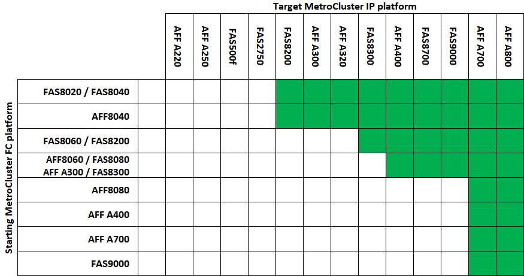

= 無停止移行でサポートされるプラットフォーム
:allow-uri-read: 
:icons: font
:imagesdir: ../media/

[role="lead"]
MetroCluster IP 構成に移行する場合は、サポートされているプラットフォームモデルを組み合わせて使用する必要があります。

次の表に、サポートされるプラットフォームの組み合わせを示します。左側の列にあるプラットフォームから、列の右側にサポートされているプラットフォームに移行できます。これは、緑の表のセルで示されます。

* 緑色のセルは、その組み合わせがサポートされていることを示します。
* 白い ( 空白の ) セルは、その組み合わせがサポートされていないことを示します。

たとえば、 AFF8060 コントローラモジュールで構成される MetroCluster FC 構成から、 AFF A400 コントローラモジュールで構成される IP 構成への移行がサポートされます。

== Cisco 9336C-FX2 共有スイッチ構成に移行します

Cisco 9336C-FX2 共有スイッチ構成への移行はサポートされていません。a_shared スイッチの設定 _ は、 MetroCluster 接続とストレージシェルフ接続の両方を提供します。

Cisco 9336C-FX2 スイッチが MetroCluster 接続のみを提供する構成がサポートされています。
