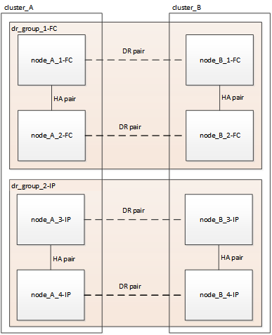

= 無停止での MetroCluster の移行のワークフロー
:icons: font
:imagesdir: ../media/

[role="lead"]
無停止移行を成功させるには、特定のワークフローに従う必要があります。

移行プロセスは、正常な 4 ノード MetroCluster FC 構成から始まります。

image::../media/transition_dr_group_1_fc_nodes.png[移行 DR グループ 1 の FC ノード]

新しい MetroCluster IP ノードは 2 つ目の DR グループとして追加されます。

データが古い DR グループから新しい DR グループに転送され、古いノードとそのストレージが構成から削除されて運用が停止されます。プロセスは、 4 ノード MetroCluster の IP 構成で終了します。

image::../media/transition_dr_group_2_ip.png[DR グループ 2 の IP を移行します]

MetroCluster 構成を移行するには、次のワークフローを使用します。

image::../media/workflow_4n_transition_nondisruptive.png[ワークフロー 4n による無停止の移行]
