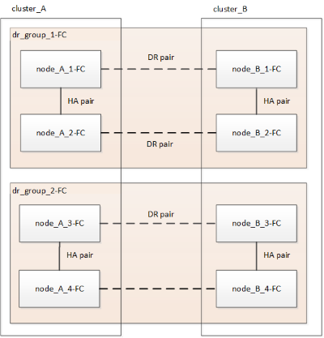

= 無停止での MetroCluster の移行のワークフロー
:allow-uri-read: 
:icons: font
:imagesdir: ../media/

[role="lead"]
無停止移行を成功させるには、特定のワークフローに従う必要があります。構成に応じたワークフローを選択します。

* <<4ノードFC構成の移行ワークフロー>>
* <<8ノードFC構成の移行ワークフロー>>

== 4ノードFC構成の移行ワークフロー

移行プロセスは、正常な 4 ノード MetroCluster FC 構成から始まります。

image::../media/transition_dr_group_1_fc_nodes.png[移行 DR グループ 1 の FC ノード]

新しい MetroCluster IP ノードは 2 つ目の DR グループとして追加されます。

image::../media/transition_dr_groups_fc_and_ip.png[移行 DR グループ FC および IP]

データが古い DR グループから新しい DR グループに転送され、古いノードとそのストレージが構成から削除されて運用が停止されます。プロセスは、 4 ノード MetroCluster の IP 構成で終了します。

image::../media/transition_dr_group_2_ip.png[DR グループ 2 の IP を移行します]

== 8ノードFC構成の移行ワークフロー

移行プロセスは、正常な8ノードMetroCluster FC構成から始まります。

新しいMetroCluster IPノードが3つ目のDRグループとして追加されます。

image::../media/mcc_dr_group_c2.png[MCC DRグループC2]

データがDR_GROUP_1-FCからDR_GROUP_1-IPに転送され、古いノードとそのストレージが構成から削除されて運用が停止されます。

NOTE: 8ノードFC構成から4ノードIP構成に移行する場合は、dr_group_1-FCおよびdr_group_2-FCのすべてのデータを新しいIP DRグループ（dr_group_1-IP）に移行する必要があります。その後、両方のFC DRグループの運用を停止できます。FC DRグループを削除すると、4ノードのMetroCluster IP構成でプロセスが終了します。

image::../media/mcc_dr_group_c8.png[MCC DRグループC8]

残りのMetroCluster IPノードを既存のMetroCluster 構成に追加します。同じ手順を繰り返して、dr_group_2-FCノードからdr_group_2-IPノードにデータを転送します。

image::../media/mcc_dr_group_c7.png[MCC DRグループC7]

dr_group_2-FCを削除すると、8ノードのMetroCluster IP構成でプロセスが終了します。

image::../media/mcc_dr_group_c6.png[MCC DRグループC6]

== 移行プロセスのワークフロー

MetroCluster 構成を移行するには、次のワークフローを使用します。

image::../media/workflow_4n_transition_nondisruptive.png[ワークフロー 4n による無停止の移行]
