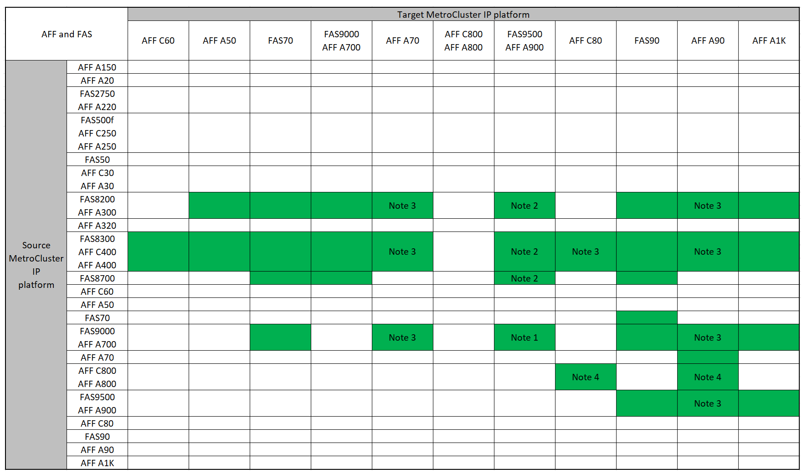
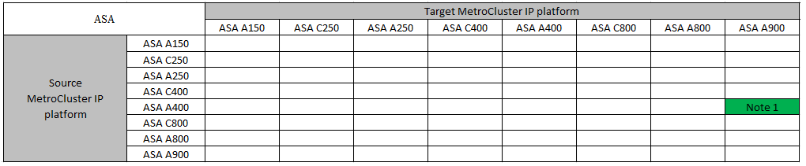

= コントローラのアップグレード手順 を選択します
:allow-uri-read: 
:icons: font
:imagesdir: ../media/

[role="lead"]
使用するコントローラアップグレード手順 は、プラットフォームモデルとMetroCluster 構成のタイプによって異なります。

アップグレード手順 では、コントローラが新しいコントローラモデルに置き換えられます。ストレージシェルフモデルはアップグレードされません。

* スイッチオーバーとスイッチバックの手順では、パートナークラスタのコントローラモジュールをアップグレードしている間、 MetroCluster スイッチオーバー処理を使用してクライアントに無停止のサービスが提供されます。
* ARL ベースコントローラのアップグレード手順では、アグリゲートの再配置処理を使用して、古い構成からアップグレード後の新しい構成へ、データを無停止で移動します。

== サポートされるコントローラのアップグレード

サポートされるMetroCluster IPコントローラとFCコントローラのアップグレードの組み合わせについて説明します。

=== system controller replaceコマンドを使用したサポートされるMetroCluster IPコントローラのアップグレード

サポートされるプラットフォームについては、の表を参照して link:task_upgrade_controllers_system_control_commands_in_a_four_node_mcc_ip.html["「system controller replace」コマンドを使用したスイッチオーバーとスイッチバックを使用した4ノードMetroCluster IP構成のコントローラのアップグレード（ONTAP 9.13.1以降）"] ください。

=== サポートされているその他すべてのMetroCluster IPコントローラのアップグレード

このセクションのMetroClusterコントローラーのアップグレード表から、お使いの*ソース*プラットフォームを検索してください。*ソース*プラットフォーム行と*ターゲット*プラットフォーム列が空白の場合、アップグレードはサポートされていません。

* お使いのプラットフォームがリストに表示されない場合は、サポートされているコントローラのアップグレードの組み合わせはありません。
* コントローラのアップグレードを実行するときは、古いプラットフォームタイプと新しいプラットフォームタイプ*が一致している必要があります*。
+
** FASシステムをFASシステムにアップグレードしたり、AFF AシリーズをAFF Aシリーズにアップグレードしたりすることができます。
** FASシステムをAFF Aシリーズにアップグレードしたり、AFF AシリーズをAFF Cシリーズにアップグレードしたりすることはできません。
+
たとえば、アップグレードするプラットフォームがFAS8200の場合は、FAS9000にアップグレードできます。FAS8200システムをAFF A700システムにアップグレードすることはできません。

* MetroCluster構成内のすべてのノード（新旧のノード）で同じバージョンのONTAPが実行されている必要があります。ご使用の組み合わせでサポートされるONTAPの最小バージョンについては、を参照してlink:https://hwu.netapp.com["Hardware Universe"^]ください。

==== サポートされるAFFおよびFAS MetroCluster IPコントローラのアップグレード

次の表に、MetroCluster IP構成でAFFまたはFASシステムを手動でアップグレードする場合にサポートされるプラットフォームの組み合わせを2つのグループに分けて示します。

* *グループ1 *は、AFF A150 FAS8700、AFF AFF C400 A20、FAS2750 AFF A400、AFF A220、FAS500f、AFF C250、AFF A250、FAS50、AFF A300 C30、AFF A320 A30、FAS8200、AFF、AFF、FAS8300システムへのアップグレードの組み合わせを示しています。
* *グループ2 *は、AFF C60、AFF A50、FAS70、FAS9000、AFF A700、AFF A90、AFF A900、AFF、FAS9500、AFF C800、AFF A800 C80、FAS90、AFF A70、およびAFF A1Kシステムへのアップグレードの組み合わせを示しています。

次の注意事項は両方のグループに適用されます。

* 注1：このアップグレードでは、次の手順を使用してください。link:task_upgrade_A700_to_A900_in_a_four_node_mcc_ip_us_switchover_and_switchback.html["スイッチオーバーとスイッチバックを使用して、MetroCluster IP構成のAFF A700 / FAS9000からAFF A900 / FAS9500にコントローラをアップグレードする（ONTAP 9.10.1以降）"]
* 注2：コントローラのアップグレードは、ONTAP 9.13.1以降を実行しているシステムでサポートされます。
* 注3：コントローラのアップグレードが完了するまで、ターゲットプラットフォームに内蔵ドライブを搭載することはできません。内蔵ドライブはアップグレード後に追加できます。
* 注4：コントローラモジュールの交換が必要です。
* 注5：古いコントローラを外付けSASシェルフに変換するには、IOMモジュールが必要です。サポートされているIOMモジュールについては、を参照してくださいlink:https://hwu.netapp.com/["Hardware Universe"^]。

[role="tabbed-block"]
====
.AFFとFASの組み合わせグループ1
--
AFF A150 FAS8700、AFF AFF C400 A20、FAS2750 AFF A400、AFF A220、AFF、AFF C250、AFF A250、FAS50、FAS500f C30、AFF A320 A30、FAS8200、AFF A300、AFF、FAS8300システムへのアップグレードでサポートされる組み合わせを確認します。

image:../media/manual-upgrade-combination-group-1.png["に、グループ1プラットフォームでサポートされるアップグレードの組み合わせを示します。"]

--
.AFFとFASの組み合わせグループ2
--
C60、AFF A50、FAS70、、AFF A700、AFF A70、AFF C800、AFF、AFF A90、FAS9000、AFF、AFF A900、AFF A800 C80、FAS90、FAS9500、およびAFF A1Kシステムへのアップグレードでサポートされる組み合わせを確認します。

--
====

==== サポートされるASA MetroCluster IPコントローラのアップグレード

次の表に、MetroCluster IP構成でASAシステムを手動でアップグレードする場合にサポートされるプラットフォームの組み合わせを示します。

* 注1：コントローラのアップグレードは、ONTAP 9.13.1以降を実行しているシステムでサポートされます。

=== サポートされるMetroCluster FCコントローラのアップグレード

このセクションのMetroClusterコントローラーのアップグレード表から、お使いの*ソース*プラットフォームを検索してください。*ソース*プラットフォーム行と*ターゲット*プラットフォーム列が空白の場合、アップグレードはサポートされていません。

* お使いのプラットフォームがリストに表示されない場合は、サポートされているコントローラのアップグレードの組み合わせはありません。
* コントローラのアップグレードを実行するときは、古いプラットフォームタイプと新しいプラットフォームタイプ*が一致している必要があります*。
+
** FASシステムをFASシステムにアップグレードしたり、AFF AシリーズをAFF Aシリーズにアップグレードしたりすることができます。
** FASシステムをAFF Aシリーズにアップグレードしたり、AFF AシリーズをAFF Cシリーズにアップグレードしたりすることはできません。
+
たとえば、アップグレードするプラットフォームがFAS8200の場合は、FAS9000にアップグレードできます。FAS8200システムをAFF A700システムにアップグレードすることはできません。

* MetroCluster構成内のすべてのノード（新旧のノード）で同じバージョンのONTAPが実行されている必要があります。ご使用の組み合わせでサポートされるONTAPの最小バージョンについては、を参照してlink:https://hwu.netapp.com["Hardware Universe"^]ください。

==== サポートされるAFFおよびFAS MetroCluster FCコントローラのアップグレード

次の表に、MetroCluster FC構成のAFFシステムまたはFASシステムのアップグレードでサポートされるプラットフォームの組み合わせを示します。

image::../media/metrocluster_fc_upgrade_table_aff_fas.png[MetroCluster FCアップグレード表AFF FAS]

* 注1：既存のFAS8020またはAFF8020ノードでFCVI接続にポート1cと1dを使用する場合は、次のコントローラをアップグレードしますhttps://kb.netapp.com/Advice_and_Troubleshooting/Data_Protection_and_Security/MetroCluster/Upgrading_controllers_when_FCVI_connections_on_existing_FAS8020_or_AFF8020_nodes_use_ports_1c_and_1d["ナレッジベースの記事"^]。
* 注2：オンボードポート0eおよび0fをFC-VI接続として使用するAFF A300またはFAS8200プラットフォームからのコントローラのアップグレードは、次のシステムでのみサポートされます。
+
** ONTAP 9.9.1以前
** ONTAP 9.10.1P9
** ONTAP 9.11.1P5
** ONTAP 9.12.1GA
** ONTAP 9.13.1以降
+
詳細については、を参照してください link:https://mysupport.netapp.com/site/bugs-online/product/ONTAP/BURT/1507088["パブリックレポート"^]。

* 注3：このアップグレードについては、を参照してください link:task_upgrade_A700_to_A900_in_a_four_node_mcc_fc_us_switchover_and_switchback.html["スイッチオーバーとスイッチバックを使用して、MetroCluster FC構成のAFF A700 / FAS9000からAFF A900/ FAS9500にコントローラをアップグレード（ONTAP 9.10.1以降）"]
* 注4：コントローラのアップグレードは、ONTAP 9.13.1以降を実行しているシステムでサポートされます。

==== サポートされるASA MetroCluster FCコントローラのアップグレード

次の表に、MetroCluster FC構成のASAシステムのアップグレードでサポートされるプラットフォームの組み合わせを示します。

[cols="3*"]
|===
| ソースMetroCluster FCプラットフォーム | デスティネーションMetroCluster FCプラットフォーム | サポートの有無 

.2+| ASA A400 | ASA A400 | はい。 

| ASA A900 | いいえ 

.2+| ASA A900 | ASA A400 | いいえ 

| ASA A900 | ○（注1を参照） 
|===
* 注1：コントローラのアップグレードは、ONTAP 9.14.1以降を実行しているシステムでサポートされます。

== スイッチオーバーとスイッチバックのプロセスを使用する手順を選択

サポートされるアップグレードの組み合わせを確認したら、構成に適したコントローラのアップグレード手順を選択します。

[cols="2,1,1,2"]
|===

| MetroCluster タイプ | アップグレード方法 | ONTAP バージョン | 手順 

 a| 
IP
 a| 
「system controller replace」コマンドを使用してアップグレードします
 a| 
9.13.1以降
 a| 
link:task_upgrade_controllers_system_control_commands_in_a_four_node_mcc_ip.html["手順 へのリンク"]

 a| 
FC
 a| 
「system controller replace」コマンドを使用してアップグレードします
 a| 
9.10.1 以降
 a| 
link:task_upgrade_controllers_system_control_commands_in_a_four_node_mcc_fc.html["手順 へのリンク"]

 a| 
FC
 a| 
CLIコマンドによる手動アップグレード（AFF A700 / FAS9000からAFF A900 / FAS9500へのアップグレードのみ）
 a| 
9.10.1 以降
 a| 
link:task_upgrade_A700_to_A900_in_a_four_node_mcc_fc_us_switchover_and_switchback.html["手順 へのリンク"]

 a| 
IP
 a| 
CLIコマンドによる手動アップグレード（AFF A700 / FAS9000からAFF A900 / FAS9500へのアップグレードのみ）
 a| 
9.10.1 以降
 a| 
link:task_upgrade_A700_to_A900_in_a_four_node_mcc_ip_us_switchover_and_switchback.html["手順 へのリンク"]

 a| 
FC
 a| 
CLIコマンドを使用した手動アップグレード
 a| 
9.8 以降
 a| 
link:task_upgrade_controllers_in_a_four_node_fc_mcc_us_switchover_and_switchback_mcc_fc_4n_cu.html["手順 へのリンク"]

 a| 
IP
 a| 
CLIコマンドを使用した手動アップグレード
 a| 
9.8 以降
 a| 
link:task_upgrade_controllers_in_a_four_node_ip_mcc_us_switchover_and_switchback_mcc_ip.html["手順 へのリンク"]

|===

== アグリゲートの再配置を使用した手順の選択

ARL ベースコントローラのアップグレード手順では、アグリゲートの再配置処理を使用して、古い構成からアップグレード後の新しい構成へ、データを無停止で移動します。

|===
| MetroCluster タイプ | アグリゲートの再配置 | ONTAP バージョン | 手順 

 a| 
FC
 a| 
「system controller replace」コマンドを使用して、同じシャーシ内のコントローラモデルをアップグレードします
 a| 
9.10.1 以降
 a| 
https://docs.netapp.com/us-en/ontap-systems-upgrade/upgrade-arl-auto-affa900/index.html["手順 へのリンク"^]

 a| 
FC
 a| 
「 system controller replace 」コマンドを使用します
 a| 
9.8 以降
 a| 
https://docs.netapp.com/us-en/ontap-systems-upgrade/upgrade-arl-auto-app/index.html["手順 へのリンク"^]

 a| 
FC
 a| 
「 system controller replace 」コマンドを使用します
 a| 
9.5 ～ 9.7
 a| 
https://docs.netapp.com/us-en/ontap-systems-upgrade/upgrade-arl-auto/index.html["手順 へのリンク"^]

 a| 
FC
 a| 
手動 ARL コマンドを使用
 a| 
9.8
 a| 
https://docs.netapp.com/us-en/ontap-systems-upgrade/upgrade-arl-manual-app/index.html["手順 へのリンク"^]

 a| 
FC
 a| 
手動 ARL コマンドを使用
 a| 
9.7 以前
 a| 
https://docs.netapp.com/us-en/ontap-systems-upgrade/upgrade-arl-manual/index.html["手順 へのリンク"^]

|===