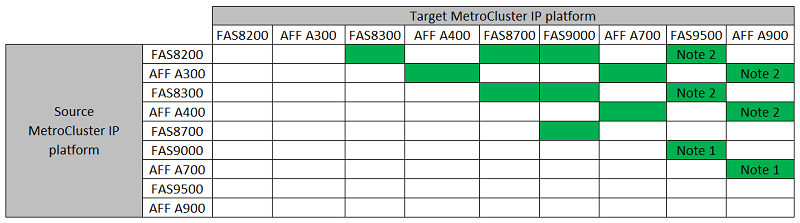

= コントローラのアップグレード手順 を選択します
:allow-uri-read: 
:icons: font
:imagesdir: ../media/

[role="lead"]
使用するコントローラアップグレード手順 は、プラットフォームモデルとMetroCluster 構成のタイプによって異なります。

アップグレード手順 では、コントローラが新しいコントローラモデルに置き換えられます。ストレージシェルフモデルはアップグレードされません。

* スイッチオーバーとスイッチバックの手順では、パートナークラスタのコントローラモジュールをアップグレードしている間、 MetroCluster スイッチオーバー処理を使用してクライアントに無停止のサービスが提供されます。
* ARL ベースコントローラのアップグレード手順では、アグリゲートの再配置処理を使用して、古い構成からアップグレード後の新しい構成へ、データを無停止で移動します。

== スイッチオーバーとスイッチバックのプロセスを使用する手順 を選択します

FCまたはIPの表から現在のプラットフォームを選択してください。現在のプラットフォーム行とターゲットプラットフォーム列の交差部分が空白の場合、アップグレードはサポートされません。

=== サポートされるMetroCluster IPコントローラのアップグレード

お使いのプラットフォームがリストに表示されない場合は、サポートされているコントローラのアップグレードの組み合わせはありません。

* 注1：このアップグレードでは、手順 を使用します link:task_upgrade_A700_to_A900_in_a_four_node_mcc_ip_us_switchover_and_switchback.html["スイッチオーバーとスイッチバックを使用して、MetroCluster IP構成のAFF A700 / FAS9000からAFF A900 / FAS9500にコントローラをアップグレードする（ONTAP 9.10.1以降）"]
* 注2：コントローラのアップグレードは、ONTAP 9.13.1以降を実行しているシステムでサポートされます。

=== サポートされるMetroCluster FCコントローラのアップグレード

image::../media/metrocluster_fc_upgrade_table_p_13_1.PNG[MetroCluster fcアップグレード表p 13 1.]

* 注1：既存のFAS8020またはAFF8020ノードでFCVI接続にポート1cと1dを使用する場合は、次のコントローラをアップグレードしますhttps://kb.netapp.com/Advice_and_Troubleshooting/Data_Protection_and_Security/MetroCluster/Upgrading_controllers_when_FCVI_connections_on_existing_FAS8020_or_AFF8020_nodes_use_ports_1c_and_1d["ナレッジベースの記事"^]。
* 注2：オンボードポート0eおよび0fをFC-VI接続として使用してAFF A300またはFAS8200プラットフォームからコントローラをアップグレードする場合、ONTAP 9.9..1を実行しているシステムのみサポートされます。またはそれ以前のバージョン。詳細については、を参照してください link:https://mysupport.netapp.com/site/bugs-online/product/ONTAP/BURT/1507088["パブリックレポート"^]。
* 注3：このアップグレードについては、を参照してください link:task_upgrade_A700_to_A900_in_a_four_node_mcc_fc_us_switchover_and_switchback.html["スイッチオーバーとスイッチバックを使用して、MetroCluster FC構成のAFF A700 / FAS9000からAFF A900/ FAS9500にコントローラをアップグレード（ONTAP 9.10.1以降）"]
* 注4：コントローラのアップグレードは、ONTAP 9.13.1以降を実行しているシステムでサポートされます。

[cols="2,1,1,2"]
|===

| MetroCluster タイプ | アップグレード方法 | ONTAP バージョン | 手順 

 a| 
IP
 a| 
「system controller replace」コマンドを使用してアップグレードします
 a| 
9.13.1以降
 a| 
link:task_upgrade_controllers_system_control_commands_in_a_four_node_mcc_ip.html["手順 へのリンク"]

 a| 
FC
 a| 
「system controller replace」コマンドを使用してアップグレードします
 a| 
9.10.1 以降
 a| 
link:task_upgrade_controllers_system_control_commands_in_a_four_node_mcc_fc.html["手順 へのリンク"]

 a| 
FC
 a| 
CLIコマンドによる手動アップグレード（AFF A700 / FAS9000からAFF A900 / FAS9500へのアップグレードのみ）
 a| 
9.10.1 以降
 a| 
link:task_upgrade_A700_to_A900_in_a_four_node_mcc_fc_us_switchover_and_switchback.html["手順 へのリンク"]

 a| 
IP
 a| 
CLIコマンドによる手動アップグレード（AFF A700 / FAS9000からAFF A900 / FAS9500へのアップグレードのみ）
 a| 
9.10.1 以降
 a| 
link:task_upgrade_A700_to_A900_in_a_four_node_mcc_ip_us_switchover_and_switchback.html["手順 へのリンク"]

 a| 
FC
 a| 
CLIコマンドを使用した手動アップグレード
 a| 
9.8 以降
 a| 
link:task_upgrade_controllers_in_a_four_node_fc_mcc_us_switchover_and_switchback_mcc_fc_4n_cu.html["手順 へのリンク"]

 a| 
IP
 a| 
CLIコマンドを使用した手動アップグレード
 a| 
9.8 以降
 a| 
link:task_upgrade_controllers_in_a_four_node_ip_mcc_us_switchover_and_switchback_mcc_ip.html["手順 へのリンク"]

|===

== アグリゲートの再配置を使用した手順の選択

ARL ベースコントローラのアップグレード手順では、アグリゲートの再配置処理を使用して、古い構成からアップグレード後の新しい構成へ、データを無停止で移動します。

|===
| MetroCluster タイプ | アグリゲートの再配置 | ONTAP バージョン | 手順 

 a| 
FC
 a| 
「system controller replace」コマンドを使用して、同じシャーシ内のコントローラモデルをアップグレードします
 a| 
9.10.1 以降
 a| 
https://docs.netapp.com/us-en/ontap-systems-upgrade/upgrade-arl-auto-affa900/index.html["手順 へのリンク"^]

 a| 
FC
 a| 
「 system controller replace 」コマンドを使用します
 a| 
9.8 以降
 a| 
https://docs.netapp.com/us-en/ontap-systems-upgrade/upgrade-arl-auto-app/index.html["手順 へのリンク"^]

 a| 
FC
 a| 
「 system controller replace 」コマンドを使用します
 a| 
9.5 ～ 9.7
 a| 
https://docs.netapp.com/us-en/ontap-systems-upgrade/upgrade-arl-auto/index.html["手順 へのリンク"^]

 a| 
FC
 a| 
手動 ARL コマンドを使用
 a| 
9.8
 a| 
https://docs.netapp.com/us-en/ontap-systems-upgrade/upgrade-arl-manual-app/index.html["手順 へのリンク"^]

 a| 
FC
 a| 
手動 ARL コマンドを使用
 a| 
9.7 以前
 a| 
https://docs.netapp.com/us-en/ontap-systems-upgrade/upgrade-arl-manual/index.html["手順 へのリンク"^]

|===