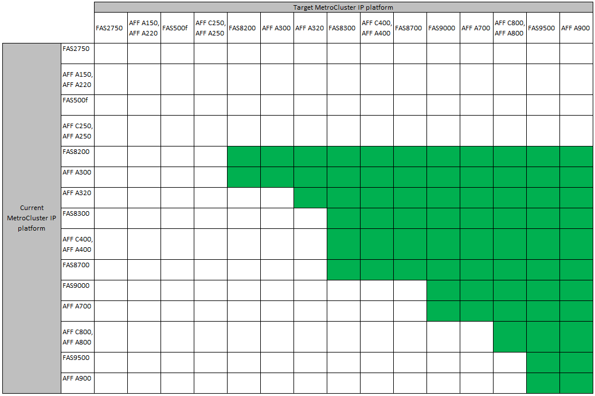

= システムの更新方法を選択する
:allow-uri-read: 
:icons: font
:imagesdir: ../media/

[role="lead"]
使用するシステム更新手順 は、プラットフォームモデルおよびMetroCluster 構成のタイプによって異なります。更新手順は、コントローラとストレージシェルフに適用されます。更新手順では、新しいコントローラとシェルフを MetroCluster 構成に追加して 2 つ目の DR グループを作成すると、データが新しいノードに無停止で移行されます。その後、元のコントローラが撤去されます。

=== サポートされるMetroCluster FC機器更改の組み合わせ

image::../media/metrocluster_fc_tech_refresh.png[MetroCluster fc tech refresh]

* 新しい負荷を追加する前に、Tech Refresh手順 が完了したことを確認してください。

NOTE: 組み合わせて使用するプラットフォームの「下位」のオブジェクト制限を超えないようにしてください。2つのプラットフォームのオブジェクトの下限を適用します。を参照してください link:https://hwu.netapp.html["Hardware Universe"^] プラットフォームの制限：

=== サポートされているMetroCluster IP Tech Refreshの組み合わせ

* 新しい負荷を追加する前に、Tech Refresh手順 が完了したことを確認してください。

NOTE: 組み合わせて使用するプラットフォームの「下位」のオブジェクト制限を超えないようにしてください。2つのプラットフォームのオブジェクトの下限を適用します。を参照してください link:https://hwu.netapp.html["Hardware Universe"^] プラットフォームの制限：

[cols="2,1,1,2"]
|===
| リフレッシュ方法 | 構成タイプ | ONTAP バージョン | 手順 

 a| 
* 方法： MetroCluster 設定を展開して古いノードを削除します

 a| 
4ノードFC
 a| 
9.6 以降
 a| 
link:task_refresh_4n_mcc_fc.html["手順 へのリンク"]

 a| 
* 方法： MetroCluster 設定を展開して古いノードを削除します

 a| 
4ノードIP
 a| 
9.8 以降
 a| 
link:task_refresh_4n_mcc_ip.html["手順 へのリンク"]

|===