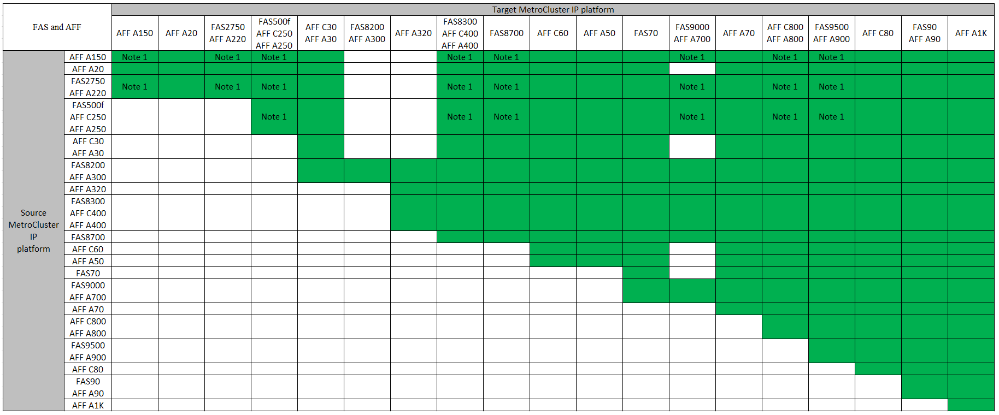
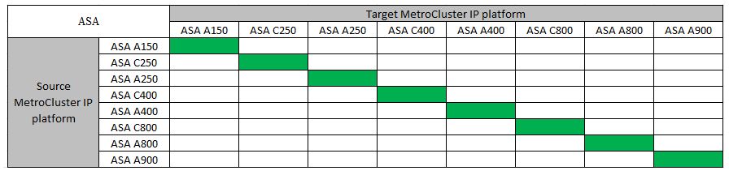

= システムの更新方法を選択する
:allow-uri-read: 
:icons: font
:imagesdir: ../media/

[role="lead"]
使用するシステム更新手順 は、プラットフォームモデルおよびMetroCluster 構成のタイプによって異なります。更新手順は、コントローラとストレージシェルフに適用されます。更新手順では、新しいコントローラとシェルフを MetroCluster 構成に追加して 2 つ目の DR グループを作成すると、データが新しいノードに無停止で移行されます。その後、元のコントローラが撤去されます。

== サポートされているMetroCluster IP Tech Refreshの組み合わせ

* 新しい負荷を追加する前に、機器更改（Tech Refresh）の手順 を完了する必要があります。
* MetroCluster構成内のすべてのノードで同じバージョンのONTAPが実行されている必要があります。たとえば、8ノード構成の場合は、8つのすべてのノードで同じバージョンのONTAPを実行する必要があります。ご使用の組み合わせでサポートされるONTAPの最小バージョンについては、を参照してlink:https://hwu.netapp.com["Hardware Universe"^]ください。
* 組み合わせて使用するプラットフォームの「下位」のオブジェクト制限を超えないようにしてください。2つのプラットフォームのオブジェクトの下限を適用します。
* ターゲットプラットフォームの制限がMetroCluster の制限よりも低い場合は、新しいノードを追加する前に、ターゲットプラットフォームの制限以下になるようにMetroCluster を再設定する必要があります。
* を参照してください link:https://hwu.netapp.com["Hardware Universe"^] プラットフォームの制限：

.サポートされるAFFとFAS MetroCluster IPの機器更改の組み合わせ
次の表に、MetroCluster IP構成のAFFシステムまたはFASシステムの更新でサポートされるプラットフォームの組み合わせを示します。

*注1：*この組み合わせにはONTAP 9.13.1以降が必要です。

.サポートされるASA MetroCluster IPの機器更改の組み合わせ
次の表に、MetroCluster IP構成でASAシステムを更新する際にサポートされるプラットフォームの組み合わせを示します。

== サポートされるMetroCluster FC機器更改の組み合わせ

* 新しい負荷を追加する前に、機器更改（Tech Refresh）の手順 を完了する必要があります。
* MetroCluster構成内のすべてのノードで同じバージョンのONTAPが実行されている必要があります。たとえば、8ノード構成の場合は、8つのすべてのノードで同じバージョンのONTAPを実行する必要があります。ご使用の組み合わせでサポートされるONTAPの最小バージョンについては、を参照してlink:https://hwu.netapp.com["Hardware Universe"^]ください。
* 組み合わせて使用するプラットフォームの「下位」のオブジェクト制限を超えないようにしてください。2つのプラットフォームのオブジェクトの下限を適用します。
* ターゲットプラットフォームの制限がMetroCluster の制限よりも低い場合は、新しいノードを追加する前に、ターゲットプラットフォームの制限以下になるようにMetroCluster を再設定する必要があります。
* を参照してください link:https://hwu.netapp.com["Hardware Universe"^] プラットフォームの制限：

.サポートされるAFFとFAS MetroCluster FCの機器更改の組み合わせ
次の表に、MetroCluster FC構成のAFFシステムまたはFASシステムの更新でサポートされるプラットフォームの組み合わせを示します。

image::../media/metrocluster_fc_tech_refresh.png[MetroCluster fc tech refresh]

.サポートされるASA MetroCluster FC機器更改の組み合わせ
次の表に、MetroCluster FC構成のASAシステムの更新でサポートされるプラットフォームの組み合わせを示します。

[cols="3*"]
|===
| ソースMetroCluster FCプラットフォーム | デスティネーションMetroCluster FCプラットフォーム | サポートの有無 

.2+| ASA A400 | ASA A400 | はい。 

| ASA A900 | いいえ 

.2+| ASA A900 | ASA A400 | いいえ 

| ASA A900 | はい。 
|===

== 更新手順の選択

次の表から、構成に応じた更新手順を選択します。

[cols="2,1,1,2"]
|===
| リフレッシュ方法 | 構成タイプ | ONTAP バージョン | 手順 

 a| 
* 方法： MetroCluster 設定を展開して古いノードを削除します

 a| 
4ノードFC
 a| 
9.6 以降
 a| 
link:task_refresh_4n_mcc_fc.html["手順 へのリンク"]

 a| 
* 方法： MetroCluster 設定を展開して古いノードを削除します

 a| 
4ノードIP
 a| 
9.8 以降
 a| 
link:task_refresh_4n_mcc_ip.html["手順 へのリンク"]

|===