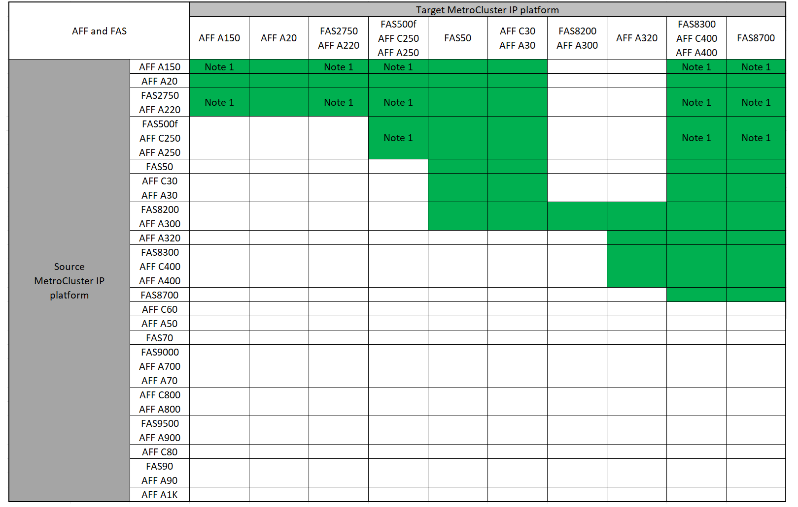

= システムの更新方法を選択する
:allow-uri-read: 
:icons: font
:imagesdir: ../media/

[role="lead"]
使用するシステム更新手順 は、プラットフォームモデルおよびMetroCluster 構成のタイプによって異なります。更新手順は、コントローラとストレージシェルフに適用されます。更新手順では、新しいコントローラとシェルフを MetroCluster 構成に追加して 2 つ目の DR グループを作成すると、データが新しいノードに無停止で移行されます。その後、元のコントローラが撤去されます。

== サポートされているMetroCluster IP Tech Refreshの組み合わせ

* 新しい負荷を追加する前に、機器更改（Tech Refresh）の手順 を完了する必要があります。
* MetroCluster構成内のすべてのノードで同じバージョンのONTAPが実行されている必要があります。たとえば、8ノード構成の場合は、8つのすべてのノードで同じバージョンのONTAPを実行する必要があります。ご使用の組み合わせでサポートされるONTAPの最小バージョンについては、を参照してlink:https://hwu.netapp.com["Hardware Universe"^]ください。
* 組み合わせて使用するプラットフォームの「下位」のオブジェクト制限を超えないようにしてください。2つのプラットフォームのオブジェクトの下限を適用します。
* ターゲットプラットフォームの制限がMetroCluster の制限よりも低い場合は、新しいノードを追加する前に、ターゲットプラットフォームの制限以下になるようにMetroCluster を再設定する必要があります。
* を参照してください link:https://hwu.netapp.com["Hardware Universe"^] プラットフォームの制限：

=== サポートされるAFFとFAS MetroCluster IPの機器更改の組み合わせ

次の表に、MetroCluster IP構成のAFFシステムまたはFASシステムの更新でサポートされるプラットフォームの組み合わせを示します。テーブルは次の2つのグループに分割されます。

* *グループ1 *は、、AFF A20、FAS2750、AFF A220、AFF A150、FAS500f、AFF C250、FAS8200、FAS50、AFF C400 C30、AFF A30、AFF A250、AFF A300、AFF A400、FAS8700、AFF、AFF A320、FAS8300システムの組み合わせを示しています。
* *グループ2 *は、AFF C60、AFF A50、FAS70、FAS9000、AFF A700、AFF A70、AFF C800、AFF、FAS9500、AFF A900、AFF A800 C80、FAS90、AFF A90、およびAFF A1Kシステムの組み合わせを示しています。

次の注意事項は両方のグループに適用されます。

* 注1：この組み合わせを使用するには、ONTAP 9.13.1以降が必要です。

[role="tabbed-block"]
====
.AFFとFASの組み合わせグループ1
--
AFF A150 FAS8700、AFF AFF C400 A20、FAS2750 AFF A400、AFF A220、AFF、AFF C250、AFF A250、FAS50、FAS500f C30、AFF A320 A30、FAS8200、AFF A300、AFF、FAS8300システムのシステム更新の組み合わせを確認します。

--
.AFFとFASの組み合わせグループ2
--
C60、AFF A50、FAS70、、AFF A700、AFF A70、AFF C800、AFF、AFF A90、FAS9000、AFF、AFF A1K、AFF A800 C80、FAS90、FAS9500、AFF A900システムのシステム更新の組み合わせを確認します。

image:../media/tech-refresh-ip-group-2-updated.png["AFFおよびFASグループ2プラットフォームのシステム更新の組み合わせ"]

--
====

=== サポートされるASA MetroCluster IPの機器更改の組み合わせ

次の表に、MetroCluster IP構成でASAシステムを更新する際にサポートされるプラットフォームの組み合わせを示します。

image::../media/mcc-ip-techrefresh-asa-9161.png[MetroCluster IP ASAの機器更改の組み合わせ]

== サポートされるMetroCluster FC機器更改の組み合わせ

* 新しい負荷を追加する前に、機器更改（Tech Refresh）の手順 を完了する必要があります。
* MetroCluster構成内のすべてのノードで同じバージョンのONTAPが実行されている必要があります。たとえば、8ノード構成の場合は、8つのすべてのノードで同じバージョンのONTAPを実行する必要があります。ご使用の組み合わせでサポートされるONTAPの最小バージョンについては、を参照してlink:https://hwu.netapp.com["Hardware Universe"^]ください。
* 組み合わせて使用するプラットフォームの「下位」のオブジェクト制限を超えないようにしてください。2つのプラットフォームのオブジェクトの下限を適用します。
* ターゲットプラットフォームの制限がMetroCluster の制限よりも低い場合は、新しいノードを追加する前に、ターゲットプラットフォームの制限以下になるようにMetroCluster を再設定する必要があります。
* を参照してください link:https://hwu.netapp.com["Hardware Universe"^] プラットフォームの制限：

=== サポートされるAFFとFAS MetroCluster FCの機器更改の組み合わせ

次の表に、MetroCluster FC構成のAFFシステムまたはFASシステムの更新でサポートされるプラットフォームの組み合わせを示します。

image::../media/metrocluster_fc_tech_refresh.png[MetroCluster FC技術更新でサポートされるプラットフォームの組み合わせ]

=== サポートされるASA MetroCluster FC機器更改の組み合わせ

次の表に、MetroCluster FC構成のASAシステムの更新でサポートされるプラットフォームの組み合わせを示します。

[cols="3*"]
|===
| ソースMetroCluster FCプラットフォーム | デスティネーションMetroCluster FCプラットフォーム | サポートの有無 

.2+| ASA A400 | ASA A400 | はい。 

| ASA A900 | いいえ 

.2+| ASA A900 | ASA A400 | いいえ 

| ASA A900 | はい。 
|===

== 更新手順の選択

次の表から、構成に応じた更新手順を選択します。

[cols="2,1,1,2"]
|===
| リフレッシュ方法 | 構成タイプ | ONTAP バージョン | 手順 

 a| 
* 方法： MetroCluster 設定を展開して古いノードを削除します

 a| 
4ノードFC
 a| 
9.6 以降
 a| 
link:task_refresh_4n_mcc_fc.html["手順 へのリンク"]

 a| 
* 方法： MetroCluster 設定を展開して古いノードを削除します

 a| 
4ノードIP
 a| 
9.8 以降
 a| 
link:task_refresh_4n_mcc_ip.html["手順 へのリンク"]

|===