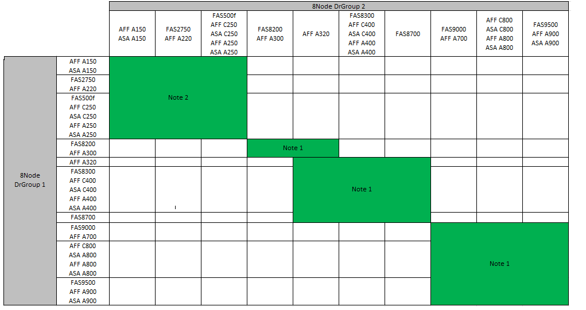

= MetroCluster IP構成の拡張
:allow-uri-read: 
:icons: font
:imagesdir: ../media/

[role="lead"]
ONTAP のバージョンに応じて、4つの新しいノードを新しいDRグループとして追加することでMetroCluster IP構成を拡張できます。

ONTAP 9.13.1以降では、8ノードMetroCluster構成を一時的に拡張してコントローラとストレージを更新できます。を参照してください link:https://docs.netapp.com/us-en/ontap-metrocluster/upgrade/task_refresh_4n_mcc_ip.html["4ノードまたは8ノードのMetroCluster IP構成の更新（ONTAP 9.8以降）"] を参照してください。

ONTAP 9.9.9..1 以降では、 4 つの新しいノードを 2 つ目の DR グループとして MetroCluster IP 構成に追加できます。これにより、 8 ノード MetroCluster 構成が作成されます。

.作業を開始する前に
* 古いノードと新しいノードで同じバージョンの ONTAP を実行する必要があります。
* この手順では、既存のMetroCluster IP構成に4ノードDRグループを1つ追加する手順について説明します。8ノード構成を更新する場合は、手順全体をDRグループごとに1つずつ追加して繰り返す必要があります。
* 新旧のプラットフォームモデルでプラットフォームの混在がサポートされていることを確認します。
+
https://hwu.netapp.com["NetApp Hardware Universe の略"^]

* 古いプラットフォームモデルと新しいプラットフォームモデルの両方がIPスイッチでサポートされていることを確認します。
+
https://hwu.netapp.com["NetApp Hardware Universe の略"^]

* 新しいノードには、古いノードのデータを格納するための十分なストレージと、ルートアグリゲートとスペアディスク用の十分なディスクが必要です。
* 古いノードにデフォルトのブロードキャストドメインが作成されていることを確認します。
+
デフォルトのブロードキャストドメインがない既存のクラスタに新しいノードを追加すると、想定される名前ではなくUniversal Unique Identifier（UUID）を使用して新しいノード用のノード管理LIFが作成されます。詳細については、技術情報アーティクルを参照してください https://kb.netapp.com/onprem/ontap/os/Node_management_LIFs_on_newly-added_nodes_generated_with_UUID_names["UUID名で生成された新しく追加されたノードのノード管理LIF"^]。

== この手順での命名例

この手順では、全体的な名前の例を使用して、 DR グループ、ノード、および関連するスイッチを特定します。

|===

| DR グループ | site_A で cluster_A | site_B （ site_B 

 a| 
dr_group_1 - 古い
 a| 
* node_A_1 - 古い
* Node_a_2-old

 a| 
* node_B_1 - 古い
* node_B_2 - 古い

 a| 
dr_group_2 - 新規
 a| 
* Node_a_3 - 新規
* Node_a_4 - 新規

 a| 
* node_B_2 - 新規
* node_B_2 - 新規

|===

== 2つ目のDRグループを追加する際にサポートされるプラットフォームの組み合わせ

次の表に、8ノードIP構成でサポートされるプラットフォームの組み合わせを示します。

[IMPORTANT]
====
* MetroCluster構成内のすべてのノードで同じバージョンのONTAPが実行されている必要があります。たとえば、8ノード構成の場合は、8つのすべてのノードで同じバージョンのONTAPを実行する必要があります。
* この表の組み合わせは、通常の8ノード構成または永続的な8ノード構成にのみ該当します。
* この表に示されているプラットフォームの組み合わせは、移行手順または更新手順を使用する場合は適用されません*。
* 1つのDRグループ内のすべてのノードのタイプと構成が同じである必要があります。

====

* *注1 *：これらの組み合わせには、ONTAP 9.9.1以降（またはプラットフォームでサポートされるONTAP の最小バージョン）が必要です。
* *注2 *：これらの組み合わせには、ONTAP 9.13.1以降（またはプラットフォームでサポートされているONTAP の最小バージョン）が必要です。

== カスタム AutoSupport メッセージをメンテナンス前に送信する

メンテナンスを実行する前に、 AutoSupport an 問題 message to notify NetApp technical support that maintenance is maintenancing （メンテナンスが進行中であることをネットアップテクニカルサポートに通知する）を実行システム停止が発生したとみなしてテクニカルサポートがケースをオープンしないように、メンテナンスが進行中であることを通知する必要があります。

.このタスクについて
このタスクは MetroCluster サイトごとに実行する必要があります。

.手順
. サポートケースが自動で生成されないようにするには、アップグレードが進行中であることを示す AutoSupport メッセージを送信します。
+
.. 次のコマンドを問題に設定します。
+
「 system node AutoSupport invoke -node * -type all -message 」 MAINT=10h Upgrading _old-model_to _new-model 」に変更します

+
この例では、 10 時間のメンテナンス時間を指定しています。プランによっては、さらに時間をかけたい場合もあります。

+
この時間が経過する前にメンテナンスが完了した場合は、メンテナンス期間が終了したことを通知する AutoSupport メッセージを起動できます。

+
「 system node AutoSupport invoke -node * -type all -message MAINT= end 」というメッセージが表示されます

.. パートナークラスタに対してこのコマンドを繰り返します。

== MetroCluster 構成の健全性の確認

移行を実行する前に、 MetroCluster 構成の健全性と接続を確認する必要があります

.手順
. ONTAP で MetroCluster 構成の動作を確認します。
+
.. システムがマルチパスかどうかを確認します。
+
'node run -node _node-name_sysconfig -a

.. ヘルスアラートがないかどうかを両方のクラスタで確認します。
+
「 system health alert show 」というメッセージが表示されます

.. MetroCluster 構成と運用モードが正常な状態であることを確認します。
+
「 MetroCluster show 」

.. MetroCluster チェックを実行します。
+
「 MetroCluster check run 」のようになります

.. MetroCluster チェックの結果を表示します。
+
MetroCluster チェックショー

.. Config Advisor を実行します。
+
https://mysupport.netapp.com/site/tools/tool-eula/activeiq-configadvisor["ネットアップのダウンロード： Config Advisor"]

.. Config Advisor の実行後、ツールの出力を確認し、推奨される方法で検出された問題に対処します。

. クラスタが正常であることを確認します。
+
「 cluster show 」を参照してください

+
[listing]
----
cluster_A::> cluster show
Node           Health  Eligibility
-------------- ------  -----------
node_A_1       true    true
node_A_2       true    true

cluster_A::>
----
. すべてのクラスタポートが動作していることを確認します。
+
「 network port show -ipspace cluster 」のように表示されます

+
[listing]
----
cluster_A::> network port show -ipspace Cluster

Node: node_A_1-old

                                                  Speed(Mbps) Health
Port      IPspace      Broadcast Domain Link MTU  Admin/Oper  Status
--------- ------------ ---------------- ---- ---- ----------- --------
e0a       Cluster      Cluster          up   9000  auto/10000 healthy
e0b       Cluster      Cluster          up   9000  auto/10000 healthy

Node: node_A_2-old

                                                  Speed(Mbps) Health
Port      IPspace      Broadcast Domain Link MTU  Admin/Oper  Status
--------- ------------ ---------------- ---- ---- ----------- --------
e0a       Cluster      Cluster          up   9000  auto/10000 healthy
e0b       Cluster      Cluster          up   9000  auto/10000 healthy

4 entries were displayed.

cluster_A::>
----
. すべてのクラスタ LIF が動作していることを確認します。
+
「 network interface show -vserver Cluster 」のように表示されます

+
各クラスタ LIF で、 Is Home には true 、 Status Admin/Oper には up/up と表示されるはずです

+
[listing]
----
cluster_A::> network interface show -vserver cluster

            Logical      Status     Network          Current       Current Is
Vserver     Interface  Admin/Oper Address/Mask       Node          Port    Home
----------- ---------- ---------- ------------------ ------------- ------- -----
Cluster
            node_A_1-old_clus1
                       up/up      169.254.209.69/16  node_A_1   e0a     true
            node_A_1-old_clus2
                       up/up      169.254.49.125/16  node_A_1   e0b     true
            node_A_2-old_clus1
                       up/up      169.254.47.194/16  node_A_2   e0a     true
            node_A_2-old_clus2
                       up/up      169.254.19.183/16  node_A_2   e0b     true

4 entries were displayed.

cluster_A::>
----
. すべてのクラスタ LIF で自動リバートが有効になっていることを確認します。
+
network interface show -vserver Cluster -fields auto-revert を実行します

+
[listing]
----
cluster_A::> network interface show -vserver Cluster -fields auto-revert

          Logical
Vserver   Interface     Auto-revert
--------- ------------- ------------
Cluster
           node_A_1-old_clus1
                        true
           node_A_1-old_clus2
                        true
           node_A_2-old_clus1
                        true
           node_A_2-old_clus2
                        true

    4 entries were displayed.

cluster_A::>
----

== 監視アプリケーションから構成を削除します

ONTAP Tiebreaker ソフトウェア、 MetroCluster メディエーター、またはスイッチオーバーを開始できるその他の他社製アプリケーション（ ClusterLion など）で既存の構成を監視している場合は、アップグレードの前に、監視ソフトウェアから MetroCluster 構成を削除する必要があります。

.手順
. Tiebreaker 、メディエーター、またはスイッチオーバーを開始できるその他のソフトウェアから既存の MetroCluster 構成を削除します。
+
[cols="2*"]
|===

| 使用するポート | 使用する手順 

 a| 
Tiebreaker
 a| 
link:../tiebreaker/concept_configuring_the_tiebreaker_software.html#commands-for-modifying-metrocluster-tiebreaker-configurations["MetroCluster 設定の削除"]。

 a| 
メディエーター
 a| 
ONTAP プロンプトで次のコマンドを問題に設定します。

MetroCluster 構成設定のメディエーターが削除されました

 a| 
サードパーティ製アプリケーション
 a| 
製品マニュアルを参照してください。

|===
. スイッチオーバーを開始できるサードパーティ製アプリケーションから既存の MetroCluster 構成を削除します。
+
アプリケーションのマニュアルを参照してください。

== 新しいコントローラモジュールの準備を行います

[role="lead"]
4 つの新しい MetroCluster ノードを準備し、正しいバージョンの ONTAP をインストールする必要があります。

.このタスクについて
このタスクは新しい各ノードで実行する必要があります。

* Node_a_3 - 新規
* Node_a_4 - 新規
* node_B_2 - 新規
* node_B_2 - 新規

この手順では、ノードの設定をクリアし、新しいドライブのメールボックスのリージョンをクリアします。

.手順
. 新しいコントローラをラックに設置します。
. MetroCluster のインストールと設定に示すように、新しい MetroCluster IP ノードを IP スイッチにケーブル接続します。 _
+
link:../install-ip/using_rcf_generator.html["IP スイッチのケーブル接続"]

. MetroCluster のインストールと設定について、次のセクションを使用して MetroCluster IP ノードを設定します。 _
+
.. link:../install-ip/task_sw_config_gather_info.html["必要な情報の収集"]
.. link:../install-ip/task_sw_config_restore_defaults.html["コントローラモジュールでのシステムデフォルトのリストア"]
.. link:../install-ip/task_sw_config_verify_haconfig.html["コンポーネントの ha-config 状態の確認"]
.. link:../install-ip/task_sw_config_assign_pool0.html#manually-assigning-drives-for-pool-0-ontap-9-4-and-later["プール 0 ドライブの手動割り当て（ ONTAP 9.4 以降）"]

. 保守モードから問題 the halt コマンドを実行して保守モードを終了し、 boot_ontap コマンドを問題してシステムをブートしてクラスタセットアップを開始します。
+
このとき、クラスタウィザードやノードウィザードを実行しないでください。

== RCF ファイルをアップグレードします

[role="lead"]
新しいスイッチファームウェアをインストールする場合は、 RCF ファイルをアップグレードする前にスイッチファームウェアをインストールする必要があります。

.このタスクについて
この手順では、 RCF ファイルをアップグレードするスイッチ上のトラフィックが中断されます。新しい RCF ファイルが適用されると、トラフィックは再開されます。

.手順
. 構成の健全性を確認
+
.. MetroCluster コンポーネントが正常であることを確認します。
+
「 MetroCluster check run 」のようになります

+
[listing]
----
cluster_A::*> metrocluster check run

----

+
この処理はバックグラウンドで実行されます。

+
.. MetroCluster check run オペレーションが完了したら ' MetroCluster check show を実行して結果を表示します
+
約 5 分後に、次の結果が表示されます。

+
[listing]
----
-----------
::*> metrocluster check show

Last Checked On: 4/7/2019 21:15:05

Component           Result
------------------- ---------
nodes               ok
lifs                ok
config-replication  ok
aggregates          warning
clusters            ok
connections         not-applicable
volumes             ok
7 entries were displayed.
----
.. 実行中の MetroCluster チェック処理のステータスを確認します。
+
MetroCluster オペレーション履歴 show -job-id 38`

.. ヘルスアラートがないことを確認します。
+
「 system health alert show 」というメッセージが表示されます

. 新しい RCF ファイルを適用するための IP スイッチを準備します。
+
スイッチベンダーの手順に従います。

+
** link:../install-ip/task_switch_config_broadcom.html["Broadcom IP スイッチを工場出荷時のデフォルトにリセット"^]
** link:../install-ip/task_switch_config_cisco.html["Cisco IP スイッチを工場出荷時のデフォルトにリセットする"^]

. スイッチベンダーに応じて、IP RCFファイルをダウンロードしてインストールします。
+

NOTE: スイッチを次の順序で更新します。Switch_A_1、Switch_B_1、Switch_A_1、Switch_B_2

+
** link:../install-ip/task_switch_config_broadcom.html#downloading-and-installing-the-broadcom-rcf-files["Broadcom IP の RCF ファイルをダウンロードしてインストールします"]
** link:../install-ip/task_switch_config_cisco.html#downloading-and-installing-the-cisco-ip-rcf-files["Cisco IP RCF ファイルのダウンロードとインストール"]
+

NOTE: L2共有またはL3ネットワーク構成を使用している場合は、お客様の中間スイッチまたはお客様のスイッチでISLポートの調整が必要になることがあります。スイッチポートモードが「access」モードから「trunk」モードに変わることがあります。スイッチ_A_1とB_1の間のネットワーク接続が完全に機能していて、ネットワークが正常である場合にのみ、2つ目のスイッチペア（A_2、B_2）のアップグレードに進みます。

== 新しいノードのクラスタへの追加

4 つの新しい MetroCluster IP ノードを既存の MetroCluster 構成に追加する必要があります。

.このタスクについて
このタスクは両方のクラスタで実行する必要があります。

.手順
. 新しい MetroCluster IP ノードを既存の MetroCluster 構成に追加
+
.. 最初の新しい MetroCluster IP ノード（ node_A_1 の新しいノード）を既存の MetroCluster IP 構成に追加します。
+
[listing]
----

Welcome to the cluster setup wizard.

You can enter the following commands at any time:
  "help" or "?" - if you want to have a question clarified,
  "back" - if you want to change previously answered questions, and
  "exit" or "quit" - if you want to quit the cluster setup wizard.
     Any changes you made before quitting will be saved.

You can return to cluster setup at any time by typing "cluster setup".
To accept a default or omit a question, do not enter a value.

This system will send event messages and periodic reports to NetApp Technical
Support. To disable this feature, enter
autosupport modify -support disable
within 24 hours.

Enabling AutoSupport can significantly speed problem determination and
resolution, should a problem occur on your system.
For further information on AutoSupport, see:
http://support.netapp.com/autosupport/

Type yes to confirm and continue {yes}: yes

Enter the node management interface port [e0M]: 172.17.8.93

172.17.8.93 is not a valid port.

The physical port that is connected to the node management network. Examples of
node management ports are "e4a" or "e0M".

You can type "back", "exit", or "help" at any question.

Enter the node management interface port [e0M]:
Enter the node management interface IP address: 172.17.8.93
Enter the node management interface netmask: 255.255.254.0
Enter the node management interface default gateway: 172.17.8.1
A node management interface on port e0M with IP address 172.17.8.93 has been created.

Use your web browser to complete cluster setup by accessing https://172.17.8.93

Otherwise, press Enter to complete cluster setup using the command line
interface:

Do you want to create a new cluster or join an existing cluster? {create, join}:
join

Existing cluster interface configuration found:

Port    MTU     IP              Netmask
e0c     9000    169.254.148.217 255.255.0.0
e0d     9000    169.254.144.238 255.255.0.0

Do you want to use this configuration? {yes, no} [yes]: yes
.
.
.
----
.. 2 つ目の新しい MetroCluster IP ノード（ node_A_1 の新しいノード）を既存の MetroCluster IP 構成に追加します。

. 同じ手順を繰り返して、 node_B_1 の新規クラスタ B に node_B_2 を追加します

== クラスタ間 LIF の設定、 MetroCluster インターフェイスの作成、およびルートアグリゲートのミラーリングを行います

クラスタピア LIF を作成し、新しい MetroCluster IP ノードに MetroCluster インターフェイスを作成する必要があります。

.このタスクについて
例で使用しているホームポートはプラットフォーム固有です。MetroCluster IP ノードプラットフォームに固有の適切なホームポートを使用する必要があります。

.手順
. 新しい MetroCluster IP ノードで、次の手順に従ってクラスタ間 LIF を設定します。
+
link:../install-ip/task_sw_config_configure_clusters.html#peering-the-clusters["専用ポートでのクラスタ間 LIF の設定"]

+
link:../install-ip/task_sw_config_configure_clusters.html#peering-the-clusters["共有データポートでのクラスタ間 LIF の設定"]

. 各サイトで、クラスタピアリングが設定されていることを確認します。
+
cluster peer show

+
次の例は、 cluster_A のクラスタピアリング設定を示しています。

+
[listing]
----
cluster_A:> cluster peer show
Peer Cluster Name         Cluster Serial Number Availability   Authentication
------------------------- --------------------- -------------- --------------
cluster_B                 1-80-000011           Available      ok
----
+
次の例は、 cluster_B でのクラスタピアリング設定を示しています。

+
[listing]
----
cluster_B:> cluster peer show
Peer Cluster Name         Cluster Serial Number Availability   Authentication
------------------------- --------------------- -------------- --------------
cluster_A                 1-80-000011           Available      ok
cluster_B::>
----
. MetroCluster IP ノードの DR グループを作成します。
+
MetroCluster 構成設定 dr-group create -partner-cluster

+
MetroCluster の設定と接続の詳細については、次のトピックを参照してください。

+
link:../install-ip/concept_considerations_mcip.html["MetroCluster IP 構成に関する考慮事項"]

+
link:../install-ip/task_sw_config_configure_clusters.html#creating-the-dr-group["DR グループを作成します"]

+
[listing]
----
cluster_A::> metrocluster configuration-settings dr-group create -partner-cluster
cluster_B -local-node node_A_1-new -remote-node node_B_1-new
[Job 259] Job succeeded: DR Group Create is successful.
cluster_A::>
----
. DR グループが作成されたことを確認します。
+
「 MetroCluster configurion-settings dr-group show 」を参照してください

+
[listing]
----
cluster_A::> metrocluster configuration-settings dr-group show

DR Group ID Cluster                    Node               DR Partner Node
----------- -------------------------- ------------------ ------------------
1           cluster_A
                                       node_A_1-old        node_B_1-old
                                       node_A_2-old        node_B_2-old
            cluster_B
                                       node_B_1-old        node_A_1-old
                                       node_B_2-old        node_A_2-old
2           cluster_A
                                       node_A_1-new        node_B_1-new
                                       node_A_2-new        node_B_2-new
            cluster_B
                                       node_B_1-new        node_A_1-new
                                       node_B_2-new        node_A_2-new
8 entries were displayed.

cluster_A::>
----
. 新しく参加した MetroCluster IP ノードの MetroCluster IP インターフェイスを設定します。
+
MetroCluster 構成設定インターフェイス create-cluster-name

+
--
[NOTE]
====
** 一部のプラットフォームでは、 MetroCluster IP インターフェイスに VLAN が使用されています。デフォルトでは、 2 つのポートでそれぞれ 10 と 20 の異なる VLAN が使用されます。また、 MetroCluster 設定設定インターフェイス create コマンドの「 -vlan-id 」パラメータを使用して、 100 （ 101 ～ 4095 ）より大きい（デフォルト以外の） VLAN を指定することもできます。
** ONTAP 9.9..1 以降では、レイヤ 3 設定を使用している場合、 MetroCluster IP インターフェイスを作成するときに -gateway パラメータも指定する必要があります。を参照してください link:../install-ip/concept_considerations_layer_3.html["レイヤ 3 ワイドエリアネットワークに関する考慮事項"]。

====
--
+
使用するVLANが10/20以上の場合は、次のプラットフォームモデルを既存のMetroCluster 構成に追加できます。他のMetroCluster インターフェイスは設定できないため、これらのプラットフォームを既存の設定に追加することはできません。他のプラットフォームを使用している場合は、ONTAP では必要ないため、VLANの設定は関係ありません。

+
|===

| AFF プラットフォーム | FAS プラットフォーム 

 a| 
** AFF A220
** AFF A250
** AFF A400

 a| 
** FAS2750
** FAS500f
** FAS8300
** FAS8700 の場合

|===
+
--

NOTE: どちらのクラスタからも MetroCluster IP インターフェイスを設定できます。

--
+
[listing]
----
cluster_A::> metrocluster configuration-settings interface create -cluster-name cluster_A -home-node node_A_1-new -home-port e1a -address 172.17.26.10 -netmask 255.255.255.0
[Job 260] Job succeeded: Interface Create is successful.

cluster_A::> metrocluster configuration-settings interface create -cluster-name cluster_A -home-node node_A_1-new -home-port e1b -address 172.17.27.10 -netmask 255.255.255.0
[Job 261] Job succeeded: Interface Create is successful.

cluster_A::> metrocluster configuration-settings interface create -cluster-name cluster_A -home-node node_A_2-new -home-port e1a -address 172.17.26.11 -netmask 255.255.255.0
[Job 262] Job succeeded: Interface Create is successful.

cluster_A::> :metrocluster configuration-settings interface create -cluster-name cluster_A -home-node node_A_2-new -home-port e1b -address 172.17.27.11 -netmask 255.255.255.0
[Job 263] Job succeeded: Interface Create is successful.

cluster_A::> metrocluster configuration-settings interface create -cluster-name cluster_B -home-node node_B_1-new -home-port e1a -address 172.17.26.12 -netmask 255.255.255.0
[Job 264] Job succeeded: Interface Create is successful.

cluster_A::> metrocluster configuration-settings interface create -cluster-name cluster_B -home-node node_B_1-new -home-port e1b -address 172.17.27.12 -netmask 255.255.255.0
[Job 265] Job succeeded: Interface Create is successful.

cluster_A::> metrocluster configuration-settings interface create -cluster-name cluster_B -home-node node_B_2-new -home-port e1a -address 172.17.26.13 -netmask 255.255.255.0
[Job 266] Job succeeded: Interface Create is successful.

cluster_A::> metrocluster configuration-settings interface create -cluster-name cluster_B -home-node node_B_2-new -home-port e1b -address 172.17.27.13 -netmask 255.255.255.0
[Job 267] Job succeeded: Interface Create is successful.
----

. MetroCluster IP インターフェイスが作成されたことを確認します。
+
「 MetroCluster configurion-settings interface show 」を参照してください

+
[listing]
----
cluster_A::>metrocluster configuration-settings interface show

DR                                                                    Config
Group Cluster Node    Network Address Netmask         Gateway         State
----- ------- ------- --------------- --------------- --------------- ---------
1     cluster_A
             node_A_1-old
                 Home Port: e1a
                      172.17.26.10    255.255.255.0   -               completed
                 Home Port: e1b
                      172.17.27.10    255.255.255.0   -               completed
              node_A_2-old
                 Home Port: e1a
                      172.17.26.11    255.255.255.0   -               completed
                 Home Port: e1b
                      172.17.27.11    255.255.255.0   -               completed
      cluster_B
             node_B_1-old
                 Home Port: e1a
                      172.17.26.13    255.255.255.0   -               completed
                 Home Port: e1b
                      172.17.27.13    255.255.255.0   -               completed
              node_B_1-old
                 Home Port: e1a
                      172.17.26.12    255.255.255.0   -               completed
                 Home Port: e1b
                      172.17.27.12    255.255.255.0   -               completed
2     cluster_A
             node_A_3-new
                 Home Port: e1a
                      172.17.28.10    255.255.255.0   -               completed
                 Home Port: e1b
                      172.17.29.10    255.255.255.0   -               completed
              node_A_3-new
                 Home Port: e1a
                      172.17.28.11    255.255.255.0   -               completed
                 Home Port: e1b
                      172.17.29.11    255.255.255.0   -               completed
      cluster_B
             node_B_3-new
                 Home Port: e1a
                      172.17.28.13    255.255.255.0   -               completed
                 Home Port: e1b
                      172.17.29.13    255.255.255.0   -               completed
              node_B_3-new
                 Home Port: e1a
                      172.17.28.12    255.255.255.0   -               completed
                 Home Port: e1b
                      172.17.29.12    255.255.255.0   -               completed
8 entries were displayed.

cluster_A>
----
. MetroCluster IP インターフェイスを接続します。
+
MetroCluster 構成設定接続接続

+

NOTE: このコマンドの実行には数分かかることがあります。

+
[listing]
----
cluster_A::> metrocluster configuration-settings connection connect

cluster_A::>
----
. 接続が正しく確立されていることを確認します MetroCluster configurion-settings connection show
+
[listing]
----
cluster_A::> metrocluster configuration-settings connection show

DR                    Source          Destination
Group Cluster Node    Network Address Network Address Partner Type Config State
----- ------- ------- --------------- --------------- ------------ ------------
1     cluster_A
              node_A_1-old
                 Home Port: e1a
                      172.17.28.10    172.17.28.11    HA Partner   completed
                 Home Port: e1a
                      172.17.28.10    172.17.28.12    DR Partner   completed
                 Home Port: e1a
                      172.17.28.10    172.17.28.13    DR Auxiliary completed
                 Home Port: e1b
                      172.17.29.10    172.17.29.11    HA Partner   completed
                 Home Port: e1b
                      172.17.29.10    172.17.29.12    DR Partner   completed
                 Home Port: e1b
                      172.17.29.10    172.17.29.13    DR Auxiliary completed
              node_A_2-old
                 Home Port: e1a
                      172.17.28.11    172.17.28.10    HA Partner   completed
                 Home Port: e1a
                      172.17.28.11    172.17.28.13    DR Partner   completed
                 Home Port: e1a
                      172.17.28.11    172.17.28.12    DR Auxiliary completed
                 Home Port: e1b
                      172.17.29.11    172.17.29.10    HA Partner   completed
                 Home Port: e1b
                      172.17.29.11    172.17.29.13    DR Partner   completed
                 Home Port: e1b
                      172.17.29.11    172.17.29.12    DR Auxiliary completed

DR                    Source          Destination
Group Cluster Node    Network Address Network Address Partner Type Config State
----- ------- ------- --------------- --------------- ------------ ------------
1     cluster_B
              node_B_2-old
                 Home Port: e1a
                      172.17.28.13    172.17.28.12    HA Partner   completed
                 Home Port: e1a
                      172.17.28.13    172.17.28.11    DR Partner   completed
                 Home Port: e1a
                      172.17.28.13    172.17.28.10    DR Auxiliary completed
                 Home Port: e1b
                      172.17.29.13    172.17.29.12    HA Partner   completed
                 Home Port: e1b
                      172.17.29.13    172.17.29.11    DR Partner   completed
                 Home Port: e1b
                      172.17.29.13    172.17.29.10    DR Auxiliary completed
              node_B_1-old
                 Home Port: e1a
                      172.17.28.12    172.17.28.13    HA Partner   completed
                 Home Port: e1a
                      172.17.28.12    172.17.28.10    DR Partner   completed
                 Home Port: e1a
                      172.17.28.12    172.17.28.11    DR Auxiliary completed
                 Home Port: e1b
                      172.17.29.12    172.17.29.13    HA Partner   completed
                 Home Port: e1b
                      172.17.29.12    172.17.29.10    DR Partner   completed
                 Home Port: e1b
                      172.17.29.12    172.17.29.11    DR Auxiliary completed

DR                    Source          Destination
Group Cluster Node    Network Address Network Address Partner Type Config State
----- ------- ------- --------------- --------------- ------------ ------------
2     cluster_A
              node_A_1-new**
                 Home Port: e1a
                      172.17.26.10    172.17.26.11    HA Partner   completed
                 Home Port: e1a
                      172.17.26.10    172.17.26.12    DR Partner   completed
                 Home Port: e1a
                      172.17.26.10    172.17.26.13    DR Auxiliary completed
                 Home Port: e1b
                      172.17.27.10    172.17.27.11    HA Partner   completed
                 Home Port: e1b
                      172.17.27.10    172.17.27.12    DR Partner   completed
                 Home Port: e1b
                      172.17.27.10    172.17.27.13    DR Auxiliary completed
              node_A_2-new
                 Home Port: e1a
                      172.17.26.11    172.17.26.10    HA Partner   completed
                 Home Port: e1a
                      172.17.26.11    172.17.26.13    DR Partner   completed
                 Home Port: e1a
                      172.17.26.11    172.17.26.12    DR Auxiliary completed
                 Home Port: e1b
                      172.17.27.11    172.17.27.10    HA Partner   completed
                 Home Port: e1b
                      172.17.27.11    172.17.27.13    DR Partner   completed
                 Home Port: e1b
                      172.17.27.11    172.17.27.12    DR Auxiliary completed

DR                    Source          Destination
Group Cluster Node    Network Address Network Address Partner Type Config State
----- ------- ------- --------------- --------------- ------------ ------------
2     cluster_B
              node_B_2-new
                 Home Port: e1a
                      172.17.26.13    172.17.26.12    HA Partner   completed
                 Home Port: e1a
                      172.17.26.13    172.17.26.11    DR Partner   completed
                 Home Port: e1a
                      172.17.26.13    172.17.26.10    DR Auxiliary completed
                 Home Port: e1b
                      172.17.27.13    172.17.27.12    HA Partner   completed
                 Home Port: e1b
                      172.17.27.13    172.17.27.11    DR Partner   completed
                 Home Port: e1b
                      172.17.27.13    172.17.27.10    DR Auxiliary completed
              node_B_1-new
                 Home Port: e1a
                      172.17.26.12    172.17.26.13    HA Partner   completed
                 Home Port: e1a
                      172.17.26.12    172.17.26.10    DR Partner   completed
                 Home Port: e1a
                      172.17.26.12    172.17.26.11    DR Auxiliary completed
                 Home Port: e1b
                      172.17.27.12    172.17.27.13    HA Partner   completed
                 Home Port: e1b
                      172.17.27.12    172.17.27.10    DR Partner   completed
                 Home Port: e1b
                      172.17.27.12    172.17.27.11    DR Auxiliary completed
48 entries were displayed.

cluster_A::>
----
. ディスクの自動割り当てとパーティショニングを確認します。
+
「 Disk show -pool Pool1 」

+
[listing]
----
cluster_A::> disk show -pool Pool1
                     Usable           Disk    Container   Container
Disk                   Size Shelf Bay Type    Type        Name      Owner
---------------- ---------- ----- --- ------- ----------- --------- --------
1.10.4                    -    10   4 SAS     remote      -         node_B_2
1.10.13                   -    10  13 SAS     remote      -         node_B_2
1.10.14                   -    10  14 SAS     remote      -         node_B_1
1.10.15                   -    10  15 SAS     remote      -         node_B_1
1.10.16                   -    10  16 SAS     remote      -         node_B_1
1.10.18                   -    10  18 SAS     remote      -         node_B_2
...
2.20.0              546.9GB    20   0 SAS     aggregate   aggr0_rha1_a1 node_a_1
2.20.3              546.9GB    20   3 SAS     aggregate   aggr0_rha1_a2 node_a_2
2.20.5              546.9GB    20   5 SAS     aggregate   rha1_a1_aggr1 node_a_1
2.20.6              546.9GB    20   6 SAS     aggregate   rha1_a1_aggr1 node_a_1
2.20.7              546.9GB    20   7 SAS     aggregate   rha1_a2_aggr1 node_a_2
2.20.10             546.9GB    20  10 SAS     aggregate   rha1_a1_aggr1 node_a_1
...
43 entries were displayed.

cluster_A::>
----
. ルートアグリゲートをミラーします。
+
「 storage aggregate mirror -aggregate aggr0_cluster1_01 -new 」という名前のアグリゲートが作成されます

+

NOTE: この手順は MetroCluster IP ノードごとに実行する必要があります。

+
[listing]
----
cluster_A::> aggr mirror -aggregate aggr0_node_A_1-new

Info: Disks would be added to aggregate "aggr0_node_A_1-new"on node "node_A_1-new"
      in the following manner:

      Second Plex

        RAID Group rg0, 3 disks (block checksum, raid_dp)
                                                            Usable Physical
          Position   Disk                      Type           Size     Size
          ---------- ------------------------- ---------- -------- --------
          dparity    4.20.0                    SAS               -        -
          parity     4.20.3                    SAS               -        -
          data       4.20.1                    SAS         546.9GB  558.9GB

      Aggregate capacity available forvolume use would be 467.6GB.

Do you want to continue? {y|n}: y

cluster_A::>
----
. ルートアグリゲートがミラーされたことを確認します。
+
「 storage aggregate show

+
[listing]
----
cluster_A::> aggr show

Aggregate     Size Available Used% State   #Vols  Nodes            RAID Status
--------- -------- --------- ----- ------- ------ ---------------- ------------
aggr0_node_A_1-old
           349.0GB   16.84GB   95% online       1 node_A_1-old      raid_dp,
                                                                   mirrored,
                                                                   normal
aggr0_node_A_2-old
           349.0GB   16.84GB   95% online       1 node_A_2-old      raid_dp,
                                                                   mirrored,
                                                                   normal
aggr0_node_A_1-new
           467.6GB   22.63GB   95% online       1 node_A_1-new      raid_dp,
                                                                   mirrored,
                                                                   normal
aggr0_node_A_2-new
           467.6GB   22.62GB   95% online       1 node_A_2-new      raid_dp,
                                                                   mirrored,
                                                                   normal
aggr_data_a1
            1.02TB    1.01TB    1% online       1 node_A_1-old      raid_dp,
                                                                   mirrored,
                                                                   normal
aggr_data_a2
            1.02TB    1.01TB    1% online       1 node_A_2-old      raid_dp,
                                                                   mirrored,
----

== 新しいノードの追加を完了しています

新しい DR グループを MetroCluster 構成に組み込み、新しいノードにミラーされたデータアグリゲートを作成する必要があります。

.手順
. MetroCluster 構成を更新します。
+
.. advanced 権限モードに切り替えます。
+
「 advanced 」の権限が必要です

.. 新しいノードの 1 つで MetroCluster 構成を更新します。
+
MetroCluster 構成

+
次の例では、両方の DR グループで MetroCluster 構成を更新しています。

+
[listing]
----
cluster_A::*> metrocluster configure -refresh true

[Job 726] Job succeeded: Configure is successful.
----
.. admin 権限モードに戻ります。
+
「特権管理者」

. 新しい MetroCluster ノードのそれぞれで、ミラーされたデータアグリゲートを作成します。
+
「 storage aggregate create -aggregate _aggregate-name _ -node_name_diskcount 」 - disks_no-of disks _ -mirror true 」という名前のアグリゲートが作成されます

+

NOTE: 各サイトに少なくとも 1 つのミラーされたデータアグリゲートを作成する必要があります。MetroCluster IP ノード上のサイトごとに 2 つのミラーされたデータアグリゲートを配置して MDV ボリュームをホストすることを推奨しますが、サイトごとに 1 つのアグリゲートをサポートできます（ただし推奨しません）。MetroCluster の一方のサイトにはミラーされたデータアグリゲートが 1 つあり、もう一方のサイトにはミラーされたデータアグリゲートが複数あることがサポートされます。

+
次の例は、 node_A_1 で新しいアグリゲートを作成します。

+
[listing]
----
cluster_A::> storage aggregate create -aggregate data_a3 -node node_A_1-new -diskcount 10 -mirror t

Info: The layout for aggregate "data_a3" on node "node_A_1-new" would be:

      First Plex

        RAID Group rg0, 5 disks (block checksum, raid_dp)
                                                            Usable Physical
          Position   Disk                      Type           Size     Size
          ---------- ------------------------- ---------- -------- --------
          dparity    5.10.15                   SAS               -        -
          parity     5.10.16                   SAS               -        -
          data       5.10.17                   SAS         546.9GB  547.1GB
          data       5.10.18                   SAS         546.9GB  558.9GB
          data       5.10.19                   SAS         546.9GB  558.9GB

      Second Plex

        RAID Group rg0, 5 disks (block checksum, raid_dp)
                                                            Usable Physical
          Position   Disk                      Type           Size     Size
          ---------- ------------------------- ---------- -------- --------
          dparity    4.20.17                   SAS               -        -
          parity     4.20.14                   SAS               -        -
          data       4.20.18                   SAS         546.9GB  547.1GB
          data       4.20.19                   SAS         546.9GB  547.1GB
          data       4.20.16                   SAS         546.9GB  547.1GB

      Aggregate capacity available for volume use would be 1.37TB.

Do you want to continue? {y|n}: y
[Job 440] Job succeeded: DONE

cluster_A::>
----
. ノードが DR グループに追加されたことを確認します。
+
[listing]
----
cluster_A::*> metrocluster node show

DR                               Configuration  DR
Group Cluster Node               State          Mirroring Mode
----- ------- ------------------ -------------- --------- --------------------
1     cluster_A
              node_A_1-old        configured     enabled   normal
              node_A_2-old        configured     enabled   normal
      cluster_B
              node_B_1-old        configured     enabled   normal
              node_B_2-old        configured     enabled   normal
2     cluster_A
              node_A_3-new        configured     enabled   normal
              node_A_4-new        configured     enabled   normal
      cluster_B
              node_B_3-new        configured     enabled   normal
              node_B_4-new        configured     enabled   normal
8 entries were displayed.

cluster_A::*>
----
. advanced 権限で、 MDV_CRS ボリュームを古いノードから新しいノードに移動します。
+
.. ボリュームを表示して MDV ボリュームを特定します。
+

NOTE: 各サイトにミラーされたデータアグリゲートが 1 つある場合、両方の MDV ボリュームをこの 1 つのアグリゲートに移動します。ミラーされたデータアグリゲートが 2 つ以上ある場合、各 MDV ボリュームを別々のアグリゲートに移動します。

+
次に 'volume show 出力の MDV ボリュームの例を示します

+
[listing]
----
cluster_A::> volume show
Vserver   Volume       Aggregate    State      Type       Size  Available Used%
--------- ------------ ------------ ---------- ---- ---------- ---------- -----
...

cluster_A   MDV_CRS_2c78e009ff5611e9b0f300a0985ef8c4_A
                       aggr_b1      -          RW            -          -     -
cluster_A   MDV_CRS_2c78e009ff5611e9b0f300a0985ef8c4_B
                       aggr_b2      -          RW            -          -     -
cluster_A   MDV_CRS_d6b0b313ff5611e9837100a098544e51_A
                       aggr_a1      online     RW         10GB     9.50GB    0%
cluster_A   MDV_CRS_d6b0b313ff5611e9837100a098544e51_B
                       aggr_a2      online     RW         10GB     9.50GB    0%
...
11 entries were displayed.mple
----
.. advanced 権限レベルを設定します。
+
「 advanced 」の権限が必要です

.. MDV ボリュームを 1 つずつ移動します。
+
'volume move start -volume_MDV_-destination-aggregate_aggr-on_new-node-vserver_vserver-name_`

+
次の例は、「 MDV_CRS_d6b0b313ff5611e9837100a098544e51_a 」を「 node_A_1 」のアグリゲート「 node_A_1 」に移動するコマンドと出力を示しています。

+
[listing]
----
cluster_A::*> vol move start -volume MDV_CRS_d6b0b313ff5611e9837100a098544e51_A -destination-aggregate data_a3 -vserver cluster_A

Warning: You are about to modify the system volume
         "MDV_CRS_d6b0b313ff5611e9837100a098544e51_A". This might cause severe
         performance or stability problems. Do not proceed unless directed to
         do so by support. Do you want to proceed? {y|n}: y
[Job 494] Job is queued: Move "MDV_CRS_d6b0b313ff5611e9837100a098544e51_A" in Vserver "cluster_A" to aggregate "data_a3". Use the "volume move show -vserver cluster_A -volume MDV_CRS_d6b0b313ff5611e9837100a098544e51_A" command to view the status of this operation.
----
.. volume show コマンドを使用して、 MDV ボリュームが正常に移動されたことを確認します。
+
'volume show_MDV_NAME_`

+
次の出力は、 MDV ボリュームが移動されたことを示しています。

+
[listing]
----
cluster_A::*> vol show MDV_CRS_d6b0b313ff5611e9837100a098544e51_B
Vserver     Volume       Aggregate    State      Type       Size  Available Used%
---------   ------------ ------------ ---------- ---- ---------- ---------- -----
cluster_A   MDV_CRS_d6b0b313ff5611e9837100a098544e51_B
                       aggr_a2      online     RW         10GB     9.50GB    0%
----

. 古いノードから新しいノードにイプシロンを移動します。
+
.. 現在イプシロンが設定されているノードを特定します。
+
cluster show -fields epsilon

+
[listing]
----
cluster_B::*> cluster show -fields epsilon
node             epsilon
---------------- -------
node_A_1-old      true
node_A_2-old      false
node_A_3-new      false
node_A_4-new      false
4 entries were displayed.
----
.. 古いノード（ node_A_1 古い）でイプシロンを false に設定します。
+
cluster modify -node _old-node--epsilon false *

.. 新しいノード（ node_A_1 ）でイプシロンを true に設定します。
+
cluster modify -node-new-node--epsilon true

.. イプシロンが正しいノードに移動されたことを確認します。
+
cluster show -fields epsilon

+
[listing]
----
cluster_A::*> cluster show -fields epsilon
node             epsilon
---------------- -------
node_A_1-old      false
node_A_2-old      false
node_A_3-new      true
node_A_4-new      false
4 entries were displayed.
----

