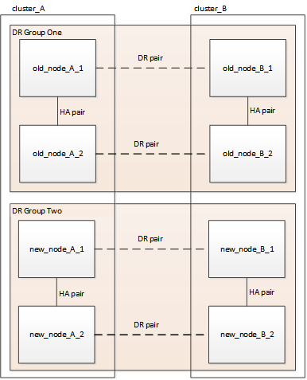

= 4 ノード MetroCluster FC 構成を更新しています
:allow-uri-read: 
:icons: font
:imagesdir: ../media/

[role="lead"]
4 ノード MetroCluster 構成のコントローラとストレージをアップグレードするには、構成を拡張して 8 ノード構成にし、古いディザスタリカバリ（ DR ）グループを削除します。

.このタスクについて
「古いノード」とは、置き換えるノードを意味します。

* この手順 を使用できるのは、MetroCluster FC構成の特定のプラットフォームモデルのみです。
+
** サポートされるプラットフォームアップグレードの組み合わせについては、のMetroCluster FC更新の表を参照してください link:../upgrade/concept_choosing_tech_refresh_mcc.html#supported-metrocluster-fc-tech-refresh-combinations["システムの更新方法を選択する"]。

.手順
. 古いノードから情報を収集します。
+
この段階では、次の図に示すように 4 ノード構成が表示されます。

+
image::../media/mcc_dr_group_a.png[MCC DR グループ A]

. MetroCluster タイプに対応した 4 ノード拡張手順のすべての手順を実行します。
+
link:task_expand_a_four_node_mcc_fc_configuration_to_an_eight_node_configuration.html["4 ノード MetroCluster FC 構成から 8 ノード構成への拡張"]

+
拡張手順が完了すると、次の図のような構成が表示されます。

+

. CRS ボリュームを移動します。
+
の手順を実行します https://docs.netapp.com/ontap-9/topic/com.netapp.doc.hw-metrocluster-service/task_move_a_metadata_volume_in_mcc_configurations.html["MetroCluster 構成でのメタデータボリュームの移動"]。

. の次の手順に従って、古いノードから新しいノードにデータを移動します https://docs.netapp.com/platstor/topic/com.netapp.doc.hw-upgrade-controller/home.html["その他のプラットフォーム手順： Controller Hardware Upgrade Express"^]。
+
.. のすべての手順を実行します http://docs.netapp.com/platstor/topic/com.netapp.doc.hw-upgrade-controller/GUID-AFE432F6-60AD-4A79-86C0-C7D12957FA63.html["アグリゲートの作成と新しいノードへのボリュームの移動"]。
+

NOTE: アグリゲートのミラーリングは、作成時または作成後に実行できます。

.. のすべての手順を実行します http://docs.netapp.com/platstor/topic/com.netapp.doc.hw-upgrade-controller/GUID-95CA9262-327D-431D-81AA-C73DEFF3DEE2.html["SAN 以外のデータ LIF とクラスタ管理 LIF を新しいノードに移動する"]。
.. のすべての手順を実行します http://docs.netapp.com/platstor/topic/com.netapp.doc.hw-upgrade-controller/GUID-91EC7830-0C28-4C78-952F-6F956CC5A62F.html["SAN LIF を元のノードから削除"]。

. 手順の手順に従って、古い DR グループを削除します。
+
link:concept_removing_a_disaster_recovery_group.html["ディザスタリカバリグループを削除しています"]

+
古い DR グループ（ DR グループ 1 ）を削除すると、次の図のような構成が表示されます。

+
image::../media/mcc_dr_group_d.png[MCC DR グループ d]

