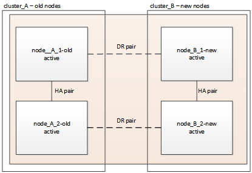

= スイッチオーバーとスイッチバックを使用して MetroCluster FC 構成の AFF A700 から AFF A900 にコントローラをアップグレード（ ONTAP 9.10.1 以降）
:icons: font
:imagesdir: ../media/

[role="lead"]
MetroCluster スイッチオーバー処理を使用すると、パートナークラスタのコントローラモジュールのアップグレード中もクライアントに無停止でサービスを提供できます。この手順の一部として他のコンポーネント（ストレージシェルフやスイッチなど）をアップグレードすることはできません。

.このタスクについて
* この手順は、コントローラのアップグレードにのみ使用できます。
+
ストレージシェルフやスイッチなど、構成内の他のコンポーネントも同時にアップグレードすることはできません。

* この手順は ONTAP 9.10.1 以降で使用できます。
+
** ONTAP 9.10.1 以降では、 4 ノードと 8 ノードの構成がサポートされます。
+

NOTE: AFF A900 システムは、 ONTAP 9.10.1 以降でのみサポートされます。

+
https://hwu.netapp.com/["NetApp Hardware Universe の略"^]

* 構成内のすべてのコントローラは、同じメンテナンス期間にアップグレードする必要があります。
+
次の表に、コントローラのアップグレードでサポートされるモデルマトリックスを示します。

|===

| 旧プラットフォームモデル | 新しいプラットフォームモデル 

 a| 
* AFF A700

 a| 
* AFF A900 の略

|===
* アップグレード用の手順では、 RCF やケーブル接続の物理的な変更を含めて、 MetroCluster ファブリックを変更する必要があります。RCF およびケーブル接続の変更は、コントローラのアップグレード前に実行できます。
* このアップグレード手順では、元のノードと新しいノードの間のストレージ接続、 FC 接続、イーサネット接続を変更する必要はありません。
* 手順のアップグレード中は、 AFF A700 システムに他のカードを追加したり、取り外したりしないでください。詳細については、を参照してください https://hwu.netapp.com/["NetApp Hardware Universe の略"^]

この手順では、次の名前が使用されています。

* site_A
+
** アップグレード前：
+
*** node_A_1 - A700
*** Node_a_2-A700

** アップグレード後：
+
*** node_A_1 - A900
*** Node_a_2-A900

* site_B
+
** アップグレード前：
+
*** node_B_1 - A700
*** node_B_2 - A700

** アップグレード後：
+
*** Node_B_1-A900
*** node_B_2 - A900

== アップグレードを準備

既存の MetroCluster 設定に変更を加える前に、設定の健全性を確認し、 RCF ファイルおよびケーブル接続を AFF A900 ファブリック MetroCluster の設定に必要な新しいポート接続トポロジに変更し、その他のタスクを実行する必要があります。

== AFF A700 コントローラのスロット 7 をクリアします

AFF A900 の MetroCluster 構成では、スロット 5 および 7 の FC-VI カードに FC-VI ポートが 8 つ必要です。アップグレードを開始する前に、 AFF A700 のスロット 7 にカードがある場合は、それらをクラスタのすべてのノード用の他のスロットに移動する必要があります。

=== MetroCluster 構成の健全性を確認

AFF A900 ファブリック MetroCluster 構成の RCF ファイルおよびケーブル接続を更新する前に、構成の健全性と接続を確認する必要があります。

.手順
. ONTAP で MetroCluster 構成の動作を確認します。
+
.. ノードがマルチパスであるかどうかを確認します。 +`node run -node node_name sysconfig -a`
+
このコマンドは、 MetroCluster 構成のノードごとに問題で実行する必要があります。

.. 構成に破損ディスクがないことを確認します。
+
「 storage disk show -broken 」

+
このコマンドは、 MetroCluster 構成の各ノードで問題を実行する必要があります。

.. ヘルスアラートがないかどうかを確認します。
+
「 system health alert show 」というメッセージが表示されます

+
このコマンドは、各クラスタで問題を実行する必要があります。

.. クラスタのライセンスを確認します。
+
「 system license show 」を参照してください

+
このコマンドは、各クラスタで問題を実行する必要があります。

.. ノードに接続されているデバイスを確認します。
+
「 network device-discovery show 」のように表示されます

+
このコマンドは、各クラスタで問題を実行する必要があります。

.. 両方のサイトでタイムゾーンと時間が正しく設定されていることを確認します。
+
cluster date show

+
このコマンドは、各クラスタで問題を実行する必要があります。時刻とタイムゾーンを設定するには 'cluster date コマンドを使用します

. スイッチにヘルスアラートがないかどうかを確認します（ある場合）。
+
「 storage switch show 」と表示されます

+
このコマンドは、各クラスタで問題を実行する必要があります。

. MetroCluster 構成の運用モードを確認し、 MetroCluster チェックを実行
+
.. MetroCluster 構成と運用モードが正常な状態であることを確認します。
+
「 MetroCluster show 」

.. 想定されるすべてのノードが表示されることを確認します。
+
MetroCluster node show

.. 次のコマンドを問題に設定します。
+
「 MetroCluster check run 」のようになります

.. MetroCluster チェックの結果を表示します。
+
MetroCluster チェックショー

. Config Advisor ツールを使用して MetroCluster のケーブル接続を確認します。
+
.. Config Advisor をダウンロードして実行します。
+
https://mysupport.netapp.com/site/tools/tool-eula/activeiq-configadvisor["ネットアップのダウンロード： Config Advisor"^]

.. Config Advisor の実行後、ツールの出力を確認し、推奨される方法で検出された問題に対処します。

=== ファブリックスイッチの RCF ファイルを更新します

AFF A900 ファブリック MetroCluster には、ノードあたり 2 つの 4 ポート FC-VI アダプタが必要ですが、 AFF A700 で必要な 4 ポート FC-VI アダプタは 1 つ必要です。AFF A900 コントローラへのコントローラのアップグレードを開始する前に、ファブリックスイッチの RCF ファイルを変更して AFF A900 接続トポロジをサポートする必要があります。

. から https://mysupport.netapp.com/site/products/all/details/metrocluster-rcf/downloads-tab["MetroCluster の RCF ファイルのダウンロードページ"^]で、 AFF A900 ファブリック MetroCluster と、 AFF A700 構成で使用しているスイッチモデルに対応した正しい RCF ファイルをダウンロードします。
. [[Update-RCF ]] の手順に従って、ファブリック A のスイッチ、スイッチ A1 、およびスイッチ B1 の RCF ファイルを更新します link:../disaster-recovery/task_cfg_switches_mcfc.html["FC スイッチを設定します"]。
+

NOTE: AFF A900 ファブリック MetroCluster 構成をサポートするための RCF ファイルの更新では、 AFF A700 ファブリックの MetroCluster 構成に使用するポートと接続には影響しません。

. ファブリック A のスイッチで RCF ファイルを更新したら、ストレージと FC-VI のすべての接続をオンラインにする必要があります。FC-VI 接続を確認します。
+
MetroCluster interconnect mirror show

+
.. ローカル・サイト・ディスクとリモート・サイト・ディスクが sysconfig 出力結果に表示されていることを確認します

. [[verify-backup ]] ファブリック A スイッチの MetroCluster ファイル更新後に、 が正常な状態であることを確認する必要があります。
+
.. メトロ・クラスタ接続を確認します MetroCluster interconnect mirror show
.. MetroCluster check: MetroCluster check run' を実行します
.. 実行が完了したら、 MetroCluster の実行結果を確認します。「 MetroCluster check show 」

. を繰り返してファブリック B のスイッチ（スイッチ 2 と 4 ）を更新します <<Update-RCF,手順 2>> 終了： <<verify-healthy,手順 5>>。

=== RCF ファイルの更新後に MetroCluster 設定の健全性を確認します

アップグレードを実行する前に、 MetroCluster 構成の健全性と接続を確認する必要があります。

.手順
. ONTAP で MetroCluster 構成の動作を確認します。
+
.. ノードがマルチパスであるかどうかを確認します。 +`node run -node node_name sysconfig -a`
+
このコマンドは、 MetroCluster 構成のノードごとに問題で実行する必要があります。

.. 構成に破損ディスクがないことを確認します。
+
「 storage disk show -broken 」

+
このコマンドは、 MetroCluster 構成の各ノードで問題を実行する必要があります。

.. ヘルスアラートがないかどうかを確認します。
+
「 system health alert show 」というメッセージが表示されます

+
このコマンドは、各クラスタで問題を実行する必要があります。

.. クラスタのライセンスを確認します。
+
「 system license show 」を参照してください

+
このコマンドは、各クラスタで問題を実行する必要があります。

.. ノードに接続されているデバイスを確認します。
+
「 network device-discovery show 」のように表示されます

+
このコマンドは、各クラスタで問題を実行する必要があります。

.. 両方のサイトでタイムゾーンと時間が正しく設定されていることを確認します。
+
cluster date show

+
このコマンドは、各クラスタで問題を実行する必要があります。時刻とタイムゾーンを設定するには 'cluster date コマンドを使用します

. スイッチにヘルスアラートがないかどうかを確認します（ある場合）。
+
「 storage switch show 」と表示されます

+
このコマンドは、各クラスタで問題を実行する必要があります。

. MetroCluster 構成の運用モードを確認し、 MetroCluster チェックを実行
+
.. MetroCluster 構成と運用モードが正常な状態であることを確認します。
+
「 MetroCluster show 」

.. 想定されるすべてのノードが表示されることを確認します。
+
MetroCluster node show

.. 次のコマンドを問題に設定します。
+
「 MetroCluster check run 」のようになります

.. MetroCluster チェックの結果を表示します。
+
MetroCluster チェックショー

. Config Advisor ツールを使用して MetroCluster のケーブル接続を確認します。
+
.. Config Advisor をダウンロードして実行します。
+
https://mysupport.netapp.com/site/tools/tool-eula/activeiq-configadvisor["ネットアップのダウンロード： Config Advisor"^]

.. Config Advisor の実行後、ツールの出力を確認し、推奨される方法で検出された問題に対処します。

=== AFF A700 ノードから AFF A900 ノードへのポートのマッピング

コントローラのアップグレードプロセスで変更する必要があるのは、この手順に記載されている接続だけです。

AFF A700 コントローラのスロット 7 手順にカードが挿入されている場合は、コントローラのアップグレードを開始する前に、カードを別のスロットに移動する必要があります。AFF A900 でファブリック MetroCluster を機能させるために必要な 2 つ目の FC-VI アダプタの追加に、スロット 7 を使用できる必要があります。

=== アップグレード前に情報を収集

アップグレードの開始前に各ノードについて情報を収集し、必要に応じてネットワークブロードキャストドメインを調整し、 VLAN やインターフェイスグループを削除して、暗号化情報を収集する必要があります。

このタスクは、既存の MetroCluster FC 構成で実行します。

.手順
. MetroCluster 構成ノードのシステム ID を収集します。
+
MetroCluster node show -fields node-systemid 、 dr-partner-systemid'

+
交換用手順では、これらのシステム ID をコントローラモジュールのシステム ID に置き換えます。

+
この 4 ノード MetroCluster FC 構成の例では、次の古いシステム ID が取得されます。

+
** node_A_1 - A700 ： 537037649
** Node_a_2-A700 ： 537407030
** Node_B_1-A700 ： 0537407114
** node_B_2 - A700 ： 537035354

+
[listing]
----
Cluster_A::*> metrocluster node show -fields node-systemid,ha-partner-systemid,dr-partner-systemid,dr-auxiliary-systemid
dr-group-id cluster    node           node-systemid ha-partner-systemid dr-partner-systemid dr-auxiliary-systemid
----------- ------------------------- ------------- ------------------- ------------------- ---------------------
1           Cluster_A  nodeA_1-A700   537407114     537035354           537411005           537410611
1           Cluster_A  nodeA_2-A700   537035354     537407114           537410611           537411005
1           Cluster_B  nodeB_1-A700   537410611     537411005           537035354           537407114
1           Cluster_B  nodeB_2-A700   537411005

4 entries were displayed.
----
. 各ノードのポートと LIF の情報を収集
+
ノードごとに次のコマンドの出力を収集する必要があります。

+
** 'network interface show -role cluster, node-mgmt
** 'network port show -node node_name -type physical ’
** 'network port vlan show -node -node-name _`
** 「 network port ifgrp show -node node_name 」 - instance 」を指定します
** 「 network port broadcast-domain show 」
** 「 network port reachability show-detail` 」と表示されます
** network ipspace show
** volume show
** 「 storage aggregate show
** 「 system node run -node _node-name_sysconfig -a 」のように入力します

. MetroCluster ノードが SAN 構成になっている場合は、関連情報を収集します。
+
次のコマンドの出力を収集する必要があります。

+
** 「 fcp adapter show -instance 」のように表示されます
** 「 fcp interface show -instance 」の略
** 「 iscsi interface show 」と表示されます
** ucadmin show

. ルートボリュームが暗号化されている場合は、 key-manager に使用するパスフレーズを収集して保存します。
+
「 securitykey-manager backup show 」を参照してください

. MetroCluster ノードがボリュームまたはアグリゲートに暗号化を使用している場合は、キーとパスフレーズに関する情報をコピーします。
+
追加情報の場合は、を参照してください https://docs.netapp.com/us-en/ontap/encryption-at-rest/backup-key-management-information-manual-task.html["オンボードキー管理情報の手動でのバックアップ"^]。

+
.. オンボードキーマネージャが設定されている場合：
+
「 securitykey manager onboard show-backup 」を参照してください

+
パスフレーズは、あとでアップグレード手順で必要になります。

.. Enterprise Key Management （ KMIP ）が設定されている場合は、次のコマンドを問題で実行します。
+
「 securitykey-manager external show -instance 」

+
「セキュリティキーマネージャのキークエリ」

=== Tiebreaker またはその他の監視ソフトウェアから既存の設定を削除します

スイッチオーバーを開始できる MetroCluster Tiebreaker 構成や他社製アプリケーション（ ClusterLion など）で既存の構成を監視している場合は、移行の前に Tiebreaker またはその他のソフトウェアから MetroCluster 構成を削除する必要があります。

.手順
. Tiebreaker ソフトウェアから既存の MetroCluster 設定を削除します。
+
link:/tiebreaker/concept_configuring_the_tiebreaker_software.html["MetroCluster 構成を削除"]

. スイッチオーバーを開始できるサードパーティ製アプリケーションから既存の MetroCluster 構成を削除します。
+
アプリケーションのマニュアルを参照してください。

=== カスタム AutoSupport メッセージをメンテナンス前に送信する

メンテナンスを実行する前に、 AutoSupport an 問題 message to notify NetApp technical support that maintenance is maintenancing （メンテナンスが進行中であることをネットアップテクニカルサポートに通知する）を実行システム停止が発生したとみなしてテクニカルサポートがケースをオープンしないように、メンテナンスが進行中であることを通知する必要があります。

このタスクは MetroCluster サイトごとに実行する必要があります。

.手順
. サポートケースが自動で生成されないようにするには、メンテナンスが進行中であることを示す AutoSupport メッセージを送信します。
+
.. 次のコマンドを問題に設定します。
+
「 system node AutoSupport invoke -node * -type all -message MAINT=__ maintenance-window-in-hours __ 」というメッセージが表示されます

+
「メンテナンス時間」では、メンテナンス時間の長さを最大 72 時間指定します。この時間が経過する前にメンテナンスが完了した場合は、メンテナンス期間が終了したことを通知する AutoSupport メッセージを起動できます。

+
「 system node AutoSupport invoke -node * -type all -message MAINT= end 」というメッセージが表示されます

.. パートナークラスタに対してこのコマンドを繰り返します。

== MetroCluster 構成をスイッチオーバーします

site_B のプラットフォームをアップグレードできるように、設定を site_A にスイッチオーバーする必要があります。

このタスクは Site_A 上で実行する必要があります

このタスクを完了すると、 Site_A がアクティブになり、両方のサイトでデータを提供します。site_B は非アクティブで、次の図のようにアップグレードプロセスを開始する準備ができています。

image::../media/mcc_upgrade_cluster_a_in_switchover.png[MCC アップグレードで、クラスタ A をスイッチオーバーします]

.手順
. Site_B のノードをアップグレードできるように、 MetroCluster 構成を Site_A にスイッチオーバーします。
+
.. Site_A で次のコマンドを問題します。
+
MetroCluster switche-controller-replacement true

+
この処理が完了するまでに数分かかることがあります。

.. スイッチオーバー処理を監視します。
+
「 MetroCluster operation show 」を参照してください

.. 処理が完了したら、ノードがスイッチオーバー状態であることを確認します。
+
「 MetroCluster show 」

.. MetroCluster ノードのステータスを確認します。
+
MetroCluster node show

. データアグリゲートを修復します。
+
.. データアグリゲートを修復します。
+
MetroCluster は ' データ・アグリゲートを修復します

.. 正常なクラスタで MetroCluster operation show コマンドを実行して、修復操作が完了したことを確認します。
+
[listing]
----

cluster_A::> metrocluster operation show
  Operation: heal-aggregates
      State: successful
 Start Time: 7/29/2020 20:54:41
   End Time: 7/29/2020 20:54:42
     Errors: -
----

. ルートアグリゲートを修復します。
+
.. データアグリゲートを修復します。
+
MetroCluster はルートアグリゲートを修復します

.. 正常なクラスタで MetroCluster operation show コマンドを実行して、修復操作が完了したことを確認します。
+
[listing]
----

cluster_A::> metrocluster operation show
  Operation: heal-root-aggregates
      State: successful
 Start Time: 7/29/2020 20:58:41
   End Time: 7/29/2020 20:59:42
     Errors: -
----

== サイト B で AFF A700 コントローラモジュールと NVS を取り外します

構成から古いコントローラを削除する必要があります。

このタスクはサイト B で実行します

接地対策がまだの場合は、自身で適切に実施します。

.手順
. サイト B の古いコントローラ（ node_B_1 700 および node_B_2 700 ）のシリアルコンソールに接続し、「 LOADER」 プロンプトが表示されていることを確認します。
. サイト B の両方のノードから bootarg の値を取得します printenv
. サイト B でシャーシの電源をオフにします

== サイト B の両方のノードからコントローラモジュールと NVS を取り外します

=== AFF A700 コントローラモジュールを取り外します

次の手順を使用して、 AFF A700 コントローラモジュールを取り外します。

.手順
. コントローラモジュールを取り外す前に、コントローラモジュールからコンソールケーブル（ある場合）と管理ケーブルを外します。
. コントローラモジュールのロックを解除してシャーシから取り外します。
+
.. カムハンドルのオレンジ色のボタンを下にスライドさせてロックを解除します。
+
image:../media/drw_9500_remove_PCM.png["コントローラ"]

+
|===

|  | カムハンドルのリリースボタン 

| image:../media/number2.png["番号 2"] | カムハンドル 
|===
.. カムハンドルを回転させて、コントローラモジュールをシャーシから完全に外し、コントローラモジュールをシャーシから引き出します。このとき、空いている手でコントローラモジュールの底面を支えてください。

=== AFF A700 NVS モジュールを取り外します

次の手順を使用して、 AFF A700 NVS モジュールを取り外します。

NOTE: AFF A700 NVS モジュールはスロット 6 にあり、システム内の他のモジュールと比較して高さが 2 倍になっています。

. NVS のロックを解除し、スロット 6 から取り外します。
+
.. 文字と数字が記載されたカムボタンを押し下げます。カムボタンがシャーシから離れます。
.. カムラッチを下に回転させて水平にします。NVS がシャーシから外れ、数インチ移動します。
.. NVS をシャーシから取り外すには、モジュール前面の両側にあるプルタブを引いてください。
+
image:../media/drw_a900_move-remove_NVRAM_module.png["NVS モジュール"]

+
|===

|  | 文字と数字が記載された I/O カムラッチ 

| image:../media/number2.png["番号 2"] | ロックが完全に解除された I/O ラッチ 
|===

NOTE: AFF A700 不揮発性ストレージモジュールにコアダンプデバイスとして使用されているアドオンモジュールがある場合は、それらを AFF A900 NVS に転送しないでください。AFF A700 コントローラモジュールと NVS から AFF A900 にパーツを転送しないでください。

== AFF A900 NVS およびコントローラモジュールを取り付けます

Site_B の両方のノードに、アップグレードキットから AFF A900 NVS およびコントローラモジュールをインストールする必要がありますコアダンプデバイスを AFF A700 NVS モジュールから AFF A900 NVS モジュールに移動しないでください。

接地対策がまだの場合は、自身で適切に実施します。

=== AFF A900 NVS を取り付けます

次の手順を使用して、サイト B の両方のノードのスロット 6 に AFF A900 NVS を取り付けます

.手順
. NVS をスロット 6 のシャーシ開口部の端に合わせます。
. NVS をスロットにそっと挿入し、文字と数字が記載された I/O カムラッチを上に押して NVS を所定の位置にロックします。
+
image:../media/drw_a900_move-remove_NVRAM_module.png["NVS モジュール"]

+
|===

|  | 文字と数字が記載された I/O カムラッチ 

| image:../media/number2.png["番号 2"] | ロックが完全に解除された I/O ラッチ 
|===

=== AFF A900 コントローラモジュールを取り付けます

次の手順を使用して、 AFF A900 コントローラモジュールを取り付けます。

.手順
. コントローラモジュールの端をシャーシの開口部に合わせ、コントローラモジュールをシステムに半分までそっと押し込みます。
. コントローラモジュールをシャーシに挿入し、ミッドプレーンまでしっかりと押し込んで完全に装着します。コントローラモジュールが完全に装着されると、ロックラッチが上がります。
+

CAUTION: コネクタの破損を防ぐため、コントローラモジュールをスライドしてシャーシに挿入する際に力を入れすぎないでください。

. 管理ポートとコンソールポートをコントローラモジュールにケーブル接続します。
+
image:../media/drw_9500_remove_PCM.png["コントローラ"]

+
|===

|  | カムハンドルのリリースボタン 

| image:../media/number2.png["番号 2"] | カムハンドル 
|===
. 各ノードのスロット 7 に 2 枚目の X91129A カードを取り付けます。
+
.. スロット 7 の FC-VI ポートをスイッチに接続します。を参照してください link:../install-fc/index.html["ファブリック接続型のインストールと設定"] 環境内のスイッチタイプに応じた AFF A900 ファブリック MetroCluster 接続の要件については、を参照してください。

. シャーシの電源を入れ、シリアルコンソールに接続します。
. BIOS の初期化後にノードで自動ブートが開始された場合は、 Ctrl-C を押して自動ブートを中断します
. AUTOBOOT を中断すると、ノードで LOADER プロンプトが停止します。ブートを中断せずに node1 でブートが開始された場合は、 Ctrl+C キーを押してブートメニューに入るまで待ちます。ブートメニューでノードが停止したら、オプション 8 を使用してノードをリブートし、リブート時に自動ブートを中断します。
. 「 loader 」プロンプトで、デフォルトの環境変数「 set-defaults 」を設定します
. デフォルトの環境変数設定である saveenv を保存します

=== サイト B のノードをネットブート

AFF A900 コントローラモジュールと NVS をスワップしたら、 AFF A900 ノードをネットブートし、クラスタ上で実行されているものと同じ ONTAP バージョンおよびパッチレベルをインストールする必要があります。「 netboot 」という用語は、リモート・サーバに保存されている ONTAP イメージからブートすることを意味します。ネットブートを準備するときは ' システムがアクセスできる Web サーバに ONTAP 9 ブート・イメージのコピーを追加する必要があります

AFF A900 コントローラモジュールのブートメディアにインストールされている ONTAP のバージョンは、シャーシに取り付けて電源がオンになっていないかぎり確認できません。AFF A900 ブートメディアの ONTAP バージョンは、アップグレード対象の AFF A700 システムで実行されている ONTAP バージョンと同じで、プライマリブートイメージとバックアップブートイメージの両方が一致している必要があります。イメージを設定するには、「 netboot 」に続けて「 wipeconfig 」コマンドを実行します。コントローラモジュールが以前に別のクラスタで使用されていた場合は、「 wipeconfig 」コマンドはブートメディア上の残留設定をクリアします。

.を開始する前に
* システムから HTTP サーバにアクセスできることを確認します。
* ご使用のシステムに必要なシステムファイルと、適切なバージョンの ONTAP をからダウンロードする必要があります link:https://mysupport.netapp.com/site/["ネットアップサポート"^] サイトこのタスクについて、インストールされている ONTAP のバージョンが元のコントローラにインストールされているバージョンと異なる場合は、新しいコントローラを「ネットブート」する必要があります。新しいコントローラをそれぞれ取り付けたら、 Web サーバに保存されている ONTAP 9 イメージからシステムをブートします。その後、以降のシステムブートで使用するブートメディアデバイスに正しいファイルをダウンロードできます。

.手順
. にアクセスします link:https://mysupport.netapp.com/site/["ネットアップサポート"^] システムのネットブートの実行に使用するシステム・ネットブートの実行に必要なファイルをダウンロードするには、次の手順を実行します。
. [step2-download-software]] ネットアップサポートサイトのソフトウェアダウンロードセクションから適切な ONTAP ソフトウェアをダウンロードし、「 <ONTAP_version>_image.tgz 」ファイルを Web にアクセスできるディレクトリに保存します。
. Web にアクセスできるディレクトリに移動し、必要なファイルが利用可能であることを確認します。ディレクトリの一覧には「 <ONTAP_version>_image.tgz 」が含まれている必要があります。
. 次のいずれかの操作を選択して 'netboot' 接続を構成しますメモ：管理ポートと IP を「 netboot 」接続として使用してください。アップグレードの実行中にデータ LIF IP を使用しないでください。データ LIF が停止する可能性があります。
+
|===

| 動的ホスト構成プロトコル（ DHCP ）の状態 | 作業 

| 実行中です | ブート環境プロンプトで次のコマンドを使用して、自動的に接続を設定します。 ifconfig e0M -auto 

| 実行されていません | ブート環境プロンプトで次のコマンドを使用して、接続を手動で設定します。 ifconfig e0M -addr= <filer_addr> -mask= <netmask> -gw= <gateway> -dns= <dns_addr> domain= <dns_domain> `<filer_addr>`<netmask>` はストレージシステムのネットワークマスクです。「 <gateway>` 」は、ストレージシステムのゲートウェイです。「 <dns_addr> 」は、ネットワーク上のネームサーバの IP アドレスです。このパラメータはオプションです。「 <dns_domain> 」は、 Domain Name Service （ DNS ；ドメインネームサービス）ドメイン名です。このパラメータはオプションです。注：使用しているインターフェイスによっては、他のパラメータが必要になる場合もあります。詳細については、ファームウェアのプロンプトで「 help ifconfig 」と入力してください。 
|===
. ノード 1 でネットブートを実行します http://<web_server_ip/path_to_web_accessible_directory>/netboot/kernel`[]「 <path_the_web-accessible_directory> 」は、「 <ONTAP_version>_image.tgz 」をダウンロードした場所を指します <<step2-download-software,手順 2>>。
+

NOTE: トランクを中断しないでください。

. AFF A900 コントローラモジュールで実行されているノード 1 がブートするのを待ち、次のようにブートメニューオプションを表示します。
+
[listing]
----
Please choose one of the following:

(1)  Normal Boot.
(2)  Boot without /etc/rc.
(3)  Change password.
(4)  Clean configuration and initialize all disks.
(5)  Maintenance mode boot.
(6)  Update flash from backup config.
(7)  Install new software first.
(8)  Reboot node.
(9)  Configure Advanced Drive Partitioning.
(10) Set Onboard Key Manager recovery secrets.
(11) Configure node for external key management.
Selection (1-11)?
----
. 起動メニューからオプション（ 7 ） Install new software first （新しいソフトウェアを最初にインストール）を選択します。このメニューオプションを選択すると、新しい ONTAP イメージがブートデバイスにダウンロードおよびインストールされます。
+

NOTE: 次のメッセージは無視してください： This 手順 is not supported for Non-Disruptive Upgrade on an HA pair. 環境の無停止の ONTAP ソフトウェアアップグレード。コントローラのアップグレードは含まれません。新しいノードを希望するイメージに更新する場合は、必ずネットブートを使用してください。別の方法で新しいコントローラにイメージをインストールした場合、間違ったイメージがインストールされることがあります。この問題環境 All ONTAP リリース

. 手順を続行するかどうかを確認するメッセージが表示されたら、「 y 」と入力し、パッケージの入力を求められたら URL を入力します。http://<web_server_ip/path_to_web-accessible_directory>/<ontap_version>_image.tgz[]
. 次の手順を実行してコントローラモジュールをリブートします。
+
.. 次のプロンプトが表示されたら 'n' を入力してバックアップ・リカバリをスキップしますバックアップ構成を今すぐリストアしますか ? {y|n}`
.. 次のプロンプトが表示されたら 'y' と入力して再起動します ' 新しくインストールしたソフトウェアの使用を開始するには ' ノードを再起動する必要があります今すぐリブートしますか？{y|n}`
+
コントローラモジュールはリブートしますが、ブートメニューで停止します。これは、ブートデバイスが再フォーマットされたことにより、構成データのリストアが必要なためです。

. プロンプトで「 wipeconfig 」コマンドを実行して、ブートメディアの以前の設定をクリアします。
+
.. 次のメッセージが表示されたら、回答は「 yes 」を選択します。これにより、クラスタメンバーシップを含む重要なシステム構成が削除されます。警告：テイクオーバーされた HA ノードでは実行しないでください。続行してもよろしいですか ?:`
.. ノードがリブートして「 wipeconfig 」を終了し、ブートメニューで停止します。

. ブート・メニューからオプション「 5 」を選択して、保守モードに切り替えます。ノードがメンテナンス・モードで停止し ' コマンド・プロンプト *>` が表示されるまで ' プロンプトを表示します回答

=== HBA 構成をリストア

コントローラモジュールに HBA カードが搭載されているかどうかや設定によっては、サイトで使用するために正しく設定する必要があります。

.手順
. メンテナンスモードで、システム内の HBA の設定を行います。
+
.. ucadmin show と入力し、各ポートの現在の設定を確認します
.. 必要に応じてポートの設定を更新します。

+
|===

| HBA のタイプと目的のモード | 使用するコマンド 

 a| 
CNA FC
 a| 
ucadmin modify -m fc -t initiator_adapter-name _ `

 a| 
CNA イーサネット
 a| 
ucadmin modify -mode cna_adapter-name_`

 a| 
FC ターゲット
 a| 
fcadmin config -t target_adapter-name_`

 a| 
FC イニシエータ
 a| 
fcadmin config -t initiator_adapter-name_`

|===

=== 新しいコントローラとシャーシで HA 状態を設定

コントローラとシャーシの HA 状態を確認し、必要に応じてシステム構成に合わせて更新する必要があります。

.手順
. メンテナンスモードで、コントローラモジュールとシャーシの HA 状態を表示します。
+
「 ha-config show 」

+
すべてのコンポーネントの HA の状態が mcc である必要があります。

. 表示されたコントローラまたはシャーシのシステム状態が正しくない場合は、 HA 状態を設定します。
+
「 ha-config modify controller mcc 」

+
「 ha-config modify chassis mcc 」

. ノードを停止しますノードは 'LOADER>` プロンプトで停止します
. 各ノードで ' システムの日付 ' 時刻 ' タイムゾーンを確認しますつまり ' 日付を表示します
. 必要に応じて、日付を UTC またはグリニッジ標準時（ GMT ）に設定します。「 set date <mm/dd/yyyy>` 」
. ブート環境プロンプトで次のコマンドを使用して ' 時刻を確認します
. 必要に応じて、時刻を UTC または GMT:' 設定時刻 <:hh:mm:ss>` で設定します
. 設定を保存します： saveenv
. 環境変数 :printenv' を収集します
. ノードをブートして保守モードに戻り、設定の変更が反映されるようにします。「 boot_ontap maint 」
. 行った変更が有効であることを確認し、 ucadmin に FC イニシエータポートがオンラインで表示されるようにします。
+
|===

| HBA のタイプ | 使用するコマンド 

 a| 
CNA
 a| 
ucadmin show

 a| 
FC
 a| 
fcadmin show`

|===
. ha-config モードを確認します。「 ha-config show
+
.. 次の出力があることを確認します。
+
[listing]
----
*> ha-config show
Chassis HA configuration: mcc
Controller HA configuration: mcc
----

=== 新しいコントローラとシャーシで HA 状態を設定

コントローラとシャーシの HA 状態を確認し、必要に応じてシステム構成に合わせて更新する必要があります。

.手順
. メンテナンスモードで、コントローラモジュールとシャーシの HA 状態を表示します。
+
「 ha-config show 」

+
すべてのコンポーネントの HA の状態が mcc である必要があります。

+
|===

| MetroCluster 構成の内容 | HA の状態 

 a| 
2 ノード
 a| 
mcc-2n

 a| 
4 ノードまたは 8 ノード
 a| 
MCC

|===
. 表示されたコントローラのシステム状態が正しくない場合は、コントローラモジュールとシャーシの HA 状態を設定します。
+
|===

| MetroCluster 構成の内容 | 問題コマンド 

 a| 
* 2 ノード *
 a| 
「 ha-config modify controller mcc-2n 」という形式で指定します

「 ha-config modify chassis mcc-2n 」というようになりました

 a| 
* 4 ノードまたは 8 ノード *
 a| 
「 ha-config modify controller mcc 」

「 ha-config modify chassis mcc 」

|===

=== ルートアグリゲートディスクを再割り当てします

前の手順で確認したシステム ID を使用して、ルートアグリゲートディスクを新しいコントローラモジュールに再割り当てします

このタスクはメンテナンスモードで実行します。

古いシステム ID は、で識別されています link:task_upgrade_controllers_in_a_four_node_fc_mcc_us_switchover_and_switchback_mcc_fc_4n_cu.html["アップグレード前に情報を収集"]。

この手順の例では、次のシステム ID を持つコントローラを使用します。

|===

| ノード | 古いシステム ID | 新しいシステム ID 

 a| 
node_B_1
 a| 
4068741254
 a| 
1574774970

|===
.手順
. 他のすべての接続を新しいコントローラモジュール（ FC-VI 、ストレージ、クラスタインターコネクトなど）にケーブル接続します。
. システムを停止して 'LOADER' プロンプトからメンテナンス・モードで起動します
+
「 boot_ontap maint 」を使用してください

. node_B_1 A700 が所有するディスクを表示します。
+
「ディスクショー - A` 」

+
次の出力例は、新しいコントローラモジュールのシステム ID （ 1574774970 ）を示しています。ただし、ルートアグリゲートディスクは古いシステム ID （ 4068741254 ）で所有されます。この例で表示されているのは、 MetroCluster 構成の他のノードが所有するドライブではありません。

+
[listing]
----
*> disk show -a
Local System ID: 1574774970

  DISK         OWNER                     POOL   SERIAL NUMBER    HOME                      DR HOME
------------   -------------             -----  -------------    -------------             -------------
...
rr18:9.126L44 node_B_1-A700(4068741254)   Pool1  PZHYN0MD         node_B_1-A700(4068741254)  node_B_1-A700(4068741254)
rr18:9.126L49 node_B_1-A700(4068741254)   Pool1  PPG3J5HA         node_B_1-A700(4068741254)  node_B_1-A700(4068741254)
rr18:8.126L21 node_B_1-A700(4068741254)   Pool1  PZHTDSZD         node_B_1-A700(4068741254)  node_B_1-A700(4068741254)
rr18:8.126L2  node_B_1-A700(4068741254)   Pool0  S0M1J2CF         node_B_1-A700(4068741254)  node_B_1-A700(4068741254)
rr18:8.126L3  node_B_1-A700(4068741254)   Pool0  S0M0CQM5         node_B_1-A700(4068741254)  node_B_1-A700(4068741254)
rr18:9.126L27 node_B_1-A700(4068741254)   Pool0  S0M1PSDW         node_B_1-A700(4068741254)  node_B_1-A700(4068741254)
...
----
. ドライブシェルフのルートアグリゲートディスクを新しいコントローラに再割り当てします。
+
「ディスクの再割り当て -s _old-sysid_-d_new-sysid_`

+
次の例は、ドライブの再割り当てを示しています。

+
[listing]
----
*> disk reassign -s 4068741254 -d 1574774970
Partner node must not be in Takeover mode during disk reassignment from maintenance mode.
Serious problems could result!!
Do not proceed with reassignment if the partner is in takeover mode. Abort reassignment (y/n)? n

After the node becomes operational, you must perform a takeover and giveback of the HA partner node to ensure disk reassignment is successful.
Do you want to continue (y/n)? Jul 14 19:23:49 [localhost:config.bridge.extra.port:error]: Both FC ports of FC-to-SAS bridge rtp-fc02-41-rr18:9.126L0 S/N [FB7500N107692] are attached to this controller.
y
Disk ownership will be updated on all disks previously belonging to Filer with sysid 4068741254.
Do you want to continue (y/n)? y
----
. すべてのディスクが期待どおりに再割り当てされていることを確認します
+
[listing]
----
*> disk show
Local System ID: 1574774970

  DISK        OWNER                      POOL   SERIAL NUMBER   HOME                      DR HOME
------------  -------------              -----  -------------   -------------             -------------
rr18:8.126L18 node_B_1-A900(1574774970)   Pool1  PZHYN0MD        node_B_1-A900(1574774970)  node_B_1-A900(1574774970)
rr18:9.126L49 node_B_1-A900(1574774970)   Pool1  PPG3J5HA        node_B_1-A900(1574774970)  node_B_1-A900(1574774970)
rr18:8.126L21 node_B_1-A900(1574774970)   Pool1  PZHTDSZD        node_B_1-A900(1574774970)  node_B_1-A900(1574774970)
rr18:8.126L2  node_B_1-A900(1574774970)   Pool0  S0M1J2CF        node_B_1-A900(1574774970)  node_B_1-A900(1574774970)
rr18:9.126L29 node_B_1-A900(1574774970)   Pool0  S0M0CQM5        node_B_1-A900(1574774970)  node_B_1-A900(1574774970)
rr18:8.126L1  node_B_1-A900(1574774970)   Pool0  S0M1PSDW        node_B_1-A900(1574774970)  node_B_1-A900(1574774970)
*>
----
. アグリゲートのステータスを表示します。「 aggr status 」を選択します
+
[listing]
----
*> aggr status
           Aggr            State       Status           Options
aggr0_node_b_1-root    online      raid_dp, aggr    root, nosnap=on,
                           mirrored                     mirror_resync_priority=high(fixed)
                           fast zeroed
                           64-bit
----
. パートナーノード（ node_B_2 - A900 ）に対して上記の手順を繰り返します。

=== 新しいコントローラをブートします

コントローラのフラッシュイメージを更新するには、ブートメニューからコントローラをリブートする必要があります。暗号化が設定されている場合は、追加の手順が必要です。

このタスクはすべての新しいコントローラで実行する必要があります。

.手順
. ノードを停止します
. 外部キー管理ツールが設定されている場合は、関連する bootargs を設定します。
+
'setenv bootarg.kmip.init.ipaddr _ip-address_'

+
'setenv bootarg.kmip.init.netmask _netmask_`

+
'setenv bootarg.kmip.init.gateway _gateway-address_

+
'setenv bootarg.kmip.init.interface _interface-id_

. ブートメニューを表示します：「 boot_ontap menu
. ルート暗号化を使用問題する場合は、キー管理設定の boot menu コマンドを使用します。
+
|===

| 使用するポート | 選択するブートメニューオプション 

 a| 
オンボードキー管理
 a| 
オプション 10 を選択し、画面の指示に従って、キー管理ツールの構成をリカバリまたはリストアするために必要な入力を指定します

 a| 
外部キー管理
 a| 
オプション 11 を選択し、画面の指示に従って、キー管理ツールの設定をリカバリまたはリストアするために必要な入力を指定します

|===
. 自動ブートが有効になっている場合は、 control-C を押して自動ブートを中断します
. ブートメニューからオプション（ 6 ）を実行します。
+

NOTE: オプション 6 を指定すると、完了前にノードが 2 回リブートされます

+
システム ID 変更プロンプトに「 y 」と入力します。2 回目のリブートメッセージが表示されるまで待ちます。

+
[listing]
----
Successfully restored env file from boot media...

Rebooting to load the restored env file...
----
. partner-sysid が正しいことをダブルチェックします :printenv partner-sysid
+
partner-sysid が正しくない場合は、「 setenv partner-sysid_partner-SysID_` 」と設定します

. ルート暗号化を使用問題する場合は、キー管理設定に対して boot menu コマンドを再度実行します。
+
|===

| 使用するポート | 選択するブートメニューオプション 

 a| 
オンボードキー管理
 a| 
オプション 10 を選択し、画面の指示に従って、キー管理ツールの構成をリカバリまたはリストアするために必要な入力を指定します

 a| 
外部キー管理
 a| 
オプション 11 を選択し、画面の指示に従って、キー管理ツールの設定をリカバリまたはリストアするために必要な入力を指定します

|===
+
ノードが完全にブートするまで、ブートメニュープロンプトで「 recover_xxxxxxxx_keymanager 」コマンドを何度も問題に接続する必要がある場合があります。

. ノード「 boot_ontap 」をブートします
. 交換したノードがブートするまで待ちます。
+
いずれかのノードがテイクオーバーモードの場合は、「 storage failover giveback 」コマンドを使用してギブバックを実行します。

. すべてのポートがブロードキャストドメインに属していることを確認します。
+
.. ブロードキャストドメインを表示します。
+
「 network port broadcast-domain show 」

.. 必要に応じて、ブロードキャストドメインにポートを追加します。
+
link:https://docs.netapp.com/us-en/ontap/networking/add_or_remove_ports_from_a_broadcast_domain97.html["ブロードキャストドメインのポートを追加または削除します"^]

.. インタークラスタ LIF をホストする物理ポートを対応するブロードキャストドメインに追加します。
.. 新しい物理ポートをホームポートとして使用するようにクラスタ間 LIF を変更します。
.. クラスタ間 LIF が起動したら、クラスタピアのステータスを確認し、必要に応じてクラスタピアリングを再確立します。
+
クラスタピアリングの再設定が必要になる場合があります。

+
link:https://docs.netapp.com/us-en/ontap-metrocluster/install-fc/concept_configure_the_mcc_software_in_ontap.html#peering-the-clusters["クラスタピア関係を作成"]

.. 必要に応じて、 VLAN とインターフェイスグループを再作成します。
+
VLAN およびインターフェイスグループのメンバーシップは、古いノードと異なる場合があります。

+
link:https://docs.netapp.com/us-en/ontap/networking/configure_vlans_over_physical_ports.html#create-a-vlan["VLAN を作成する"^]

+
link:https://docs.netapp.com/us-en/ontap/networking/combine_physical_ports_to_create_interface_groups.html["物理ポートを組み合わせたインターフェイスグループの作成"^]

. 暗号化を使用する場合は、キー管理設定に対応したコマンドを使用してキーをリストアします。
+
|===

| 使用するポート | 使用するコマンド 

 a| 
オンボードキー管理
 a| 
「セキュリティキーマネージャオンボード同期」

詳細については、を参照してください link:https://docs.netapp.com/us-en/ontap/encryption-at-rest/restore-onboard-key-management-encryption-keys-task.html["オンボードキー管理の暗号化キーのリストア"^]。

 a| 
外部キー管理
 a| 
「 securitykey manager external restore -vserver _svm_-node __ key -server_host_name | ip_address ： port_-key-id key_id -key tag key_tag_node-name_ 」

詳細については、を参照してください link:https://docs.netapp.com/us-en/ontap/encryption-at-rest/restore-external-encryption-keys-93-later-task.html["外部キー管理の暗号化キーのリストア"^]。

|===

=== LIF の設定を確認

スイッチバックの前に、 LIF が適切なノード / ポートにホストされていることを確認します。次の手順を実行する必要があります

このタスクはサイト B で実行します。サイト B では、ルートアグリゲートでノードがブートされています。

.手順
. スイッチバックの前に、 LIF が適切なノードとポートにホストされていることを確認します。
+
.. advanced 権限レベルに切り替えます。
+
「 advanced 」の権限が必要です

.. ポート設定を無視して LIF が適切に配置されるようにします。
+
「 vserver config override command 」 network interface modify -vserver vserver_name __ -home-node _active_port_after_upgrade _ -lif LIF_name -home-node _new_node_name _

+
「 vserver config override 」コマンド内で「 network interface modify 」コマンドを入力する場合、 Tab autoccomplete 機能は使用できません。autoccomplete を使用して「 network interface modify 」を作成し、「 vserver config override 」コマンドで囲むことができます。

.. admin 権限レベルに戻ります。 +`set -privilege admin`

. インターフェイスをホームノードにリバートします。
+
「 network interface revert * -vserver_vserver-name に指定します

+
必要に応じて、すべての SVM でこの手順を実行します。

== MetroCluster 構成をスイッチバックします

新しいコントローラを設定したら、 MetroCluster 構成をスイッチバックして構成を通常動作に戻します。

このタスクでは、スイッチバック処理を実行して MetroCluster 構成を通常動作に戻します。site_A のノードはまだアップグレード待ちです。

.手順
. site_B の MetroCluster node show コマンドを問題し ' 出力を確認します
+
.. 新しいノードが正しく表示されることを確認します。
.. 新しいノードの状態が「 Waiting for switchback 」であることを確認します。

. クラスタをスイッチバックします。
+
MetroCluster スイッチバック

. スイッチバック処理の進捗を確認します。
+
「 MetroCluster show 」

+
出力に「 waiting-for-switchback 」と表示されたら、スイッチバック処理はまだ進行中です。

+
[listing]
----
cluster_B::> metrocluster show
Cluster                   Entry Name          State
------------------------- ------------------- -----------
 Local: cluster_B         Configuration state configured
                          Mode                switchover
                          AUSO Failure Domain -
Remote: cluster_A         Configuration state configured
                          Mode                waiting-for-switchback
                          AUSO Failure Domain -
----
+
出力に「 normal 」と表示された場合、スイッチバック処理は完了しています。

+
[listing]
----
cluster_B::> metrocluster show
Cluster                   Entry Name          State
------------------------- ------------------- -----------
 Local: cluster_B         Configuration state configured
                          Mode                normal
                          AUSO Failure Domain -
Remote: cluster_A         Configuration state configured
                          Mode                normal
                          AUSO Failure Domain -
----
+
スイッチバックが完了するまでに時間がかかる場合は、「 MetroCluster config-replication resync-status show 」コマンドを使用することで、進行中のベースラインのステータスを確認できます。このコマンドは、 advanced 権限レベルで実行します。

== MetroCluster 構成の健全性を確認します

コントローラモジュールをアップグレードしたら、 MetroCluster 構成の健全性を確認する必要があります。

このタスクは、 MetroCluster 構成の任意のノードで実行できます。

.手順
. MetroCluster 構成の動作を確認します。
+
.. MetroCluster 構成と運用モードが正常な状態であることを確認します。
+
「 MetroCluster show 」

.. MetroCluster チェックを実行します。
+
「 MetroCluster check run 」のようになります

.. MetroCluster チェックの結果を表示します。
+
MetroCluster チェックショー

== サイト A のノードをアップグレード

Site_A でアップグレード作業を繰り返す必要があります

.ステップ
. 同じ手順を繰り返して、 Site_A のノードをからアップグレードします link:task_upgrade_controllers_in_a_four_node_fc_mcc_us_switchover_and_switchback_mcc_fc_4n_cu.html["アップグレードを準備"]。
+
タスクを実行すると、サイトおよびノードへのすべてのサンプル参照が反転されます。たとえば、この例で site_A からスイッチオーバーする場合は、 site_B からスイッチオーバーします

== カスタム AutoSupport メッセージをメンテナンス後に送信します

アップグレードの完了後、ケースの自動作成を再開できるように、メンテナンスの終了を通知する AutoSupport メッセージを送信する必要があります。

.ステップ
. サポートケースの自動生成を再開するには、メンテナンスが完了したことを示す AutoSupport メッセージを送信します。
+
.. 次のコマンドを問題に設定します。
+
「 system node AutoSupport invoke -node * -type all -message MAINT= end 」というメッセージが表示されます

.. パートナークラスタに対してこのコマンドを繰り返します。

== Tiebreaker による監視をリストアします

MetroCluster 構成が Tiebreaker ソフトウェアで監視するように設定されている場合は、 Tiebreaker 接続をリストアできます。

. の手順を使用します link:tiebreaker/concept_configuring_the_tiebreaker_software.html#adding-metrocluster-configurations["MetroCluster 構成を追加"] MetroCluster Tiebreaker のインストールと設定セクションで、次の手順を実行します。

