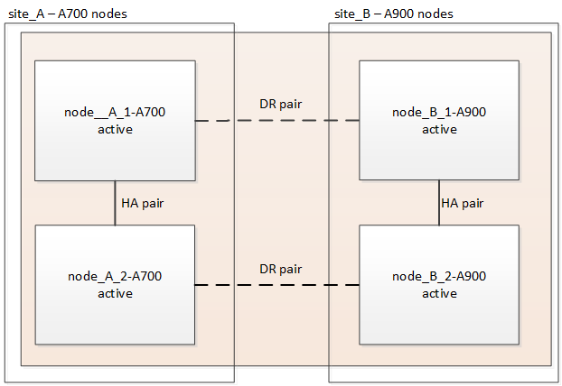

= スイッチオーバーとスイッチバックを使用して、MetroCluster IP構成のAFF A700 / FAS9000からAFF A900 / FAS9500にコントローラをアップグレードする（ONTAP 9.10.1以降）
:allow-uri-read: 

[role="lead"]
MetroCluster スイッチオーバー処理を使用すると、パートナークラスタのコントローラモジュールのアップグレード中もクライアントに無停止でサービスを提供できます。この手順の一部として他のコンポーネント（ストレージシェルフやスイッチなど）をアップグレードすることはできません。

.このタスクについて
* AFF A700コントローラモジュールをAFF A900にアップグレードするには、コントローラでONTAP 9.10.1以降が実行されている必要があります。
* FAS9000コントローラモジュールをFAS9500にアップグレードするには、コントローラでONTAP 9.10.1P3以降が実行されている必要があります。
+
|===

| 旧プラットフォームモデル | 新しいプラットフォームモデル 

 a| 
** AFF A700

 a| 
** AFF A900 の略

 a| 
** FAS9000

 a| 
** FAS9500

|===
* 構成内のすべてのコントローラは、同じメンテナンス期間にアップグレードする必要があります。
+
AFF A700とAFF A900、またはFAS9000とFAS9500コントローラを使用したMetroCluster 構成の運用は、この保守作業の外部ではサポートされません。

* サポートされているファームウェアバージョンが IP スイッチで実行されている必要があります。
* 元のプラットフォームの IP アドレス、ネットマスク、ゲートウェイを新しいプラットフォームで再利用します。
* この手順 では、例と図の両方で次の名前が使用されています。
+
** site_A
+
*** アップグレード前：
+
**** node_A_1 - A700
**** Node_a_2-A700

*** アップグレード後：
+
**** node_A_1 - A900
**** Node_a_2-A900

** site_B
+
*** アップグレード前：
+
**** node_B_1 - A700
**** node_B_2 - A700

*** アップグレード後：
+
**** Node_B_1-A900
**** node_B_2 - A900

== MetroCluster IP 構成のコントローラをアップグレードするためのワークフロー

ワークフロー図は、アップグレードタスクを計画する際に役立ちます。

image::../media/workflow_ip_upgrade.png[ワークフロー IP アップグレード]

== アップグレードを準備

既存の MetroCluster 構成に変更を加える前に、構成の健全性を確認し、新しいプラットフォームを準備し、その他のタスクを実行する必要があります。

=== AFF A700またはFAS9000コントローラのスロット7をクリアします

AFF A900またはFAS9500のMetroCluster 構成では、スロット5と7にあるDRカードの各ポートのいずれかが使用されます。アップグレードを開始する前に、AFF A700またはFAS9000のスロット7にカードがある場合は、それらをクラスタのすべてのノード用の他のスロットに移動する必要があります。

=== コントローラをアップグレードする前に、 MetroCluster スイッチの RCF ファイルを更新してください

AFF A700またはFAS9000のMetroCluster IP構成では、VLANは使用されません。AFF A900またはFAS9500のMetroCluster 構成では、VLANが使用されます。そのため、AFF A700またはFAS9000からAFF A900またはFAS9500にアップグレードする際に、RCFファイルを変更する必要があります。

|===

| プラットフォームモデル | サポートされる VLAN ID 

 a| 
* AFF A900またはFAS9500

 a| 
* 10.
* 20
* 101 ~ 4096 の範囲の任意の値。

|===
* サポートされている最小バージョンの RCF ファイルがスイッチに設定されていない場合は、 RCF ファイルを更新する必要があります。使用しているスイッチモデルに対応した正しい RCF ファイルバージョンについては、を参照してください link:https://mysupport.netapp.com/site/tools/tool-eula/rcffilegenerator["RcfFileGenerator ツール"^]。次に、 RCF ファイルアプリケーションの手順を示します。

.手順
. 新しい RCF ファイルを適用するための IP スイッチを準備します。
+
使用しているスイッチベンダーに対応する手順については、を参照してください link:../install-ip/index.html["MetroCluster IP のインストールと設定"] 内容

+
** link:../install-ip/task_switch_config_broadcom.html#resetting-the-broadcom-ip-switch-to-factory-defaults["Broadcom IP スイッチを工場出荷時のデフォルトにリセット"]
** link:../install-ip/task_switch_config_broadcom.html#resetting-the-cisco-ip-switch-to-factory-defaults["Cisco IP スイッチを工場出荷時のデフォルトにリセットする"]

. RCF ファイルをダウンロードしてインストールします。
+
の手順に従います link:../install-ip/index.html["MetroCluster IP のインストールと設定"] 内容

+
** link:../install-ip/task_switch_config_broadcom.html#downloading-and-installing-the-broadcom-rcf-files["Broadcom の RCF ファイルのダウンロードとインストール"]
** link:../install-ip/task_switch_config_broadcom.html#downloading-and-installing-the-cisco-ip-rcf-files["Cisco IP RCF ファイルのダウンロードとインストール"]

=== 古いノードから新しいノードへのポートのマッピング

AFF A700からAFF A900またはFAS9000からFAS9500にアップグレードした場合、データネットワークポート、FCP SANアダプタポート、SASストレージポートとNVMeストレージポートは変更されません。データ LIF は、アップグレード中もアップグレード後もそのままの状態になります。そのため、古いノードのネットワークポートを新しいノードにマッピングする必要はありません。

=== サイトをアップグレードする前に MetroCluster の健全性を確認

アップグレードを実行する前に、 MetroCluster 構成の健全性と接続を確認する必要があります。

.手順
. ONTAP で MetroCluster 構成の動作を確認します。
+
.. ノードがマルチパスであるかどうかを確認します。 +`node run -node node_name sysconfig -a`
+
このコマンドは、 MetroCluster 構成のノードごとに問題で実行する必要があります。

.. 「 storage disk show -broken 」の構成に破損ディスクがないことを確認してください
+
このコマンドは、 MetroCluster 構成の各ノードで問題を実行する必要があります。

.. ヘルスアラートがないかどうかを確認します。
+
「 system health alert show 」というメッセージが表示されます

+
このコマンドは、各クラスタで問題を実行する必要があります。

.. クラスタのライセンスを確認します。
+
「 system license show 」を参照してください

+
このコマンドは、各クラスタで問題を実行する必要があります。

.. ノードに接続されているデバイスを確認します。
+
「 network device-discovery show 」のように表示されます

+
このコマンドは、各クラスタで問題を実行する必要があります。

.. 両方のサイトでタイムゾーンと時間が正しく設定されていることを確認します。
+
cluster date show

+
このコマンドは、各クラスタで問題を実行する必要があります。時刻とタイムゾーンを設定するには 'cluster date コマンドを使用します

. MetroCluster 構成の運用モードを確認し、 MetroCluster チェックを実行
+
.. MetroCluster の構成と動作モードが「 normal 」であることを確認します。 + MetroCluster show
.. 想定されるすべてのノードが表示されることを確認します。 + MetroCluster node show `
.. 次のコマンドを問題に設定します。
+
「 MetroCluster check run 」のようになります

.. MetroCluster チェックの結果を表示します。
+
MetroCluster チェックショー

. Config Advisor ツールを使用して MetroCluster のケーブル接続を確認します。
+
.. Config Advisor をダウンロードして実行します。
+
https://mysupport.netapp.com/site/tools/tool-eula/activeiq-configadvisor["ネットアップのダウンロード： Config Advisor"^]

.. Config Advisor の実行後、ツールの出力を確認し、推奨される方法で検出された問題に対処します。

=== アップグレード前に情報を収集

アップグレードの開始前に各ノードについて情報を収集し、必要に応じてネットワークブロードキャストドメインを調整し、 VLAN やインターフェイスグループを削除して、暗号化情報を収集する必要があります。

.手順
. 各ノードの物理的なケーブル接続をメモし、必要に応じてケーブルにラベルを付けて新しいノードを正しくケーブル接続できるようにします。
. ノードごとに次のコマンドの出力を収集します。
+
** MetroCluster interconnect show
** 「 MetroCluster configurion-settings connection show 」を参照してください
** 'network interface show -role cluster, node-mgmt
** network port show -node node_name -type physical
** 'network port vlan show -node -node-name _`
** 「 network port ifgrp show -node node_name 」 - instance 」を指定します
** 「 network port broadcast-domain show 」
** 「 network port reachability show-detail` 」と表示されます
** network ipspace show
** volume show
** 「 storage aggregate show
** 「 system node run -node _node-name_sysconfig -a 」のように入力します
** 「 vserver fcp initiator show 」のように表示されます
** 「 storage disk show 」を参照してください
** 「 MetroCluster configurion-settings interface show 」を参照してください

. site_B （プラットフォームが現在アップグレード中のサイト）の UUID を収集します。 MetroCluster node show -fields node-cluster.uuid 、 node-uuid
+
アップグレードを正常に実行するには、新しい site_B のコントローラモジュールでこれらの値を正確に設定する必要があります。あとでアップグレードプロセスの適切なコマンドに値をコピーできるように、ファイルに値をコピーします。+ 次の例は、 UUID を指定したコマンドの出力を示しています。

+
[listing]
----
cluster_B::> metrocluster node show -fields node-cluster-uuid, node-uuid
   (metrocluster node show)
dr-group-id cluster     node   node-uuid                            node-cluster-uuid
----------- --------- -------- ------------------------------------ ------------------------------
1           cluster_A node_A_1-A700 f03cb63c-9a7e-11e7-b68b-00a098908039 ee7db9d5-9a82-11e7-b68b-00a098908039
1           cluster_A node_A_2-A700 aa9a7a7a-9a81-11e7-a4e9-00a098908c35 ee7db9d5-9a82-11e7-b68b-00a098908039
1           cluster_B node_B_1-A700 f37b240b-9ac1-11e7-9b42-00a098c9e55d 07958819-9ac6-11e7-9b42-00a098c9e55d
1           cluster_B node_B_2-A700 bf8e3f8f-9ac4-11e7-bd4e-00a098ca379f 07958819-9ac6-11e7-9b42-00a098c9e55d
4 entries were displayed.
cluster_B::*

----
+
UUID を次のようなテーブルに記録することを推奨します。

+
|===

| クラスタまたはノード | UUID 

 a| 
cluster_B
 a| 
07958819 - 9ac6-11e7-9b42 - 00a098c9e55d

 a| 
node_B_1 - A700
 a| 
f37b240b-9ac1-11e7-9b42 -00a098c9e55d

 a| 
node_B_2 - A700
 a| 
bf8e3f8f-9ac4-117-bd4e-00a098c379f です

 a| 
cluster_A
 a| 
ee7db9d5-9a82-11e7-b68b-00a098908039

 a| 
node_A_1 - A700
 a| 
f03cb63c-9a7e-11e7-b68b-00a098908039

 a| 
Node_a_2-A700
 a| 
aa9a7a7a1-9a81-11e7-a4e9-00a098908c35

|===
. MetroCluster ノードが SAN 構成になっている場合は、関連情報を収集します。
+
次のコマンドの出力を収集する必要があります。

+
** 「 fcp adapter show -instance 」のように表示されます
** 「 fcp interface show -instance 」の略
** 「 iscsi interface show 」と表示されます
** ucadmin show

. ルート・ボリュームが暗号化されている場合は 'key-manager に使用するパスフレーズを収集して保存しますつまり 'security key-manager backup show
. MetroCluster ノードがボリュームまたはアグリゲートに暗号化を使用している場合は、キーとパスフレーズに関する情報をコピーします。追加情報の場合は、を参照してください https://docs.netapp.com/us-en/ontap/encryption-at-rest/backup-key-management-information-manual-task.html["オンボードキー管理情報の手動でのバックアップ"^]。
+
.. Onboard Key Manager が設定されている場合： security key-manager onboard show-backup + アップグレード手順であとでパスフレーズが必要になります。
.. Enterprise Key Management （ KMIP ）が設定されている場合は、次のコマンドを問題で実行します。
+
....
security key-manager external show -instance
security key-manager key query
....

. 既存のノードのシステム ID を収集します。 MetroCluster node show -fields node-systemid 、 ha-partner-systemid 、 dr-partner-systemid 、 dr-auxiliary-systemid
+
次の出力は、再割り当てされたドライブを示しています。

+
[listing]
----
::> metrocluster node show -fields node-systemid,ha-partner-systemid,dr-partner-systemid,dr-auxiliary-systemid

dr-group-id cluster     node     node-systemid ha-partner-systemid dr-partner-systemid dr-auxiliary-systemid
----------- ----------- -------- ------------- ------------------- ------------------- ---------------------
1           cluster_A node_A_1-A700   537403324     537403323           537403321           537403322
1           cluster_A node_A_2-A700   537403323     537403324           537403322          537403321
1           cluster_B node_B_1-A700   537403322     537403321           537403323          537403324
1           cluster_B node_B_2-A700   537403321     537403322           537403324          537403323
4 entries were displayed.
----

=== メディエーターまたは Tiebreaker の監視を削除します

プラットフォームをアップグレードする前に、 MetroCluster 設定を Tiebreaker またはメディエーターユーティリティで監視している場合は、監視を解除する必要があります。

.手順
. 次のコマンドの出力を収集します。
+
「 storage iscsi-initiator show 」のように表示されます

. Tiebreaker 、メディエーター、またはスイッチオーバーを開始できるその他のソフトウェアから既存の MetroCluster 構成を削除します。
+
|===

| 使用するポート | 使用する手順 

 a| 
Tiebreaker
 a| 
link:../tiebreaker/concept_configuring_the_tiebreaker_software.html#removing-metrocluster-configurations["MetroCluster 設定の削除"] MetroCluster Tiebreaker インストールおよび設定コンテンツで、を参照してください

 a| 
メディエーター
 a| 
ONTAP プロンプトで次のコマンドを問題に設定します。

MetroCluster 構成設定のメディエーターが削除されました

 a| 
サードパーティ製アプリケーション
 a| 
製品マニュアルを参照してください。

|===

=== カスタム AutoSupport メッセージをメンテナンス前に送信する

メンテナンスを実行する前に、 AutoSupport an 問題 message to notify technical support that maintenance is maintenance.システム停止が発生したとみなしてテクニカルサポートがケースをオープンしないように、メンテナンスが進行中であることを通知する必要があります。

このタスクは MetroCluster サイトごとに実行する必要があります。

.手順
. クラスタにログインします。
. メンテナンスの開始を通知する AutoSupport メッセージを起動します。
+
「 system node AutoSupport invoke -node * -type all -message MAINT=__ maintenance-window-in-hours __ 」というメッセージが表示されます

+
「 maintenance-window-in-hours 」パラメータには、メンテナンス時間の長さを最大 72 時間指定します。この時間が経過する前にメンテナンスが完了した場合は、メンテナンス期間が終了したことを通知する AutoSupport メッセージを起動できます。

+
「 system node AutoSupport invoke -node * -type all -message MAINT= end 」というメッセージが表示されます

. 同じ手順をパートナーサイトでも実行します。

== MetroCluster 構成をスイッチオーバーします

site_B のプラットフォームをアップグレードできるように、設定を site_A にスイッチオーバーする必要があります。

このタスクは site_A で実行する必要があります

このタスクを完了すると、 site_A がアクティブになり、両方のサイトにデータが提供されます。site_B は非アクティブで、アップグレードプロセスを開始する準備ができています。

image::../media/mcc_upgrade_cluster_a_in_switchover_A900.png[MCC アップグレードクラスタ A をスイッチオーバー A900 でアップグレードします]

.手順
. site_B のノードをアップグレードできるように、 MetroCluster 構成を site_A にスイッチオーバーします。
+
.. site_A で次のコマンドを問題に設定します。
+
MetroCluster switche-controller-replacement true

+
この処理が完了するまでに数分かかることがあります。

.. スイッチオーバー処理を監視します。
+
「 MetroCluster operation show 」を参照してください

.. 処理が完了したら、ノードがスイッチオーバー状態であることを確認します。
+
「 MetroCluster show 」

.. MetroCluster ノードのステータスを確認します。
+
MetroCluster node show

+
コントローラのアップグレード中は、ネゴシエートスイッチオーバー後のアグリゲートの自動修復が無効になります。site_B のノードは、 LOADER プロンプトで停止および停止します。

== AFF A700またはFAS9000プラットフォームのコントローラモジュールとNVSを取り外します

接地対策がまだの場合は、自身で適切に実施します。

.手順
. site_B の両方のノードから bootarg の値を収集します printenv
. site_B のシャーシの電源をオフにします

=== AFF A700またはFAS9000コントローラモジュールを取り外します

次の手順 を使用して、AFF A700またはFAS9000コントローラモジュールを取り外します

.手順
. コントローラモジュールを取り外す前に、コントローラモジュールからコンソールケーブル（ある場合）と管理ケーブルを外します。
. コントローラモジュールのロックを解除してシャーシから取り外します。
+
.. カムハンドルのオレンジ色のボタンを下にスライドさせてロックを解除します。
+
image::../media/drw_9500_remove_PCM.png[コントローラモジュール]

+
|===

| image:../media/number1.png["番号 1"] | カムハンドルのリリースボタン 

| image:../media/number2.png["数値 2."] | カムハンドル 
|===
.. カムハンドルを回転させて、コントローラモジュールをシャーシから完全に外し、コントローラモジュールをシャーシから引き出します。このとき、空いている手でコントローラモジュールの底面を支えてください。

=== AFF A700またはFAS9000 NVSモジュールを取り外します

次の手順 を使用して、AFF A700またはFAS9000 NVSモジュールを取り外します。

メモ：NVSモジュールはスロット6にあり、システム内の他のモジュールと比較して高さが2倍になっています。

.手順
. NVS のロックを解除し、スロット 6 から取り外します。
+
.. 文字と数字が記載された「カム」ボタンを押し下げます。カムボタンがシャーシから離れます。
.. カムラッチを下に回転させて水平にします。NVS がシャーシから外れ、数インチ移動します。
.. NVS をシャーシから取り外すには、モジュール前面の両側にあるプルタブを引いてください。
+
image::../media/drw_a900_move-remove_NVRAM_module.png[モジュールを取り外します]

+
|===

| image:../media/number1.png["番号 1"] | 文字と数字が記載された I/O カムラッチ 

| image:../media/number2.png["番号 2"] | ロックが完全に解除された I/O ラッチ 
|===

. AFF A700またはFAS9000 NVSでコアダンプデバイスとして使用されるアドオンモジュールを使用している場合、それらのモジュールをAFF A900またはFAS9500 NVSに転送しないでください。AFF A700またはFAS9000コントローラモジュールとNVSからAFF A900またはFAS9500モジュールにパーツを転送しないでください。

== AFF A900またはFAS9500 NVSとコントローラモジュールを取り付けます

アップグレードキットに含まれていたAFF A900またはFAS9500 NVSとコントローラモジュールをsite_Bの両方のノードにインストールする必要がありますコアダンプデバイスをAFF A700またはFAS9000 NVSモジュールからAFF A900またはFAS9500 NVSモジュールに移動しないでください。

接地対策がまだの場合は、自身で適切に実施します。

=== AFF A900またはFAS9500 NVSをインストールします

次の手順 を使用して、site_Bの両方のノードのスロット6にAFF A900またはFAS9500 NVSをインストールします

.手順
. NVS をスロット 6 のシャーシ開口部の端に合わせます。
. NVS をスロットにそっと挿入し、文字と数字が記載された I/O カムラッチを上に押して NVS を所定の位置にロックします。
+
image::../media/drw_a900_move-remove_NVRAM_module.png[モジュールを取り外します]

+
|===

| image:../media/number1.png["番号 1"] | 文字と数字が記載された I/O カムラッチ 

| image:../media/number2.png["番号 2"] | ロックが完全に解除された I/O ラッチ 
|===

=== AFF A900またはFAS9500コントローラモジュールを取り付けます。

次の手順 を使用して、AFF A900またはFAS9500コントローラモジュールをインストールします。

.手順
. コントローラモジュールの端をシャーシの開口部に合わせ、コントローラモジュールをシステムに半分までそっと押し込みます。
. コントローラモジュールをシャーシに挿入し、ミッドプレーンまでしっかりと押し込んで完全に装着します。コントローラモジュールが完全に装着されると、ロックラッチが上がります。注意：コネクタの破損を防ぐため、コントローラモジュールをシャーシに挿入する際に力を入れすぎないように注意してください。
. 管理ポートとコンソールポートをコントローラモジュールにケーブル接続します。
+
image::../media/drw_9500_remove_PCM.png[コントローラモジュール]

+
|===

| image:../media/number1.png["番号 1"] | カムハンドルのリリースボタン 

| image:../media/number2.png["数値 2."] | カムハンドル 
|===
. 各ノードのスロット 7 に 2 枚目の X91146A カードを取り付けます
+
.. e5b 接続を e7b に移動します。
.. e5a の接続を e5b に移動します。
+

NOTE: に記載されているように、クラスタのすべてのノードのスロット 7 は空にする必要があります <<Map ports from the old nodes to the new nodes>> セクション。

. シャーシの電源を入れ、シリアルコンソールに接続します。
. BIOS の初期化後にノードで自動ブートが開始された場合は、 Ctrl-C を押して自動ブートを中断します
. 自動ブートが中断されると、ノードは LOADER プロンプトで停止します。ブートを中断せずに node1 でブートが開始された場合は、プロンプトで Ctrl+C キーを押してブートメニューに移動します。ブートメニューでノードが停止したら、オプション 8 を使用してノードをリブートし、リブート時に自動ブートを中断します。
. LOADER プロンプトで、デフォルトの環境変数を設定します。 set-defaults
. デフォルトの環境変数設定である saveenv を保存します

=== site_B のネットブートノード

AFF A900またはFAS9500コントローラモジュールとNVSを交換したら、AFF A900またはFAS9500ノードをネットブートして、クラスタで実行されているものと同じバージョンのONTAP とパッチレベルをインストールする必要があります。ネットブートという用語は、リモート・サーバに保存された ONTAP イメージからブートすることを意味します。ネットブートの準備を行うときは、システムがアクセスできる Web サーバに、 ONTAP 9 ブート・イメージのコピーを追加する必要があります。AFF A900またはFAS9500コントローラモジュールのブートメディアにインストールされているONTAP のバージョンは、シャーシに取り付けて電源がオンになっていないかぎり確認できません。AFF A900またはFAS9500ブートメディア上のONTAP バージョンは、アップグレード対象のAFF A700またはFAS9000システムで実行されているONTAP バージョンと同じで、プライマリブートイメージとバックアップブートイメージの両方が一致している必要があります。イメージを設定するには、ネットブートを実行してからブートメニューの「 wipeconfig 」コマンドを実行します。コントローラモジュールが以前に別のクラスタで使用されていた場合は、「 wipeconfig 」コマンドはブートメディア上の残留設定をクリアします。

.を開始する前に
* システムから HTTP サーバにアクセスできることを確認します。
* ご使用のシステムに必要なシステムファイルと、適切なバージョンの ONTAP をネットアップサポートサイトからダウンロードする必要があります。

インストールされている ONTAP のバージョンが元のコントローラにインストールされているバージョンと異なる場合は、新しいコントローラをネットブートする必要があります。新しいコントローラをそれぞれ取り付けたら、 Web サーバに保存されている ONTAP 9 イメージからシステムをブートします。その後、以降のシステムブートで使用するブートメディアデバイスに正しいファイルをダウンロードできます。

.手順
. にアクセスします https://mysupport.netapp.com/site/["ネットアップサポートサイト"^] システムのネットブートの実行に使用するファイルをダウンロードするには、次の手順を実行します。
. [step2-download-software]] ネットアップサポートサイトのソフトウェアダウンロードセクションから適切な ONTAP ソフトウェアをダウンロードし、「 ONTAP-version image.tgz 」ファイルを Web にアクセスできるディレクトリに保存します。
. Web にアクセスできるディレクトリに移動し、必要なファイルが利用可能であることを確認します。
. ディレクトリの一覧に <ONTAP_version>\_image.tgz が表示されている必要があります。
. 次のいずれかを実行してネットブート接続を設定します。
+

NOTE: ネットブート接続として管理ポートおよび IP を使用する必要があります。アップグレードの実行中にデータ LIF IP を使用しないでください。データ LIF が停止する可能性があります。

+
|===

| Dynamic Host Configuration Protocol （ DCHP ）の設定 | 作業 

 a| 
実行中です
 a| 
ブート環境プロンプトで次のコマンドを使用して、自動的に接続を設定します。 ifconfig e0M -auto

 a| 
実行されていません
 a| 
ブート環境プロンプトで次のコマンドを使用して、接続を手動で設定します。 ifconfig e0M -addr= <filer_addr> -mask= <netmask> -gw= <gateway> -dns= <dns_addr> domain= <dns_domain>

「 <filer_addr> 」は、ストレージ・システムの IP アドレスです。`<netmask>` はストレージシステムのネットワークマスクです。「 <gateway>` 」は、ストレージシステムのゲートウェイです。「 <dns_addr> 」は、ネットワーク上のネームサーバの IP アドレスです。このパラメータはオプションです。「 <dns_domain> 」は、 Domain Name Service （ DNS ；ドメインネームサービス）ドメイン名です。このパラメータはオプションです。注：使用しているインターフェイスによっては、他のパラメータが必要になる場合もあります。ファームウェア・プロンプトで「 help ifconfig 」と入力すると、詳細が表示されます。

|===
. node_B_1 でネットブートを実行します：ネットブート http://<web_server_ip/path_to_web_accessible_directory>/netboot/kernel`
+
「 <path_the_web-accessible_directory> 」は、「 <ONTAP_version>\_image.tgz 」をダウンロードした場所に配置する必要があります <<step2-download-software,手順 2>>。

+

NOTE: トランクを中断しないでください。

. AFF A900またはFAS9500コントローラモジュールで実行されているnode_B_1がブートするまで待ち、次のようにブートメニューオプションを表示します。
+
[listing]
----
Please choose one of the following:

(1)  Normal Boot.
(2)  Boot without /etc/rc.
(3)  Change password.
(4)  Clean configuration and initialize all disks.
(5)  Maintenance mode boot.
(6)  Update flash from backup config.
(7)  Install new software first.
(8)  Reboot node.
(9)  Configure Advanced Drive Partitioning.
(10) Set Onboard Key Manager recovery secrets.
(11) Configure node for external key management.
Selection (1-11)?
----
. 起動メニューから ' オプション (7) Install new software first.`` を選択します このメニューオプションを選択すると、新しい ONTAP イメージがブートデバイスにダウンロードおよびインストールされます。注意 : 次のメッセージは無視してください : この手順は 'HA ペアでの無停止アップグレードではサポートされていません 環境の無停止の ONTAP ソフトウェアアップグレード。コントローラのアップグレードは含まれません。
+
新しいノードを希望するイメージに更新する場合は、必ずネットブートを使用してください。別の方法で新しいコントローラにイメージをインストールした場合、正しいイメージがインストールされないことがあります。この問題環境 All ONTAP リリース

. 手順 を続行するかどうかを確認するメッセージが表示されたら 'y' と入力し ' パッケージの入力を求められたら 'URL:http://<web_server_ip/path_to_web-accessible_directory>/<ontap_version>\_image.tgz` と入力します
. 次の手順を実行してコントローラモジュールをリブートします。
+
.. 次のプロンプトが表示されたら 'n' を入力してバックアップ・リカバリをスキップしますバックアップ構成を今すぐリストアしますか ? {y|n}`
.. 次のプロンプトが表示されたら 'y と入力して再起動します ' 新しくインストールしたソフトウェアの使用を開始するには ' ノードを再起動する必要があります今すぐリブートしますか？{y|n}`` コントローラモジュールは再フォーマットされたために再起動しますが、ブートメニューで停止します。そして、設定データを復元する必要があります。

. プロンプトで「 wipeconfig 」コマンドを実行して、ブートメディアの以前の設定をクリアします。
+
.. 次のメッセージが表示されたら、回答は「 yes 」を選択します。これにより、クラスタメンバーシップを含む重要なシステム構成が削除されます。警告：テイクオーバーされた HA ノードでは実行しないでください。続行してもよろしいですか ?:`
.. ノードがリブートして「 wipeconfig 」を終了し、ブートメニューで停止します。

. ブート・メニューからオプション「 5 」を選択して、保守モードに切り替えます。ノードが保守モードで停止して ' コマンド・プロンプト \*> が表示されるまで ' プロンプトを表示します回答
. 上記の手順を繰り返して、 node_B_2 をネットブートします。

=== HBA 構成をリストア

コントローラモジュールに HBA カードが搭載されているかどうかや設定によっては、サイトで使用するために正しく設定する必要があります。

.手順
. メンテナンスモードで、システム内の HBA の設定を行います。
+
.. ポートの現在の設定を確認します。
+
ucadmin show

.. 必要に応じてポートの設定を更新します。

+
|===

| HBA のタイプと目的のモード | 使用するコマンド 

 a| 
CNA FC
 a| 
ucadmin modify -m fc -t initiator_adapter-name _ `

 a| 
CNA イーサネット
 a| 
ucadmin modify -mode cna_adapter-name_`

 a| 
FC ターゲット
 a| 
fcadmin config -t target_adapter-name_`

 a| 
FC イニシエータ
 a| 
fcadmin config -t initiator_adapter-name_`

|===
. メンテナンスモードを終了します。
+
「 halt 」

+
コマンドの実行後、ノードが LOADER プロンプトで停止するまで待ちます。

. ノードをブートしてメンテナンスモードに戻り、設定の変更が反映されるようにします。
+
「 boot_ontap maint 」を使用してください

. 変更内容を確認します。
+
|===

| HBA のタイプ | 使用するコマンド 

 a| 
CNA
 a| 
ucadmin show

 a| 
FC
 a| 
fcadmin show`

|===

=== 新しいコントローラとシャーシで HA 状態を設定

コントローラとシャーシの HA 状態を確認し、必要に応じてシステム構成に合わせて更新する必要があります。

.手順
. メンテナンスモードで、コントローラモジュールとシャーシの HA 状態を表示します。
+
「 ha-config show 」

+
すべてのコンポーネントの HA 状態は「 mccip 」である必要があります。

. 表示されたコントローラまたはシャーシのシステム状態が正しくない場合は、 HA 状態を設定します。
+
「 ha-config modify controller mccip 」を参照してください

+
「 ha-config modify chassis mccip 」を参照してください

. ノードを停止します
+
ノードは 'loader>` プロンプトで停止する必要があります

. 各ノードで、システムの日付、時刻、およびタイムゾーンを確認します。「 show date 」
. 必要に応じて 'UTC または GMT:'set date <mm/dd/yyyy>' で日付を設定します
. ブート環境プロンプトで次のコマンドを使用して ' 時刻を確認します
. 必要に応じて、時刻を UTC または GMT:' 設定時刻 <:hh:mm:ss>` で設定します
. 設定を保存します： saveenv
. 環境変数 :printenv' を収集します

== 新しいプラットフォームに対応できるようにスイッチの RCF ファイルを更新します

スイッチは、新しいプラットフォームモデルをサポートする構成に更新する必要があります。

このタスクは、現在アップグレード中のコントローラを含むサイトで実行します。この手順の例では、まず site_B をアップグレードします。

site_A のコントローラをアップグレードすると、 site_A のスイッチがアップグレードされます。

.手順
. 新しい RCF ファイルを適用するための IP スイッチを準備します。
+
MetroCluster IP のインストールと設定セクションに記載されているスイッチベンダーの手順に従ってください。

+
link:../install-ip/index.html["MetroCluster IP のインストールと設定"]

+
** link:../install-ip/task_switch_config_broadcom.html#resetting-the-broadcom-ip-switch-to-factory-defaults["Broadcom IP スイッチを工場出荷時のデフォルトにリセット"]
** link:../install-ip/task_switch_config_broadcom.html#resetting-the-cisco-ip-switch-to-factory-defaults["Cisco IP スイッチを工場出荷時のデフォルトにリセットする"]

. RCF ファイルをダウンロードしてインストールします。
+
使用しているスイッチベンダーに対応する手順については、を参照してください link:../install-ip/index.html["MetroCluster IP のインストールと設定"]。

+
** link:../install-ip/task_switch_config_broadcom.html#downloading-and-installing-the-broadcom-rcf-files["Broadcom の RCF ファイルのダウンロードとインストール"]
** link:../install-ip/task_switch_config_broadcom.html#downloading-and-installing-the-cisco-ip-rcf-files["Cisco IP RCF ファイルのダウンロードとインストール"]

== 新しいコントローラを設定します

この時点で、新しいコントローラの準備が整い、ケーブル接続が完了している必要があります。

=== MetroCluster の bootarg IP 変数を設定します

新しいコントローラモジュールには特定の MetroCluster IP bootarg 値を設定する必要があります。これらの値は、古いコントローラモジュールに設定されている値と一致する必要があります。

このタスクでは、のアップグレード手順で前述した UUID とシステム ID を使用します link:task_upgrade_controllers_in_a_four_node_ip_mcc_us_switchover_and_switchback_mcc_ip.html#gathering-information-before-the-upgrade["アップグレード前に情報を収集"]。

.手順
. 「 LOADER> 」プロンプトで、 site_B の新しいノードで次のブート引数を設定します。
+
'etenvarge.MCC.port_a_ip_config_local-ip-address/local-ip-mask'0 、 ha-partner-ip-address 、 dr-partner-ip-address 、 dr-aux-partnerip-address 、 vlan-id_`

+
「 etenvarge.MCC.port_b_ip_config_local-ip-address/local-ip-mask, 0,ha-partner-ip-address 、 dr-partner-ip-address 、 dr-aux-partnerip-address 、 vlan-id_` 」を指定します

+
次の例は、最初のネットワークに VLAN 120 を、 2 番目のネットワークに VLAN 130 を使用して、 node_B_1 から A900 の値を設定します。

+
[listing]
----
setenv bootarg.mcc.port_a_ip_config 172.17.26.10/23,0,172.17.26.11,172.17.26.13,172.17.26.12,120
setenv bootarg.mcc.port_b_ip_config 172.17.27.10/23,0,172.17.27.11,172.17.27.13,172.17.27.12,130
----
+
次の例は、最初のネットワークに VLAN 120 を、 2 番目のネットワークに VLAN 130 を使用して、 node_B_2 から A900 に値を設定します。

+
[listing]
----
setenv bootarg.mcc.port_a_ip_config 172.17.26.11/23,0,172.17.26.10,172.17.26.12,172.17.26.13,120
setenv bootarg.mcc.port_b_ip_config 172.17.27.11/23,0,172.17.27.10,172.17.27.12,172.17.27.13,130
----
. 新しいノードの LOADER プロンプトで ' UUID を設定します
+
「 etenv bootarg.mgwd.partner_uuid_partner -cluster-UUID_` 」と入力します

+
「 etenv bootarg.mgwd.cluster_ue_local-cluster-UUID_` 」と入力します

+
「 etenv bootarge.MCC.pri_partner_uuid_dr-partner -node-UUID_` 」と入力します

+
'etenv bootarg.mcc.aux_partner_uuid _dr-au-partner -UUID_`

+
「 etenv bootarg.mcc_iscsi.node_uuid _local-node-UUID_` 」と入力します

+
.. node_B_1 から A900 の UUID を設定します。
+
次の例は、 node_B_1 から A900 の UUID を設定するコマンドを示しています。

+
[listing]
----
setenv bootarg.mgwd.cluster_uuid ee7db9d5-9a82-11e7-b68b-00a098908039
setenv bootarg.mgwd.partner_cluster_uuid 07958819-9ac6-11e7-9b42-00a098c9e55d
setenv bootarg.mcc.pri_partner_uuid f37b240b-9ac1-11e7-9b42-00a098c9e55d
setenv bootarg.mcc.aux_partner_uuid bf8e3f8f-9ac4-11e7-bd4e-00a098ca379f
setenv bootarg.mcc_iscsi.node_uuid f03cb63c-9a7e-11e7-b68b-00a098908039
----
.. node_B_2 - A900 の UUID を設定します。
+
次の例は、 node_B_2 - A900 の UUID を設定するコマンドを示しています。

+
[listing]
----
setenv bootarg.mgwd.cluster_uuid ee7db9d5-9a82-11e7-b68b-00a098908039
setenv bootarg.mgwd.partner_cluster_uuid 07958819-9ac6-11e7-9b42-00a098c9e55d
setenv bootarg.mcc.pri_partner_uuid bf8e3f8f-9ac4-11e7-bd4e-00a098ca379f
setenv bootarg.mcc.aux_partner_uuid f37b240b-9ac1-11e7-9b42-00a098c9e55d
setenv bootarg.mcc_iscsi.node_uuid aa9a7a7a-9a81-11e7-a4e9-00a098908c35
----

. 元のシステムが ADP 用に設定されていた場合は、交換用ノードの LOADER プロンプトで ADP を有効にします。
+
'etenv bootarg.me.adp_enabled true

. 次の変数を設定します。
+
「 etenv bootarg.me.local_config_id_original-sys-sys-id_` 」を返します

+
「 etenv bootarge.MCC.DR_PARTNER_DR-partner -sys-id_` 」を選択します

+

NOTE: setenbootarg.mb.local_config_id' 変数は ' 元の * コントローラ・モジュールである node_B_1 A700 の sys-id に設定する必要があります

+
.. node_B_1 から A900 の変数を設定します。
+
次の例は、 node_B_1 から A900 の値を設定するコマンドを示しています。

+
[listing]
----
setenv bootarg.mcc.local_config_id 537403322
setenv bootarg.mcc.dr_partner 537403324
----
.. node_B_2 - A900 の変数を設定します。
+
次の例は、 node_B_2 から A900 の値を設定するコマンドを示しています。

+
[listing]
----
setenv bootarg.mcc.local_config_id 537403321
setenv bootarg.mcc.dr_partner 537403323
----

. 外部キー管理ツールで暗号化を使用する場合は、必要な bootargs を設定します。
+
「 etenv bootarg.kmip.init.ipaddr` 」を参照してください

+
「 etenv bootarg.kmip.kmip.init.netmask` 」を参照してください

+
「 etenv bootarg.kmip.kmip.init.gateway` 」を参照してください

+
「 etenv bootarg.kmip.kmip.init.interface` 」を参照してください

=== ルートアグリゲートディスクを再割り当てします

前の手順で確認したシステム ID を使用して、ルートアグリゲートディスクを新しいコントローラモジュールに再割り当てします。

以下の手順はメンテナンスモードで実行します。

.手順
. システムをメンテナンスモードでブートします。
+
「 boot_ontap maint 」を使用してください

. メンテナンスモードのプロンプトから node_B_1 - A900 のディスクを表示します。
+
「ディスクショー - A` 」

+
コマンド出力に、新しいコントローラモジュール（ 1574774970 ）のシステム ID が表示されます。ただし、ルートアグリゲートディスクの所有者は古いシステム ID （ 537403322 ）になります。この例で表示されているのは、 MetroCluster 構成の他のノードが所有するドライブではありません。

+
[listing]
----
*> disk show -a
Local System ID: 1574774970
DISK                  OWNER                 POOL   SERIAL NUMBER   HOME                  DR HOME
------------          ---------             -----  -------------   -------------         -------------
prod3-rk18:9.126L44   node_B_1-A700(537403322)  Pool1  PZHYN0MD     node_B_1-A700(537403322)  node_B_1-A700(537403322)
prod4-rk18:9.126L49  node_B_1-A700(537403322)  Pool1  PPG3J5HA     node_B_1-A700(537403322)  node_B_1-700(537403322)
prod4-rk18:8.126L21   node_B_1-A700(537403322)  Pool1  PZHTDSZD     node_B_1-A700(537403322)  node_B_1-A700(537403322)
prod2-rk18:8.126L2    node_B_1-A700(537403322)  Pool0  S0M1J2CF     node_B_1-(537403322)  node_B_1-A700(537403322)
prod2-rk18:8.126L3    node_B_1-A700(537403322)  Pool0  S0M0CQM5     node_B_1-A700(537403322)  node_B_1-A700(537403322)
prod1-rk18:9.126L27   node_B_1-A700(537403322)  Pool0  S0M1PSDW     node_B_1-A700(537403322)  node_B_1-A700(537403322)
.
.
.
----
. ドライブシェルフのルートアグリゲートディスクを新しいコントローラに再割り当てします。
+
|===

| ADP を使用する環境 | 使用するコマンド 

 a| 
はい。
 a| 
「ディスクの再割り当て -s _old-sysid_-d_new-sysid_-r_dr -partner sysid_`

 a| 
いいえ
 a| 
「ディスクの再割り当て -s _old-sysid_-d_new-sysid_`

|===
. ドライブシェルフのルートアグリゲートディスクを新しいコントローラに再割り当てします。
+
「ディスク再割り当て -s old-sysid -d new-sysid 」

+
次の例は、 ADP 以外の構成でのドライブの再割り当てを示しています。

+
[listing]
----
*> disk reassign -s 537403322 -d 1574774970
Partner node must not be in Takeover mode during disk reassignment from maintenance mode.
Serious problems could result!!
Do not proceed with reassignment if the partner is in takeover mode. Abort reassignment (y/n)? n

After the node becomes operational, you must perform a takeover and giveback of the HA partner node to ensure disk reassignment is successful.
Do you want to continue (y/n)? y
Disk ownership will be updated on all disks previously belonging to Filer with sysid 537403322.
Do you want to continue (y/n)? y
----
. ルートアグリゲートのディスクが正しく再割り当てされていることを確認します。 old-remove
+
「ディスクショー」

+
「ストレージ・アグリゲートのステータス」

+
[listing]
----

*> disk show
Local System ID: 537097247

  DISK                    OWNER                    POOL   SERIAL NUMBER   HOME                     DR HOME
------------              -------------            -----  -------------   -------------            -------------
prod03-rk18:8.126L18 node_B_1-A900(537097247)  Pool1  PZHYN0MD        node_B_1-A900(537097247)   node_B_1-A900(537097247)
prod04-rk18:9.126L49 node_B_1-A900(537097247)  Pool1  PPG3J5HA        node_B_1-A900(537097247)   node_B_1-A900(537097247)
prod04-rk18:8.126L21 node_B_1-A900(537097247)  Pool1  PZHTDSZD        node_B_1-A900(537097247)   node_B_1-A900(537097247)
prod02-rk18:8.126L2  node_B_1-A900(537097247)  Pool0  S0M1J2CF        node_B_1-A900(537097247)   node_B_1-A900(537097247)
prod02-rk18:9.126L29 node_B_1-A900(537097247)  Pool0  S0M0CQM5        node_B_1-A900(537097247)   node_B_1-A900(537097247)
prod01-rk18:8.126L1  node_B_1-A900(537097247)  Pool0  S0M1PSDW        node_B_1-A900(537097247)   node_B_1-A900(537097247)
::>
::> aggr status
           Aggr          State           Status                Options
aggr0_node_B_1           online          raid_dp, aggr         root, nosnap=on,
                                         mirrored              mirror_resync_priority=high(fixed)
                                         fast zeroed
                                         64-bit
----

=== 新しいコントローラをブートします

新しいコントローラをブートする必要があります。 bootarg 変数が正しいことを確認し、必要に応じて暗号化のリカバリ手順を実行するように注意してください。

.手順
. 新しいノードを停止します。
+
「 halt 」

. 外部キー管理ツールが設定されている場合は、関連する bootargs を設定します。
+
'setenv bootarg.kmip.init.ipaddr _ip-address_'

+
'setenv bootarg.kmip.init.netmask _netmask_`

+
'setenv bootarg.kmip.init.gateway _gateway-address_

+
'setenv bootarg.kmip.init.interface _interface-id_

. partner-sysid が現在のものかどうかを確認します。
+
printenv partner-sysid

+
partner-sysid が正しくない場合は、次のように設定します。

+
'setenv partner-sysid_partner-SysID_`

. ONTAP ブートメニューを表示します。
+
「 boot_ontap menu

. ルート暗号化を使用する場合は、キー管理設定のブートメニューオプションを選択します。
+
|===

| 使用するポート | 選択するブートメニューオプション 

 a| 
オンボードキー管理
 a| 
オプション 10 を選択し、画面の指示に従って、キー管理ツールの構成をリカバリまたはリストアするために必要な入力を指定します

 a| 
外部キー管理
 a| 
オプション 11 を選択し、画面の指示に従って、キー管理ツールの設定をリカバリまたはリストアするために必要な入力を指定します

|===
. ブート・メニューから '(6) Update flash from backup config' を選択します
+

NOTE: オプション 6 を指定すると、完了前にノードが 2 回リブートされます

+
システム ID 変更プロンプトに「 y 」と入力します。2 回目のリブートメッセージが表示されるまで待ちます。

+
[listing]
----
Successfully restored env file from boot media...

Rebooting to load the restored env file...
----
. 自動ブートを中断して、コントローラを LOADER で停止します。
+

NOTE: 各ノードで、に設定された bootargs を確認します link:task_upgrade_controllers_in_a_four_node_ip_mcc_us_switchover_and_switchback_mcc_ip.html["MetroCluster の bootarg IP 変数の設定"] 正しくない値があれば修正します。bootarg の値を確認したあとに次の手順にのみ移動してください。

. partner-sysid が正しいことを確認します。
+
printenv partner-sysid

+
partner-sysid が正しくない場合は、次のように設定します。

+
'setenv partner-sysid_partner-SysID_`

. ルート暗号化を使用する場合は、キー管理設定のブートメニューオプションを選択します。
+
|===

| 使用するポート | 選択するブートメニューオプション 

 a| 
オンボードキー管理
 a| 
オプション 10 を選択し、画面の指示に従って、キー管理ツールの構成をリカバリまたはリストアするために必要な入力を指定します

 a| 
外部キー管理
 a| 
オプション 11 を選択し、画面の指示に従って、キー管理ツールの設定をリカバリまたはリストアするために必要な入力を指定します

|===
+
キー管理ツールの設定に応じてオプション 10 またはオプション 11 を選択し、ブートメニューのプロンプトでオプション 6 を選択して、リカバリ手順を実行する必要があります。ノードを完全にブートするには、オプション 1 （通常ブート）のリカバリ手順の実行が必要になる場合があります。

. 新しいノード node_B_1 と node_B_2 がブートするまで待ちます。
+
いずれかのノードがテイクオーバーモードの場合は、「 storage failover giveback 」コマンドを使用してギブバックを実行します。

. 暗号化を使用する場合は、キー管理設定に対応したコマンドを使用してキーをリストアします。
+
|===

| 使用するポート | 使用するコマンド 

 a| 
オンボードキー管理
 a| 
「セキュリティキーマネージャオンボード同期」

詳細については、を参照してください https://docs.netapp.com/us-en/ontap/encryption-at-rest/restore-onboard-key-management-encryption-keys-task.html["オンボードキー管理の暗号化キーのリストア"^]。

 a| 
外部キー管理
 a| 
「 securitykey manager external restore -vserver _svm_-node __ key -server_host_name | ip_address ： port_-key-id key_id -key tag key_tag_node-name_ 」

詳細については、を参照してください https://docs.netapp.com/us-en/ontap/encryption-at-rest/restore-external-encryption-keys-93-later-task.html["外部キー管理の暗号化キーのリストア"^]。

|===
. すべてのポートがブロードキャストドメインに属していることを確認します。
+
.. ブロードキャストドメインを表示します。
+
「 network port broadcast-domain show 」

.. 必要に応じて、ブロードキャストドメインにポートを追加します。
+
https://docs.netapp.com/us-en/ontap/networking/add_or_remove_ports_from_a_broadcast_domain97.html["ブロードキャストドメインのポートの追加と削除"^]

.. 必要に応じて、 VLAN とインターフェイスグループを再作成します。
+
VLAN およびインターフェイスグループのメンバーシップは、古いノードと異なる場合があります。

+
https://docs.netapp.com/us-en/ontap/networking/configure_vlans_over_physical_ports.html#create-a-vlan["VLAN を作成する"^]

+
https://docs.netapp.com/us-en/ontap/networking/combine_physical_ports_to_create_interface_groups.html["物理ポートを組み合わせたインターフェイスグループの作成"^]

=== LIF の設定を確認してリストア

アップグレード手順の開始時にマッピングされた適切なノードとポートで LIF がホストされていることを確認します。

.このタスクについて
* このタスクは site_B で実行します
* で作成したポートマッピング計画を確認します link:task_upgrade_controllers_in_a_four_node_ip_mcc_us_switchover_and_switchback_mcc_ip.html#mapping-ports-from-the-old-nodes-to-the-new-nodes["古いノードから新しいノードへのポートのマッピング"]。

.手順
. スイッチバックの前に、 LIF が適切なノードとポートにホストされていることを確認します。
+
.. advanced 権限レベルに切り替えます。
+
「 advanced 」の権限が必要です

.. ポート設定を無視して LIF が適切に配置されるようにします。
+
「 vserver config override command 」 network interface modify -vserver vserver_name __ -home-node _active_port_after_upgrade _ -lif LIF_name -home-node _new_node_name _

+
vserver config override コマンドで network interface modify コマンドを入力した場合は、 tab autoccomplete 機能を使用することはできません。autoccomplete を使用してネットワーク 'interface modify' を作成してから 'vserver config override' コマンドで囲むことができます

.. admin 権限レベルに戻ります。
+
「特権管理者」

. インターフェイスをホームノードにリバートします。
+
「 network interface revert * -vserver_vserver-name に指定します

+
必要に応じて、すべての SVM でこの手順を実行します。

== MetroCluster 構成をスイッチバックします

このタスクでは、スイッチバック処理を実行し、 MetroCluster 構成が通常運用時の状態に戻ります。site_A のノードはまだアップグレード待ちです。

.手順
. site_B の MetroCluster node show コマンドを問題し ' 出力を確認します
+
.. 新しいノードが正しく表示されることを確認します。
.. 新しいノードの状態が「 Waiting for switchback 」であることを確認します。

. アクティブなクラスタ（アップグレードを実行していないクラスタ）の任意のノードから必要なコマンドを実行して、修復とスイッチバックを実行します。
+
.. データアグリゲートを修復します。 + MetroCluster heal aggregates `
.. ルートアグリゲートを修復します。
+
MetroCluster はルートを修復します

.. クラスタをスイッチバックします。
+
MetroCluster スイッチバック

. スイッチバック処理の進捗を確認します。
+
「 MetroCluster show 」

+
出力に「 waiting-for-switchback 」と表示されたら、スイッチバック処理はまだ進行中です。

+
[listing]
----
cluster_B::> metrocluster show
Cluster                   Entry Name          State
------------------------- ------------------- -----------
 Local: cluster_B         Configuration state configured
                          Mode                switchover
                          AUSO Failure Domain -
Remote: cluster_A         Configuration state configured
                          Mode                waiting-for-switchback
                          AUSO Failure Domain -
----
+
出力に normal と表示された場合、スイッチバック処理は完了しています。

+
[listing]
----
cluster_B::> metrocluster show
Cluster                   Entry Name          State
------------------------- ------------------- -----------
 Local: cluster_B         Configuration state configured
                          Mode                normal
                          AUSO Failure Domain -
Remote: cluster_A         Configuration state configured
                          Mode                normal
                          AUSO Failure Domain -
----
+
スイッチバックが完了するまでに時間がかかる場合は、「 MetroCluster config-replication resync-status show 」コマンドを使用することで、進行中のベースラインのステータスを確認できます。このコマンドは、 advanced 権限レベルで実行します。

== MetroCluster 構成の健全性を確認します

コントローラモジュールをアップグレードしたら、 MetroCluster 構成の健全性を確認する必要があります。

このタスクは、 MetroCluster 構成の任意のノードで実行できます。

.手順
. MetroCluster 構成の動作を確認します。
+
.. MetroCluster 構成と動作モードが正常であることを確認します。 + MetroCluster show `
.. MetroCluster チェックを実行します + MetroCluster チェックを実行します
.. MetroCluster チェックの結果を表示します。
+
MetroCluster チェックショー

. MetroCluster の接続およびステータスを確認します。
+
.. MetroCluster IP 接続を確認します。
+
「 storage iscsi-initiator show 」のように表示されます

.. ノードが動作していることを確認します。
+
MetroCluster node show

.. MetroCluster IP インターフェイスが動作していることを確認します。
+
「 MetroCluster configurion-settings interface show 」を参照してください

.. ローカルフェイルオーバーが有効になっていることを確認します。
+
「 storage failover show 」をクリックします

== site_A でノードをアップグレードします

site_A でアップグレードタスクを繰り返します

.手順
. 同じ手順を繰り返して、 site_A のノードをアップグレードします link:task_upgrade_controllers_in_a_four_node_ip_mcc_us_switchover_and_switchback_mcc_ip.html#preparing-for-the-upgrade["アップグレードを準備"]。
+
タスクを実行すると、サイトおよびノードへのすべてのサンプル参照が反転されます。たとえば、この例で site_A からスイッチオーバーする場合は site_B からスイッチオーバーします

== Tiebreaker またはメディエーターの監視をリストアします

MetroCluster 構成のアップグレードが完了したら、 Tiebreaker またはメディエーターユーティリティを使用して監視を再開できます。

.手順
. 必要に応じて、構成に応じて手順を使用してリストアを監視します。
+
|===
| 使用するポート | この手順を使用します 

 a| 
Tiebreaker
 a| 
link:../tiebreaker/concept_configuring_the_tiebreaker_software.html#adding-metrocluster-configurations["MetroCluster 構成を追加しています"] MetroCluster Tiebreaker のインストールと設定セクションで、次の手順を実行します。

 a| 
メディエーター
 a| 
リンク： ./install-ip/concept_mediator_requirements.html [Configuring the ONTAP Mediator service from a MetroCluster IP configuration] （ _ MetroCluster IP Installation and Configuration_ セクション）

 a| 
サードパーティ製アプリケーション
 a| 
製品マニュアルを参照してください。

|===

== カスタム AutoSupport メッセージをメンテナンス後に送信します

アップグレードの完了後、ケースの自動作成を再開できるように、メンテナンスの終了を通知する AutoSupport メッセージを送信する必要があります。

.手順
. サポートケースの自動生成を再開するには、メンテナンスが完了したことを示す AutoSupport メッセージを送信します。
+
.. 次のコマンドを問題で実行します。 + 「 system node AutoSupport invoke -node * -type all -message MAINT= end 」
.. パートナークラスタに対してこのコマンドを繰り返します。

